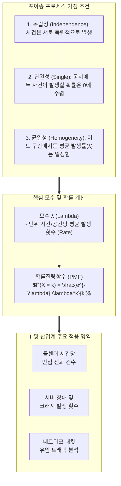

# 포아송 분포 (Poisson Distribution)

---

## I. 단위 시간·공간당 희귀 사건의 발생 횟수를 예측하는 확률 모델, 포아송 분포의 개요

* **정의**: 일정한 시간(Time) 또는 공간(Space)적 구간 내에서 어떤 사건이 독립적으로 드물게 발생할 때, 그 사건의 발생 횟수 $X$가 따르는 이산 확률 분포
* **등장 배경**: 이항분포(Binomial Distribution)에서 시행 횟수 $n$이 매우 크고 성공 확률 $p$가 매우 작을 때 계산의 복잡성을 극복하기 위해 수학자 시메옹 데니 푸아송(Siméon Denis Poisson)이 유도한 극한 분포
* **특징**: 단일 모수 $\lambda$(람다, 단위 시간당 평균 발생 횟수)에 의해 분포가 완전히 결정됨, 평균과 분산이 정확히 일치($\mu = \sigma^2 = \lambda$)하는 독특한 수학적 성질 보유

---

## II. 포아송 분포의 개념도 및 핵심 기술 요소

### 가. 포아송 분포의 확률 산출 메커니즘 및 아키텍처

* 일정한 시간이나 공간 안에서 사건이 일어나는 평균 횟수 $\lambda$를 알 때, 특정 시간 동안 사건이 정확히 $k$번 일어날 확률을 수학적으로 계산하는 모델임

### 나. 포아송 분포의 핵심 구성 요소 및 성질

| 구분 | 요소기술(키워드) | 세부 설명 |
| --- | --- | --- |
| **분포 모수** | 평균 발생률 ($\lambda$) | 특정 단위 구간(예: 1시간, 1㎡) 동안 사건이 발생하는 기대값(Expected Value). $\lambda > 0$ |
| **확률 함수** | 확률질량함수 (PMF) | $P(X=k) = \frac{e^{-\lambda}\lambda^k}{k!}$ ($k = 0, 1, 2, \dots$). $e$는 자연대수($\approx 2.718$), $k!$은 팩토리얼 |
| **통계적 성질** | 평균 = 분산 | 분포의 기대값 $E(X) = \lambda$ 이며, 분산 $Var(X) = \lambda$ 로 **평균과 분산의 값이 정확히 일치**함 |
| **포아송 과정** | Poisson Process | 시간이 흐름에 따라 연속적으로 발생하는 독립적 사건들을 수학적으로 모델리한 확률 과정 |
| **관련 분포** | 지수 분포 (Exponential) | 포아송 분포에서 **'사건과 사건 사이의 대기 시간(Waiting Time)'**을 측정할 때 사용되는 연속 확률 분포 |
| **근사 관계** | 이항분포와의 관계 | 시행 횟수 $n \ge 30$, 성공 확률 $p \le 0.05$ 이고 $np = \lambda$ 가 성립할 때, 이항분포는 포아송 분포로 수렴 |

---

## III. 이항분포와의 비교 및 IT 시스템 활용 동향

### 가. 이항분포 (Binomial) vs 포아송 분포 (Poisson) 비교

| 비교 항목 | [[이항분포|이항분포 (Binomial Distribution)]] | 포아송 분포 (Poisson Distribution) |
| --- | --- | --- |
| **데이터 성격** | **이산형** (Discrete) | **이산형** (Discrete) |
| **시행의 성격** | 명확한 총 시행 횟수 $n$이 존재 (성공 또는 실패) | 총 시도가 몇 번인지 알 수 없고, **오직 발생 '횟수'만 존재** |
| **주요 모수** | 시행 횟수 $n$, 성공 확률 $p$ | 단위 시간당 평균 발생 횟수 $\lambda$ |
| **평균과 분산** | 평균 $\mu = np$, 분산 $\sigma^2 = np(1-p)$ (분산 < 평균) | 평균 $\mu = \lambda$, 분산 $\sigma^2 = \lambda$ (**평균 = 분산**) |
| **대표 사례** | 동전 던지기를 10번 했을 때 앞면이 나오는 횟수 | **하루 동안 특정 웹서버에 접속하는 오류 건수** |

### 나. 포아송 분포의 최신 IT/데이터사이언스 활용 동향

* **[[SRE (Site Reliability Engineering)|SRE]] 및 IT 인프라 장애 예측**: 대규모 클라우드 및 마이크로서비스([[MSA (Micro Service Architecture)|MSA]]) 환경에서 서버 장애, 디스크 I/O 오류, 네트워크 패킷 손실 등의 발생 빈도를 예측하여 리소스 용량 산정(Capacity Planning) 및 [[SLA]](서비스 수준 협약) 기준 수립에 활용
* **대기행렬 이론(Queueing Theory)의 근간**: 콜센터 상담원 배치 최적화, 이커머스 쇼핑몰의 초당 결제 트래픽(TPS) 분산 처리 설계를 위해 고객의 유입 속도를 포아송 분포로 모델링하여 대기 시간과 병목 현상 분석
* **포아송 회귀(Poisson Regression) 머신러닝**: 일반적인 선형회귀와 달리, 종속 변수가 '방문자 수', '결함 수'와 같은 0 이상의 정수(Count Data)일 때 예측 정확도를 높이기 위해 포아송 분포 기반의 GLM([[일반화]] 선형 모델)을 적용하는 데이터사이언스 기법 활성화

---

### 🔗 연관 토픽

- **소속 도메인**: [[00_인공지능_MOC|🤖 인공지능]]
- **세부 분류**: `1. 수학 · 통계학 & 데이터 전처리`
- **핵심 연관 토픽**:
  - [[이항분포|이항분포 (Binomial Distribution)]]
  - [[확률분포]]
  - [[SRE (Site Reliability Engineering)]]
  - [[SLA|SLA (Service Level Agreement)]]
  - [[MSA (Micro Service Architecture)]]
