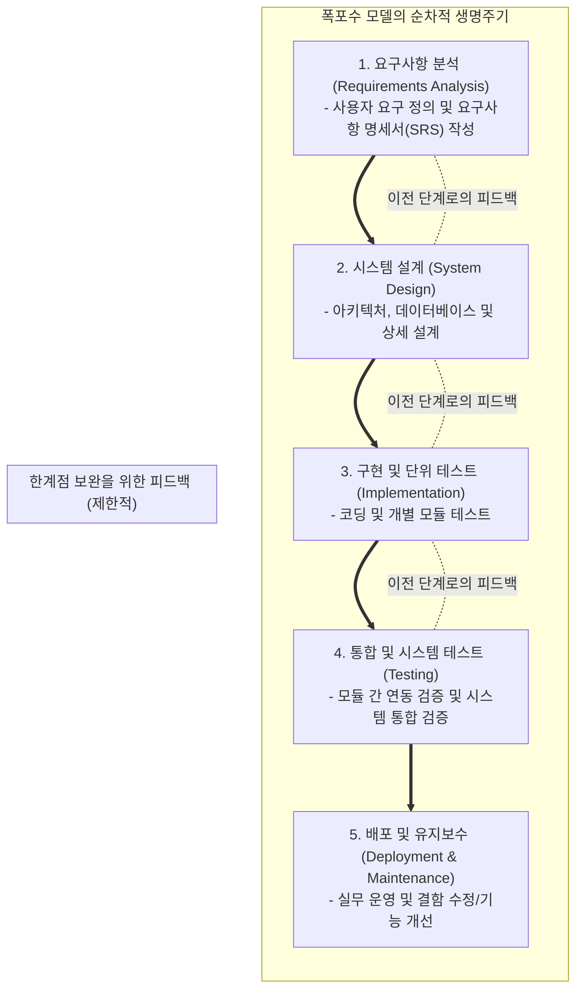

# 폭포수 모델 (Waterfall Model)

---

## I. 순차적이고 단계별 검증을 중시하는 전통적 소프트웨어 공학 모델, 폭포수 모델의 개요

* **정의**: 소프트웨어 개발 생명주기([[SDLC]])의 각 단계(요구사항 분석 $\rightarrow$ 설계 $\rightarrow$ 구현 $\rightarrow$ 테스트 $\rightarrow$ 배포 $\rightarrow$ [[유지보수]])가 폭포의 물줄기처럼 이전 단계가 완벽히 종료된 후에야 다음 단계로 순차적으로 진행되는 선형 개발 모델
* **등장 배경**: 초기 소프트웨어 개발의 혼란을 방지하고, 토목/건축 공학과 같은 전통적인 엔지니어링의 체계적이고 문서 중심적인 관리 기법을 소프트웨어 개발에 도입하기 위해 1970년대(윈스턴 로이스 등) 정립
* **특징**: 명확한 단계별 산출물(Milestone) 산출, 철저한 사전 계획과 문서화 중심, 요구사항 변경이 어려운 경직성, 프로젝트 진행 상황의 가시성이 높으나 후반부에 결함 발견 시 수정 비용 급증

---

## II. 폭포수 모델의 개념도 및 핵심 기술 요소

### 가. 폭포수 모델의 생명주기 및 단계별 흐름

* 각 단계는 철저한 검토와 승인(Phase Gate)을 거쳐 다음 단계로 넘어가는 단방향 흐름을 원칙으로 하며, 이전 단계로 돌아가는 피드백 루프는 존재하나 비용이 매우 큼

### 나. 폭포수 모델의 핵심 구성 요소 및 특징

| 구분 | 요소기술(키워드) | 세부 설명 |
| --- | --- | --- |
| **초기 단계** | 요구사항 분석 명세서 ([[요구사항 명세서|SRS]]) | 프로젝트 착수 시점에 고객의 요구사항을 완벽하고 빠짐없이 문서화하여 향후 변경을 통제하는 기준 문서 |
| **설계 단계** | 아키텍처 및 상세 설계 | 시스템의 구조, 모듈 간 인터페이스, [[데이터베이스]] [[스키마]] 등을 구현 전에 구체적으로 설계 |
| **관리 통제** | 단계별 승인 (Phase Gate) | 각 단계가 완료될 때마다 공식적인 검토 회의(Review)를 열어 품질을 검증하고 다음 단계 진입 여부 결정 |
| **산출물 중심** | 문서화 (Documentation) | 코드 자체보다 각 단계별 명세서, 설계서, 테스트 결과서 등의 문서 산출물 관리를 절대적으로 강조 |
| **한계점** | 비용의 비대칭성 (Cost Curve) | 개발 후반부(테스트 및 유지보수 단계)로 갈수록 초기 요구사항 오류나 설계를 수정하는 데 소요되는 비용이 기하급수적으로 증가 |
| **한계점** | 요구사항 변경 취약 | 프로젝트 도중에 고객이 새로운 기능을 요구하거나 환경이 바뀔 경우, 이미 지나온 단계를 되돌리기 어려워 실패 확률 증가 |

---

## III. 애자일 모델과의 비교 및 향후 전망

### 가. 폭포수 모델 vs 애자일(Agile) 방법론 비교

| 비교 항목 | [[워터폴|폭포수]] 모델 (Waterfall) | 애자일 방법론 ([[Agile]]) |
| --- | --- | --- |
| **개발 철학** | **계획 중심 (Plan-driven)** | **변화 수용 및 가치 중심 (Value-driven)** |
| **진행 방식** | 순차적, 단방향 (Linear & Sequential) | 반복적, 점진적 (Iterative & Incremental) |
| **고객 참여** | 초기 요구사항 정의 및 최종 산출물 검수 시점 | **개발 전 과정에 걸쳐 상시 참여 (Continuous)** |
| **변화 대응력** | **매우 낮음** (도중 변경 시 막대한 비용 발생) | **매우 높음** (스프린트 단위로 유연한 변경 수용) |
| **문서화 수준** | 매우 높음 (모든 단계의 상세 문서화 필수) | 상대적으로 낮음 (작동하는 소프트웨어 중심) |
| **적합한 프로젝트** | 요구사항이 명확하고 변경 가능성이 낮은 프로젝트 (국방, 항공, 대규모 인프라) | 요구사항이 유동적이고 빠른 시장 출시가 필요한 서비스 (스타트업, 앱, 웹서비스) |

### 나. 폭포수 모델의 최근 적용 동향 및 시사점

* **엄격한 규제 및 미션 크리티컬(Mission-Critical) 영역에서의 고수**: 의료기기 인증, 항공우주 제어 시스템, 원자력 발전소, 금융 핵심 원장 등 결함 발생 시 인명피해나 치명적 자산 손실로 이어지는 분야에서는 여전히 철저한 검증과 방대한 문서화를 보장하는 폭포수 기반 프로세스가 규제 준수(Compliance)의 필수 조건으로 자리 잡음
* **하이브리드(Hybrid) 프로세스로의 진화**: 순수 폭포수의 경직성과 애자일의 관리 부실 한계를 극복하기 위해, 대규모 프로젝트의 초기 아키텍처 설계와 예산 수립은 폭포수(Waterfall) 방식을 취하고, 실제 기능 구현과 개발은 반복적인 애자일 방식을 결합한 하이브리드 모델(예: Water-[[SCRUM|Scrum]]-Fall)이 엔터프라이즈 환경의 표준으로 안착 중

---

### 🔗 연관 토픽

- **소속 도메인**: [[00_소프트웨어공학_MOC|🏗️ 소프트웨어공학]]
- **세부 분류**: `1. 소프트웨어 개발 생명주기(SDLC) & 방법론`
- **핵심 연관 토픽**:
  - [[SDLC]]
  - [[Agile]]
  - [[Spiral 모델]]
  - [[반복적 개발 모델|반복적 개발 모델 (Iteration Model)]]
  - [[증분형 개발 모델|증분형 개발 모델 (Incremental Model)]]
