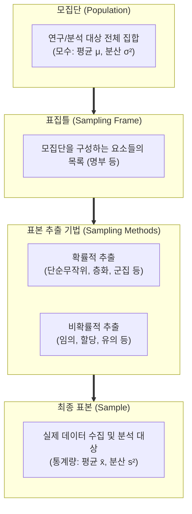

# 표본 추출 (Sampling)

---

## I. 모집단 추론의 효율성과 신뢰성을 확보하는 통계적 데이터 추출 기법, 표본 추출의 개요

* **정의**: 시간적, 비용적 제약으로 인해 모집단(Population) 전체를 조사(전수조사)할 수 없을 때, 모집단의 특성을 잘 대변할 수 있는 일부 데이터 집합인 표본(Sample)을 과학적이고 체계적인 기준으로 추출하는 통계적 기법
* **등장 배경**: 대규모 데이터 환경에서 전수조사가 불가능하거나 비효율적인 경우, 최소한의 비용과 시간으로 모집단의 모수(Parameter)를 정확하게 추정하기 위한 통계적 방법론 필요
* **특징**: 대표성(Representativeness) 확보가 성패를 좌우, 무작위성을 통한 [[편향]](Bias) 최소화, 표본 오차(Sampling Error) 관리 필수, 빅데이터 머신러닝 학습 시 데이터 리소스 최적화에 적극 활용

---

## II. 표본 추출의 개념도 및 핵심 기술 요소

### 가. 표본 추출 프로세스 및 아키텍처

* 모집단에서 표집틀(Sampling Frame)을 확정한 뒤, 특정 목적과 확률적 원리에 따라 표본을 추출하여 최종적으로 모집단의 특성을 추론함

### 나. 표본 추출의 주요 기법 및 구성 요소

| 구분 | 기법(키워드) | 세부 설명 |
| --- | --- | --- |
| **확률적 추출** | 단순무작위 추출(Simple Random) | 모집단의 모든 구성 요소가 동등한 확률로 선택될 기회를 가지는 가장 이상적인 무작위 추출 기법 |
| **확률적 추출** | 층화 표본 추출(Stratified) | 모집단을 서로 겹치지 않는 하위 그룹(계층)으로 나누고, 각 계층에서 비례 또는 무작위로 표본을 추출 (이질적 집단에 유리) |
| **확률적 추출** | 군집 표본 추출(Cluster) | 모집단을 여러 군집(Cluster)으로 나눈 뒤, 일부 군집을 통째로 선택하여 그 안의 모든 데이터를 조사 (광범위한 지리적 조사에 유리) |
| **확률적 추출** | 계통 표본 추출(Systematic) | 일정한 간격(K번째)을 두고 표본을 기계적으로 추출하는 방식 (예: 10명 마다 1명씩 선택) |
| **비확률적 추출** | 편의(임의) 추출(Convenience) | 연구자의 편의나 접근 용이성에 따라 대상을 손쉽게 선정하는 방식 (객관성 결여 우려) |
| **비확률적 추출** | 할당 표본 추출(Quota) | 모집단의 인구통계학적 비율(성별, 연령 등)에 맞춰 미리 정해진 수(할당량)만큼 비무작위로 추출 |
| **오차 통제** | 표본 오차 / 비표본 오차 | 표본 추출로 인해 발생하는 오차(표본 오차)와 조사 과정의 실수나 누락으로 발생하는 오차(비표본 오차) 구분 관리 |

---

## III. 확률적 vs 비확률적 추출 비교 및 최신 동향

### 가. 확률적 표본 추출 vs 비확률적 표본 추출 비교

| 비교 항목 | 확률적 표본 추출 (Probability Sampling) | 비확률적 표본 추출 (Non-Probability Sampling) |
| --- | --- | --- |
| **선택 기준** | **무작위성 (Randomness) 기반** (모든 요소의 추출 확률을 알 수 있음) | **주관적 기준 또는 편의** (추출 확률을 알 수 없음) |
| **통계적 추론** | **가능함** (표본 오차 및 신뢰구간 산출 가능) | 불가능함 (모집단 전체로 일반화하기 어려움) |
| **대표성** | **높음** (편향이 최소화됨) | 낮음 (선택 편향 발생 위험 큼) |
| **시간 및 비용** | 상대적으로 많이 소요됨 | **상대적으로 빠르고 경제적임** |
| **주요 활용 사례** | 학술 연구, 공식 통계조사, 품질 관리 | 탐색적 조사, 초기 시장 조사, 파일럿 테스트 |

### 나. 데이터사이언스 및 빅데이터 환경에서의 표본 추출 동향

* **불균형 데이터(Class Imbalance) 샘플링 기법 진화**: 사기 탐지(Fraud Detection)나 희귀 질병 진단 등 데이터가 극단적으로 불균형할 때, 다수 클래스를 줄이는 언더샘플링(Under-sampling)과 소수 클래스를 인공적으로 생성하는 오버샘플링(예: **SMOTE**) 기법을 결합하여 머신러닝 성능 최적화
* **스트리밍 데이터용 저수지 샘플링(Reservoir Sampling)**: 전체 데이터의 크기를 미리 알 수 없거나 끝없이 유입되는 스트리밍 환경에서, 고정된 크기의 메모리(저수지)를 유지하면서 모든 데이터가 균등한 확률로 표본에 포함되도록 실시간 추출하는 [[알고리즘]] 활용
* **빅데이터 다운샘플링(Down-sampling)과 분산 처리**: 펫바이트(Petabyte) 급 빅데이터를 단시간에 분석하기 위해, 전체 데이터셋에서 통계적 대표성을 유지하는 최적의 샘플 크기를 산출하고 아파치 스파크(Spark) 등의 분산 환경을 통해 병렬 표본 추출 수행

---

### 🔗 연관 토픽

- **소속 도메인**: [[00_인공지능_MOC|🤖 인공지능]]
- **세부 분류**: `1. 수학 · 통계학 & 데이터 전처리`
- **핵심 연관 토픽**:
  - [[편향]]
  - [[알고리즘]]
  - [[클래스 불균형|클래스 불균형(Class Imbalance)]]
  - [[모델 프리]]
  - [[Optimization Algorithm]]
