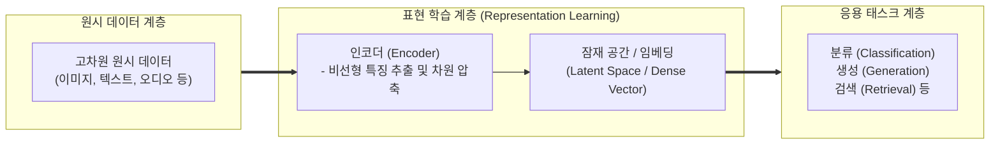

# 표현 학습 (Representation Learning)

---

## I. 수동적 특징 추출의 한계를 극복하는 자동 특징 학습 기술, 표현 학습의 개요

* **정의**: 머신러닝 모델이 원시 데이터(Raw Data)로부터 사람이 개입하는 수동적 특징 공학(Feature Engineering) 없이, 데이터의 숨겨진 구조와 핵심 의미를 내포한 저차원의 유의미한 특징(Representation/Embedding)을 스스로 학습하여 추출하는 일련의 기법
* **등장 배경**: 이미지, 텍스트, 오디오 등 고차원 비정형 데이터의 폭증, 도메인 전문가의 주관적 판단에 의존하는 기존 특징 공학의 높은 비용과 확장성 한계 극복 필요
* **특징**: 데이터의 본질적 특성을 압축하는 **잠재 공간(Latent Space)** 형성, 다운스트림 태스크(분류, 회귀 등)의 성능 극대화, [[딥러닝]] 아키텍처(오토인코더, [[트랜스포머]] 등)와의 결합을 통한 범용적 고성능 구현

---

## II. 표현 학습의 개념도 및 핵심 기술 요소

### 가. 표현 학습의 아키텍처 및 동작 원리

* 원시 데이터는 인코더(Encoder)를 거치며 데이터의 핵심 구조만 남긴 저차원의 밀집 벡터(Dense Vector) 형태의 '잠재 표현(Latent Representation)'으로 변환되며, 이는 다양한 하위 태스크의 입력으로 활용됨

### 나. 표현 학습의 핵심 구성 요소 및 기법

| 구분 | 요소기술(키워드) | 세부 설명 |
| --- | --- | --- |
| **기초 모델** | 오토인코더 (Autoencoder) | 입력 데이터를 저차원 병목(Bottleneck) 은닉층으로 압축(Encoder)했다가 원래 데이터로 복원(Decoder)하며 핵심 특징을 학습하는 비지도 신경망 |
| **표현 공간** | 잠재 공간 (Latent Space) | 고차원의 복잡한 데이터 분포를 저차원의 연속적인 벡터 공간에 투영하여, 유사한 데이터끼리 가까이 위치하도록 조직화한 공간 |
| **학습 기법** | 대조 학습 (Contrastive Learning) | 정답 레이블 없이, 유사한 데이터(Positive Pair)는 가깝게, 다른 데이터(Negative Pair)는 멀어지도록 학습하여 특징을 추출하는 자가지도 학습법 |
| **표현 형태** | 임베딩 (Embedding) | 단어, 이미지, 문장 등의 이산적 혹은 고차원 데이터를 연속적인 실수형 저차원 벡터로 변환한 표현 결과물 |
| **[[차원 축소]]** | 선형 및 비선형 기법 | 주성분 분석([[PCA(Principal Component Analysis)|PCA]]), t-SNE, UMAP 등 데이터의 시각화 및 노이즈 제거를 위해 고차원 구조를 저차원으로 투영하는 전통적 기법 |
| **최신 패러다임** | 자가지도 학습 (SSL) | 별도의 사람 손길(Label) 없이 데이터 자체의 일부를 가리고 맞추거나(Masked Modeling), 변형 간의 일관성을 학습하여 강력한 표현력 획득 |

---

## III. 전통적 특징 공학과 비교 및 최신 동향

### 가. 수동적 특징 공학 vs 표현 학습 비교

| 비교 항목 | 수동적 특징 공학 (Feature Engineering) | 표현 학습 (Representation Learning) |
| --- | --- | --- |
| **특징 추출 주체** | **도메인 전문가** (사람이 직접 설계 및 추출) | **[[인공지능]] 모델** (데이터로부터 자동 학습) |
| **데이터 확장성** | 매우 낮음 (데이터가 복잡해지면 사람이 대응 불가) | **매우 높음** (대규모 데이터와 딥러닝 구조로 확장 용이) |
| **도메인 의존도** | 매우 높음 (특정 도메인 지식에 절대적으로 종속) | 낮음 (범용적인 인코더 구조를 통해 다양한 도메인 적용 가능) |
| **대표 방식** | SIFT(컴퓨터 비전), [[TF-IDF (Term Frequency - Inverse Document Frequency)|TF-IDF]](자연어 처리) 등 | [[CNN]], Transformer, Autoencoder, Contrastive Learning 등 |

### 나. 표현 학습의 최신 활용 동향 및 시사점

* **멀티모달 표현 학습(Multimodal Representation)의 주류화**: 텍스트, 이미지, 오디오, 비디오 등 서로 다른 형태(Modal)의 데이터를 공통된 하나의 잠재 공간(Shared Latent Space)에 매핑하여 상호 이해하고 검색하는 CLIP 등의 모델이 AI 생태계의 표준으로 자리 잡음
* **파운데이션 모델의 근간**: 대규모 텍스트와 이미지로 사전 학습된 대형 언어 모델([[초거대 언어 모델|LLM]])과 비전 모델은 사실상 '가장 강력한 범용 표현 학습기'로 기능하며, 이를 통해 추출된 임베딩은 검색 증강 생성(RAG) 및 추천 시스템의 핵심 인프라로 활용됨

---

### 🔗 연관 토픽

- **소속 도메인**: [[00_인공지능_MOC|🤖 인공지능]]
- **세부 분류**: `1. 수학 · 통계학 & 데이터 전처리`
- **핵심 연관 토픽**:
  - [[차원 축소|차원 축소(Dimensionality Reduction)]]
  - [[딥러닝]]
  - [[CNN|CNN (Convolutional Neural Network)]]
  - [[PCA(Principal Component Analysis)]]
  - [[TF-IDF (Term Frequency - Inverse Document Frequency)]]
