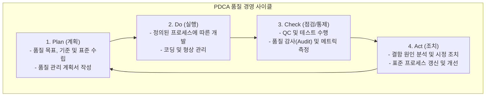

# 품질관리 (Quality Control & Assurance)

---

## I. 제품과 프로세스의 무결성을 보장하는 체계적 관리 체계, 품질관리의 개요

* **정의**: 개발되는 소프트웨어 제품이나 서비스가 사용자의 요구사항과 정해진 품질 기준(Standards)을 충족하는지 검증하고, 결함을 예방하며 지속적인 [[프로세스]] 개선을 수행하는 총체적인 관리 활동
* **등장 배경**: 소프트웨어 규모와 복잡도의 기화급수적 증가, 품질 실패로 인한 막대한 사회적·경제적 비용 발생, 객관적인 프로세스 성숙도([[CMMI]], ISO 등) 인증 및 품질 보증(QA) 체계 요구 증대
* **특징**: 프로세스 중심의 사전 예방 활동인 품질 보증(QA)과 산출물 중심의 사후 검증 활동인 품질 통제(QC)의 조화, [[PDCA(Plan-Do-Check-Act, Deming Cycle)|PDCA]] 사이클 기반의 지속적 개선, 고객 만족(Customer Satisfaction) 극대화

---

## II. 품질관리의 개념도 및 핵심 기술 요소

### 가. 품질관리의 PDCA 사이클 및 아키텍처

* 품질관리는 일회성 행사가 아닌 Plan-Do-Check-Act의 순환 고리를 통해 지속적으로 품질 수준을 높여가는 체계적인 피드백 루프를 핵심으로 함

### 나. 품질관리의 핵심 구성 요소 및 기법

| 구분 | 요소기술(키워드) | 세부 설명 |
| --- | --- | --- |
| **관리 영역** | QA (Quality Assurance) | **프로세스 중심**. 정해진 개발 표준과 절차가 올바르게 준수되는지 감시하고 결함을 사전에 예방하는 활동 |
| **관리 영역** | QC (Quality Control) | **제품(산출물) 중심**. 완성된 코드나 결과물이 요구사항에 부합하는지 테스트하고 결함을 발견 및 교정하는 활동 |
| **비용 모델** | CoQ (Cost of Quality) | 품질 관리에 소요되는 총비용으로, 예방 비용(Prevention)과 평가 비용(Appraisal)을 늘려 내부/외부 실패 비용(Failure)을 최소화하는 전략 |
| **국제 표준** | ISO/IEC 25010 | 소프트웨어 제품 품질 모델 표준. 기능 적합성, 성능 효율성, 호환성, 사용성, [[신뢰성]], 보안성 등 평가 기준 제공 |
| **프로세스 성숙도** | CMMI / SP (소프트웨어 프로세스) | 조직의 소프트웨어 개발 및 관리 프로세스 성숙도를 평가하고 단계별 개선 체계를 제시하는 모델 |
| **통계 기법** | SPC (Statistical Process) | 관리도(Control Chart), 파레토 차트, 6시그마 등을 활용하여 공정의 변동성을 통계적으로 분석하고 관리 |
| **산출물 관리** | [[형상 관리]] ([[SCM (Supply Chain Management)|SCM]]) | 소스코드 및 문서의 변경 이력을 체계적으로 통제하여 무단 변경을 방지하고 품질의 일관성 유지 |

---

## III. QA vs QC 비교 및 최신 동향

### 가. 품질 보증(QA)과 품질 통제(QC) 비교

| 비교 항목 | 품질 보증 (Quality Assurance, QA) | 품질 통제 (Quality Control, QC) |
| --- | --- | --- |
| **초점 및 대상** | **프로세스 (Process)** 중심 (어떻게 만들 것인가) | **제품 (Product)** 중심 (결과물이 잘 만들어졌는가) |
| **주요 목적** | 결함 **예방** (Defect Prevention) | 결함 **발견 및 수정** (Defect Detection) |
| **수행 시점** | 프로젝트 전 주기에 걸쳐 상시 수행 | 개발 완료 시점 또는 단위/[[통합 테스트]] 단계 |
| **수행 주체** | 독립적인 QA 팀 또는 프로세스 관리자 | 개발자, 테스터, 품질 통제 담당자 |
| **대표 활동** | 프로세스 감사(Audit), 표준 제정, 교육 | 단위/통합 테스트, 코드 리뷰, 결함 트래킹 |

### 나. 품질관리의 최신 기술 동향 및 시사점

* **[[DevSecOps]]와 지속적 품질 보증(Continuous Quality)**: 개발(Dev)과 보안(Sec), 운영(Ops)이 결합된 환경에서, 빌드 및 배포 파이프라인에 정적/동적 분석([[SAST]]/[[DAST]])과 자동화된 테스트를 결합하여 품질 검증 단계를 실시간 자동화
* **AI 기반 품질 예측 및 테스트 자동화**: 머신러닝을 활용하여 과거 결함 데이터로부터 버그 발생 확률이 높은 모듈을 예측하고, 생성형 AI를 통해 테스트 케이스를 자동 생성함으로써 품질관리의 효율성을 극대화하는 추세

---

### 🔗 연관 토픽

- **소속 도메인**: [[00_프로젝트관리_MOC|📋 프로젝트관리]]
- **세부 분류**: `3. 소프트웨어 원가 산정 & 성과 관리 (Cost & EVM)`
- **핵심 연관 토픽**:
  - [[DevSecOps]]
  - [[SAST]]
  - [[DAST]]
  - [[PDCA(Plan-Do-Check-Act, Deming Cycle)]]
  - [[SCM (Supply Chain Management)]]
