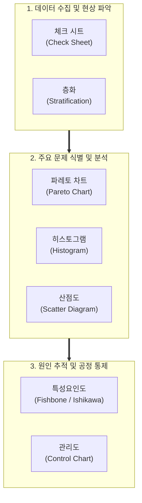

# 품질통제도구, QC 7 (Seven Basic Quality Control Tools)

---

## I. 품질 문제의 발견부터 원인 분석까지 아우르는 통계적 분석 도구, QC 7의 개요

* **정의**: 제조 및 소프트웨어 공정 등에서 발생하는 품질 문제를 파악하고, 데이터를 수집하며, 통계적 기법을 통해 원인을 분석하고 해결하기 위해 활용되는 7가지 기본 품질 통제 도구 (이시카와 가오루 박사 체계화)
* **등장 배경**: 현장의 품질 문제를 직관이나 경험에 의존하지 않고, 객관적인 데이터와 통계적 사실에 기반하여 누구나 쉽게 분석하고 개선할 수 있는 표준화된 방법론 필요
* **특징**: 직관적인 시각화(Grafical Visualization), 통계적 데이터 분석의 간소화, 품질 보증(QA) 및 품질 통제(QC) 활동 전반에 걸쳐 가장 광범위하게 활용되는 기초 도구 모음

---

## II. QC 7 도구의 개념도 및 핵심 기술 요소

### 가. 품질 문제 해결을 위한 QC 7 도구의 연계 구조

* 현장의 데이터를 체크 시트와 층화로 체계적으로 수집한 뒤, 파레토 차트와 히스토그램으로 핵심 문제를 도출하고, 특성요인도와 산점도로 근본 원인을 규명한 후 관리도로 공정을 지속 통제함

### 나. QC 7가지 도구의 핵심 내용 및 세부 설명

| 번호 | 도구명 (Tool) | 핵심 목적 및 설명 | 주요 활용 사례 |
| --- | --- | --- | --- |
| **1** | **체크 시트 (Check Sheet)** | 데이터를 쉽고 체계적으로 수집하고 기록할 수 있도록 미리 항목을 설계한 표나 양식 | 결함 유형별 발생 횟수 기록, 검사 항목 체크 |
| **2** | **파레토 차트 (Pareto)** | 발생 빈도가 높은 순서대로 항목을 정렬하고 누적 백분율을 표시하여 **핵심 소수의 원인(80/20 법칙)** 식별 | 전체 불량 중 가장 큰 비중을 차지하는 상위 결함 원인 도출 |
| **3** | **히스토그램 (Histogram)** | 수치 데이터의 분포 형태, 중심 경향, 산포(퍼짐 정도)를 직관적으로 파악하기 위한 도수포함 막대그래프 | [[프로세스]] 결과물이 규격 한계 내에 정상적으로 분포하는지 확인 |
| **4** | **특성요인도 (Ishikawa / Fishbone)** | 결과(특성)에 영향을 미치는 원인(요인)들을 뼈대 모양(생선 뼈 구조)으로 분류하여 인과관계를 체계적으로 분석 | 결함 발생의 근본 원인을 4M1E(Man, Machine, Material, Method, Environment) 관점에서 도출 |
| **5** | **산점도 (Scatter Diagram)** | 두 변수 간의 상관관계(양의 상관, 음의 상관, 무상관)를 점으로 표시하여 데이터 간 [[연관성 분석]] | 공정 온도와 제품 강도 간의 상관관계 분석 |
| **6** | **층화 (Stratification)** | 전체 데이터를 성격이 다른 몇 개의 그룹(하위 집단)으로 나누어 데이터의 숨겨진 특징 파악 | 작업자별, 장비별, 원자재 롯지별 불량률 비교 분석 |
| **7** | **관리도 (Control Chart)** | 시간에 따른 공정 데이터의 변동을 상/하한 관리선(UCL/LCL)과 비교하여 공정이 **안정 상태**인지 판별 | 우연 변동과 이상 변동을 식별하여 공정 이탈을 실시간 경고 |

---

## III. 전통적 QC 7 도구와 신 QC 7 도구 비교 및 최신 동향

### 가. QC 7 도구 (수치/통계 중심) vs 신 QC 7 도구 (언어/관리 중심)

| 비교 항목 | 전통적 QC 7 도구 (QC 7) | 신 QC 7 도구 (New QC 7 / N7) |
| --- | --- | --- |
| **분석 대상** | **수치 데이터 (Numerical Data)** 기반의 정량적 분석 | **언어 데이터 (Verbal Data)** 기반의 정성적 관리 |
| **주요 목적** | 공정의 통제, 결함 원인 규명, 수치적 품질 개선 | 복잡한 기획, 문제 구조화, 프로젝트 일정 및 전략 관리 |
| **대표 도구** | 관리도, 파레토 차트, 히스토그램, 특성요인도 등 | 친화도법, 연관도법, 계통도법, 매트릭스 도법, PDPC 등 |
| **적용 단계** | 주로 제조 및 개발 이후의 **실행 및 통제(Control)** 단계 | 기획 초기 단계, 요구사항 정의 및 **전략 수립(Planning)** 단계 |

### 나. 품질 통제 도구의 최신 IT 적용 동향 및 시사점

* **실시간 자동화 SPC(Statistical Process Control) 도입**: 전통적으로 수작업으로 그리던 관리도와 히스토그램을 [[MES]](제조실행시스템)나 APM(애플리케이션 성능 관리) 도구와 연동하여, 로그와 센서 데이터를 실시간으로 수집하고 관리선 이탈 시 자동으로 경보를 울리는 디지털 체계로 전환
* **AI 및 머신러닝 기반의 이상 탐지([[Anomaly(이상현상)|Anomaly]] Detection)**: 단순한 통계적 관리선(UCL/LCL)을 넘어, 머신러닝 모델이 복잡한 다변수 데이터의 패턴을 학습하여 인간이 발견하기 힘든 미세한 공정 이상 징후를 선제적으로 예측하고 특성요인 분석을 보조하는 형태로 진화

---

### 🔗 연관 토픽

- **소속 도메인**: [[00_프로젝트관리_MOC|📋 프로젝트관리]]
- **세부 분류**: `4. 품질 보증 · 위험 관리 & 정보시스템 감리`
- **핵심 연관 토픽**:
  - [[프로세스]]
  - [[Anomaly(이상현상)]]
  - [[위험 대응]]
  - [[연관성 분석]]
  - [[MES|MES (Manufacturing Execution System)]]
