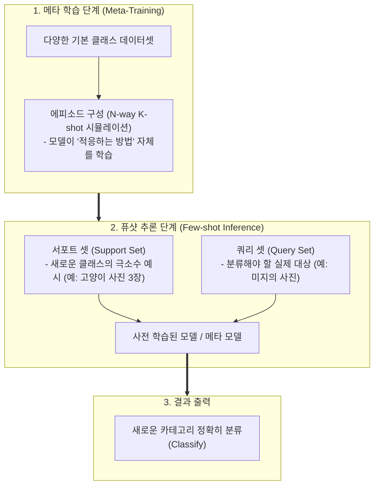

# 퓨샷 러닝 (Few-shot Learning)

---

## I. 최소한의 데이터로 새로운 태스크에 적응하는 인공지능 학습 기법, 퓨샷 러닝의 개요

* **정의**: 대규모 사전 학습을 통해 획득한 사전 지식을 바탕으로, 새로운 클래스나 태스크에 대해 극소수(통상 1개~수개)의 레이블링된 예시(Support Set)만을 주입하여 신속하게 학습하고 분류/추론을 수행하는 메타 학습(Meta-Learning) 기반 머신러닝 기법
* **등장 배경**: 전통적인 딥러닝이 높은 성능을 내기 위해 클래스당 수만 장의 방대한 레이블 데이터(Labeled Data)를 요구하는 비용과 시간적 한계 극복, 인간이 단 몇 장의 사진만 보고도 새로운 대상을 인식하는 인지 방식을 모방할 필요성 대두
* **특징**: 데이터 부족(Data Scarcity) 환경에 최적화, '학습하는 법을 배우는(Learning to Learn)' 메타 학습 패러다임 적용, 대형 언어 모델([[초거대 언어 모델|LLM]]) 환경에서는 프롬프트 내 예시 제공 방식(In-Context Learning)으로 진화

---

## II. 퓨샷 러닝의 개념도 및 핵심 기술 요소

### 가. 퓨샷 러닝의 에피소드 기반 학습 및 추론 아키텍처

* 모델은 메타 학습 단계를 통해 '적은 데이터로 빠르게 규칙을 유추하는 능력'을 함양하며, 추론 시점에 몇 개의 서포트 셋(Support Set)만 제공받아도 별도의 가중치 재학습 없이 쿼리 데이터를 정확히 분류함

### 나. 퓨샷 러닝의 핵심 기술 및 구성 요소

| 구분 | 요소기술(키워드) | 세부 설명 |
| --- | --- | --- |
| **학습 단위** | N-Way K-Shot | 퓨샷 학습의 구조를 정의하는 용어. **N-Way**(분류해야 할 [[클래스]] 수)와 **K-Shot**(클래스당 제공되는 샘플 수, 예: 5-way 1-shot) |
| **데이터 구성** | 서포트 셋 / 쿼리 셋 | 모델에게 참고용으로 제공되는 소수의 예시 집합(**Support Set**)과 실제 정답을 예측해야 하는 대상 집합(**Query Set**) |
| **접근 방식** | 메타 학습 (Meta-Learning) | '학습을 위한 학습'. 다양한 태스크를 경험하며 모델이 새로운 태스크를 마주했을 때 최소한의 업데이트로 최적의 성능을 내도록 최적화 |
| **접근 방식** | 거리 기반 메타 모델 (Prototypical Networks) | 서포트 셋의 데이터들을 임베딩 공간상에서 각 클래스의 대표 프로토타입(중심점)으로 정의하고, 쿼리 데이터와의 거리(Distance)를 측정하여 분류 |
| **LLM 영역** | 문맥 내 학습 (In-Context Learning) | 거대 언어 모델에서 파라미터를 수정하지 않고, 프롬프트 내에 몇 가지 모범 답안(Few-shot examples)을 제시하여 원하는 출력을 유도하는 기법 |

---

## III. 유사 학습 기법 비교 및 최신 동향

### 가. 제로샷(Zero-shot), 퓨샷(Few-shot), 파인튜닝(Fine-tuning) 비교

| 비교 항목 | 제로샷 러닝 (Zero-shot) | 퓨샷 러닝 (Few-shot) | [[파인 튜닝]] ([[Fine-Tuning|Fine-tuning]]) |
| --- | --- | --- | --- |
| **필요한 타겟 데이터** | **전혀 없음 (0개)** | **극소수 (1개 ~ 수개)** | **대규모 도메인 데이터 (수백~수천 개 이상)** |
| **모델 가중치 수정** | 수정 없음 (사전 학습 모델 그대로 활용) | 주로 수정 없음 (또는 극히 일부 조정) | **전체 또는 일부 가중치(Weights) 업데이트** |
| **주요 메커니즘** | 의미론적 기술(Description)이나 프롬프트 지시어 활용 | 서포트 셋의 예시(Context)를 통한 패턴 유추 | 도메인 특화 데이터로 모델 재학습 |
| **구축 비용 및 시간** | 최소 (데이터 수집 불필요) | 낮음 | 높음 (컴퓨팅 자원 및 데이터 정제 소요) |

### 나. 퓨샷 러닝의 최신 동향 및 시사점

* **거대 언어 모델(LLM)과 멀티모달의 기본 인터페이스로 정착**: 과거에는 CV(컴퓨터 비전) 분야의 소수 데이터 분류를 위해 MAML이나 프로토타이컬 네트워크 등 별도의 메타 학습 알고리즘을 구현해야 했으나, 최근에는 GPT-4, Gemini 등 파운데이션 모델의 등장으로 프롬프트 상에서 몇 줄의 예시만 적어주는 **In-Context Few-shot Prompting**이 사실상 표준 퓨샷 러닝 기법으로 자리 잡음
* **ICL(In-Context Learning)의 원리 규명 연구 활발**: LLM이 퓨샷 프롬프트(예시)를 입력받았을 때 왜 가중치 업데이트 없이도 새로운 작업을 수행할 수 있는지에 대한 내부 메커니즘(암묵적 기울기 하강 효과 등)을 이론적으로 규명하고, 퓨샷 성능을 극대화하기 위한 프롬프트 최적화 연구가 활발히 진행 중

---

### 🔗 연관 토픽

- **소속 도메인**: [[00_인공지능_MOC|🤖 인공지능]]
- **세부 분류**: `2. 머신러닝 기초 & 핵심 알고리즘`
- **핵심 연관 토픽**:
  - [[Fine-Tuning]]
  - [[파인 튜닝|파인 튜닝(Fine-tuning)]]
  - [[지도학습]]
  - [[초거대 언어 모델|초거대 언어 모델(Large Language Model)]]
  - [[인공지능 감리|인공지능 감리 (AI Audit)]]
