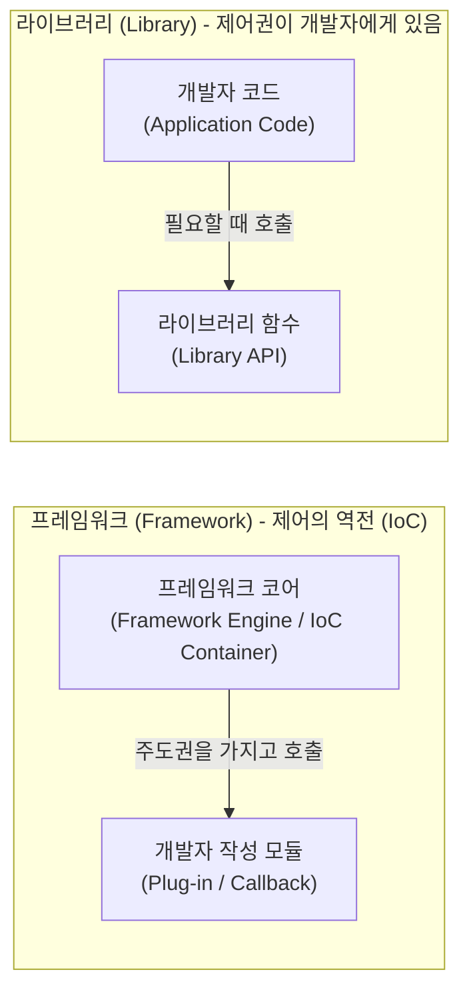

# 프레임워크 (Framework)

---

## I. 소프트웨어 개발의 뼈대와 표준을 제공하는 재사용 가능한 아키텍처, 프레임워크의 개요

* **정의**: 애플리케이션의 기본 구조, 공통 라이브러리, 제어 흐름 등을 미리 구현해 놓은 반제품 형태의 소프트웨어 뼈대로, 개발자가 비즈니스 로직에만 집중할 수 있도록 표준화된 개발 환경을 제공하는 플랫폼
* **등장 배경**: 유사한 기능을 반복해서 구현하는 중복 개발 방지, 프로젝트마다 달라지는 아키텍처 품질 편차 해소, 표준화된 기술 스택을 통한 유지보수성 및 확장성 극대화 필요성 대두
* **특징**: 제어의 역전(IoC: Inversion of Control) 적용, 확장 가능한 아키텍처(Extensibility), 일관된 코딩 표준 및 설계 철학 제공, 개발 생산성 및 품질의 상향 평준화 도모

---

## II. 프레임워크의 개념도 및 핵심 기술 요소

### 가. 프레임워크와 라이브러리의 제어 흐름 비교 (Inversion of Control)

* 라이브러리는 개발자가 주도권을 갖고 필요할 때 호출하여 사용하는 도구인 반면, 프레임워크는 전체적인 제어 흐름(Control Flow)을 프레임워크가 쥐고 있으며 개발자가 작성한 코드를 적절한 시점에 호출하는 **제어의 역전(IoC)** 구조를 가짐

### 나. 프레임워크의 핵심 기술 및 구성 요소

| 구분 | 요소기술(키워드) | 세부 설명 |
| --- | --- | --- |
| **핵심 원리** | 제어의 역전 (IoC) | 프로그램의 흐름 주도권이 개발자가 아닌 프레임워크에 있어, 정해진 생명주기에 따라 개발자 코드가 실행되는 구조 |
| **[[결합도]] 낮추기** | 의존성 주입 (DI) | 객체 간의 의존 관계를 외부(프레임워크 [[컨테이너]])에서 주입하여 모듈 간 결합도를 낮추고 테스트 용이성 확보 |
| **확장성 보장** | 템플릿과 훅 (Template & Hook) | 전체적인 흐름(템플릿)은 고정하되, 특정 부분에서 개발자가 커스텀 로직을 끼워 넣을 수 있도록 제공하는 확장 지점(Hook) |
| **아키텍처 패턴** | [[디자인 패턴]] 내장 | MVC, [[MVVM (Model, View, View Model)|MVVM]], ORM 등 검증된 아키텍처 패턴을 기본 탑재하여 아키텍처 설계 오류를 사전에 방지 |
| **자동화 기능** | 상용구 코드 제거 (Boilerplate) | [[데이터베이스]] 연결, 예외 처리, 보안 인증 등 반복적으로 작성해야 하는 공통 코드를 프레임워크가 자동 처리 |

---

## III. 라이브러리와의 비교 및 최신 동향

### 가. 프레임워크 (Framework) vs 라이브러리 (Library) 비교

| 비교 항목 | 프레임워크 (Framework) | 라이브러리 (Library) |
| --- | --- | --- |
| **제어의 주도권** | **프레임워크가 가짐 (IoC)** | **개발자가 가짐** |
| **구조적 성격** | 애플리케이션의 **전체 뼈대 (Skeleton)** | 특정 기능을 수행하는 **도구 모음 (Toolbox)** |
| **자유도 및 제약** | 규격화된 규칙을 따르므로 자유도는 낮으나 일관성 높음 | 개발자가 원하는 대로 조합하여 사용하므로 자유도 높음 |
| **러닝 곡선** | 가파름 (프레임워크의 철학과 규칙 학습 필요) | 완만함 (필요한 함수나 API만 골라서 학습 가능) |
| **대표 사례** | Spring, Django, React, Next.js, .NET | Lodash, Axios, NumPy, jQuery |

### 나. 프레임워크의 최신 트렌드 및 시사점

* **컨벤션 오버 구성(Convention over Configuration)의 보편화**: 과거 복잡한 [[XML]] 설정 파일이 필요했던 것과 달리, 현대의 프레임워크(예: Spring Boot, Ruby on Rails, Next.js)는 명확한 명명 규칙과 기본 설정(Convention)을 제공하여 최소한의 설정만으로 즉시 개발을 시작할 수 있도록 진화
* **서버리스 및 마이크로서비스([[MSA (Micro Service Architecture)|MSA]]) 최적화 초경량 프렌드**: 모놀리식 환경에 적합했던 거대 프레임워크에서 벗어나, 컨테이너 환경에서 빠른 기동과 낮은 메모리 점유율을 자랑하는 초경량, 반응형(Reactive) 프레임워크(예: Quarkus, FastAPI, Spring WebFlux)가 [[클라우드 네이티브]] 표준으로 부상

---

### 🔗 연관 토픽

- **소속 도메인**: [[00_소프트웨어공학_MOC|🏗️ 소프트웨어공학]]
- **세부 분류**: `4. 아키텍처 스타일 & 객체지향 설계 원리`
- **핵심 연관 토픽**:
  - [[MSA (Micro Service Architecture)]]
  - [[MVVM (Model, View, View Model)]]
  - [[클라우드 네이티브]]
  - [[재사용]]
  - [[결합도]]
