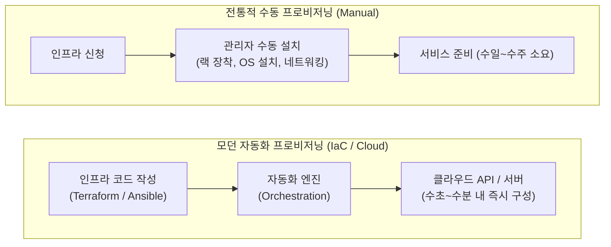

# 프로비저닝 (Provisioning)

---

## I. IT 자원의 신속하고 체계적인 할당 및 설정 관리 기술, 프로비저닝의 개요

* **정의**: 사용자나 시스템의 요구에 맞추어 서버, 스토리지, 네트워크, 소프트웨어, 계정 등 IT 인프라 자원을 사용 가능한 상태로 준비하고 구성(Configuration)하여 할당하는 일련의 과정
* **등장 배경**: 과거 물리적 하드웨어를 직접 구매하고 조립하여 OS를 설치하던 수동 방식의 긴 리드타임(Lead time) 극복, 클라우드 및 [[가상화]] 환경 확장에 따른 신속하고 동적인 자원 배포 필요성 대두
* **특징**: 수동 개입을 최소화하는 자동화(Automation), 인프라를 코드로 정의하는 인프라스트럭처 as Code(IaC)와의 결합, 자원의 유연한 확장(Scalability) 및 일관된 구성 보장

---

## II. 프로비저닝의 개념도 및 핵심 기술 요소

### 가. 전통적 프로비저닝과 자동화(IaC) 프로비저닝 아키텍처 비교

* 과거의 프로비저닝은 사람이 직접 개입하여 하드웨어를 세팅하느라 오랜 시간이 소요되었으나, 모던 인프라 환경에서는 코드로 정의된 설정값을 자동화 엔진이 읽어 즉시 자원을 생성하고 구성함

### 나. 프로비저닝의 주요 유형 및 핵심 구성 요소

| 구분 | 요소기술(키워드) | 세부 설명 |
| --- | --- | --- |
| **대상 영역** | 서버 프로비저닝 (Server) | 가상 머신(VM)이나 물리 서버를 생성하고, OS 패치, 미들웨어 및 런타임 환경을 세팅하는 작업 |
| **대상 영역** | 네트워크 프로비저닝 | [[라우터]], [[스위치 (Layer 3 Switch)|스위치]], [[방화벽]], [[VPN]] 등 네트워크 연결 및 트래픽 경로를 설정하고 최적화하는 작업 |
| **대상 영역** | 스토리지 프로비저닝 | SAN/[[NAS]] 등 대용량 저장 공간을 할당하고, 동적(Dynamic) 볼륨 배포나 [[RAID]] 구성을 설정하는 작업 |
| **대상 영역** | 사용자 프로비저닝 ([[IAM]]) | 신규 입사자나 고객에게 시스템 접근 권한, 이메일, 사내 애플리케이션 계정을 생성하고 관리하는 작업 |
| **핵심 방법론** | IaC (Infrastructure as Code) | 서버나 네트워크 설정을 수동으로 하지 않고, 코드(스크립트)로 작성하여 버전 관리 및 자동 배포하는 패러다임 |
| **대표 도구** | 테라폼 (Terraform) / 앤서블 (Ansible) | 인프라 생성(Provisioning)을 담당하는 선언형 도구(Terraform)와 OS 및 소프트웨어 구성(Configuration)을 담당하는 도구(Ansible) |

---

## III. 전통적 방식과의 비교 및 최신 동향

### 가. 수동 프로비저닝 vs 자동화(IaC) 프로비저닝 비교

| 비교 항목 | 전통적 수동 프로비저닝 (Manual) | 자동화 / IaC 프로비저닝 (Automated) |
| --- | --- | --- |
| **소요 시간** | 수일에서 수주 (Human Bottleneck) | **수초 ~ 수분 이내 (자동 실행)** |
| **휴먼 에러** | 발생 가능성 높음 (설정 누락 및 수동 실수) | **매우 낮음 (코드로 검증된 일관된 배포)** |
| **이력 관리** | 문서 기반 관리로 변경 이력 추적 어려움 | **Git 등을 통한 버전 관리 및 변경 추적 용이** |
| **확장성 (Scalability)** | 트래픽 급증 시 즉각적 대응 불가 | **오토스케일링 및 코드를 통한 무한 복제 가능** |
| **환경 일관성** | 개발, 테스트, 운영 환경 간 불일치 발생 잦음 | 동일한 코드를 사용하므로 환경 간 완벽한 일치 보장 |

### 나. 프로비저닝의 최신 기술 동향 및 시사점

* **GitOps 기반의 인프라 관리**: 인프라 프로비저닝 코드(Terraform 등)를 Git 저장소에 저장하고, 저장소의 변경(Merge)이 일어날 때 자동으로 클라우드 인프라에 반영되도록 동기화하는 GitOps 파이프라인이 엔터프라이즈 인프라 운영의 표준으로 정착
* **제로 터치 프로비저닝(ZTP, Zero Touch Provisioning)**: 네트워크 장비나 엣지([[EDGE|Edge]]) 디바이스가 현장에 설치되어 전원이 켜지는 순간, 중앙 서버에서 자동으로 설정 파일을 내려받아 사람의 개입 없이 스스로 프로비저닝을 완료하는 기술 확산

---

### 🔗 연관 토픽

- **소속 도메인**: [[00_네트워크_MOC|🌐 네트워크]]
- **세부 분류**: `1. OSI 7계층 & 데이터링크 계층 (L1/L2)`
- **핵심 연관 토픽**:
  - [[가상화]]
  - [[IAM]]
  - [[스위치 (Layer 3 Switch)]]
  - [[라우터]]
  - [[NFV]]
