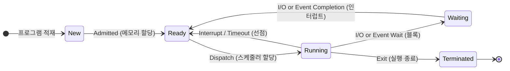

# 프로세스 관리 (Process Management)

---

## I. 시스템 자원 최적화 및 멀티태스킹의 핵심, 프로세스 관리의 개요

* **정의**: [[OS(운영체제)|운영체제]](OS)가 실행 중인 프로그램(Process)에 대해 생성, [[스케줄링]], 동기화, 통신, 소멸에 이르는 전체 수명주기(Lifecycle)를 제어하고 자원을 효율적으로 배분하는 메커니즘
* **배경 및 특징**:
* **자원 활용 극대화**: [[CPU]] 유휴 시간 최소화 및 시스템 [[처리량]](Throughput), [[응답시간]](Response Time) 최적화
* **격리 및 보호**: [[가상 메모리]] 기반 독립 실행 공간 보장 및 [[프로세스]] 간 침범 방지

---

## II. 프로세스 상태 전이도 및 프로세스 관리 핵심 요소

### 가. 프로세스 상태 전이 모델 및 제어 메커니즘

* OS는 PCB([[PCB(Process Control Block)|Process Control Block]])를 기반으로 상태를 관리하며, [[스케줄러]] 알고리즘에 의해 CPU 할당(Dispatch) 및 [[문맥 교환]](Context Switching)을 수행

### 나. 프로세스 관리의 핵심 기술 요소

| 구분 | 요소 기술/개념 | 세부 설명 |
| --- | --- | --- |
| **제어 구조** | PCB (Process Control Block) | PID, PC, 레지스터 집합, 메모리 포인터, 파일 디스크립터 등을 저장하는 핵심 [[커널]] 자료구조 |
| **실행 전환** | Context Switching | 실행 중인 프로세스의 레지스터/상태를 PCB에 저장하고 새 프로세스 상태를 복원하는 과정 (오버헤드 발생) |
| **스케줄링** | 선점형 (Preemptive) | OS가 강제로 CPU 사용권을 회수 가능 (Round Robin, SRT, Multi-Level Feedback [[Queue]]) |
| **스케줄링** | 비선점형 (Non-Preemptive) | 프로세스가 자발적으로 반환할 때까지 점유 (FCFS, SJF, HRRN) |
| **프로세스 동기화** | Critical Section / Mutex | 공유 자원에 단 하나의 프로세스만 접근하도록 상호 배제(Mutual Exclusion) 보장 |
| **프로세스 동기화** | Semaphore | 가용 자원의 개수를 정수형 변수로 관리하여 $P$(Wait), $V$(Signal) 연산으로 동시 접근 제어 |
| **프로세스 통신** | IPC (Inter-Process Comm.) | 독립된 주소 공간 간 데이터 교환 메커니즘 (Shared Memory, Message Queue, Pipe, Socket) |
| **예외 관리** | Deadlock 처리 | 상호 배제, 점유 대기, 비선점, 환형 대기 4대 조건에 대해 예방, 회피(Banker's), 탐지 및 복구 수행 |

---

## III. 프로세스 vs 스레드 비교 및 최신 동향

### 가. 프로세스와 스레드의 핵심 비교

| 비교 항목 | 프로세스 (Process) | 스레드 (Thread) |
| --- | --- | --- |
| **정의** | 운영체제로부터 자원을 할당받는 작업의 단위 | 프로세스 내에서 실행 흐름을 구성하는 CPU 스케줄링 단위 |
| **자원 공유** | 독자적인 메모리 영역(Code, Data, Heap, [[Stack]]) 유지 | Code, Data, Heap 영역을 공유, Stack 및 PC 레지스터만 독자 할당 |
| **통신 비용** | IPC 필요 (커널 개입, 통신 오버헤드 큼) | 프로세스 내부 힙 메모리 공유로 데이터 전달 신속 (동기화 이슈 존재) |
| **문맥 교환 오버헤드** | 가상 메모리 매핑 전환, [[캐시 플러시]] 등으로 큼 | TCB 단위 레지스터 교환만 수행하므로 오버헤드 작음 |

### 나. 최신 동향 및 적용 방향

* **경량 실행 단위(Goroutine, Java Virtual Threads)**: OS 커널 레벨의 스레드 한계를 극복하기 위해 사용자 영역(User-space)에서 다수의 동시성을 처리하는 유저 레벨 그린 스레드 도입 확산
* **[[컨테이너]] 기반 프로세스 격리**: Linux Cgroups(자원 제한)와 Namespaces(격리)를 활용하여 프로세스를 경량 [[가상화]] 단위([[도커|Docker]], Pod)로 격리·오케스트레이션(Kubernetes)하는 아키텍처가 표준으로 정착

---

### 🔗 연관 토픽

- **소속 도메인**: [[00_운영체제_MOC|⚙️ 운영체제]]
- **세부 분류**: `1. 프로세스 & 스레드 관리`
- **핵심 연관 토픽**:
  - [[OS(운영체제)]]
  - [[프로세스]]
  - [[커널|커널(Kernel)]]
  - [[스케줄링]]
  - [[처리량]]
