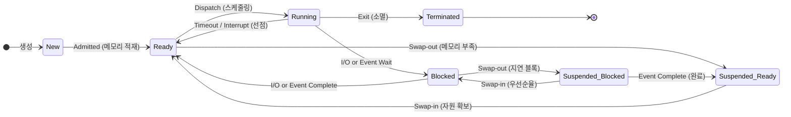

# 프로세스 상태 전이도 (Process State Transition Diagram)

---

## I. 프로세스 수명주기 제어 메커니즘, 프로세스 상태 전이도의 개요

* **정의**: 프로세스가 생성된 후 종료될 때까지 [[CPU]], 메모리, I/O 등 시스템 자원 할당 상태의 변화를 이벤트 기반으로 도식화한 운영체제의 핵심 생명주기(Lifecycle) 모델
* **배경 및 목적**:
* **멀티프로그래밍 극대화**: 제한된 CPU 자원을 복수의 프로세스가 효율적으로 분할 점유하도록 상태 제어
* **[[스케줄링]] 효율성**: 큐([[Queue]]) 기반 상태 분류를 통해 스케줄러의 [[디스패치]] 및 자원 회수 정책 신속 수행

---

## II. 프로세스 상태 전이 모델 및 전이 이벤트·핵심 요소

### 가. 7-상태 프로세스 전이 모델 (중단 상태 포함)

* 메인 메모리 부족 시 [[가상 메모리]](Swap Space)로 방출하는 중단(Suspended) 상태를 포함하여 자원 고갈을 방지하고 멀티태스킹의 안정성을 유지

### 나. 프로세스 상태 전이 이벤트 및 핵심 기술 요소

| 구분 | 전이 단계 / 요소 | 세부 설명 |
| --- | --- | --- |
| **상태** | New / Terminated | [[프로세스]] 생성 단계([[PCB(Process Control Block)|PCB]] 할당 전후) 및 실행 종료 후 자원 반환 단계(Zombie/Orphan 제어) |
| **상태** | Ready / Running | 메모리에 적재되어 CPU 할당 대기 상태 / CPU를 점유하여 실제 명령어를 수행 중인 상태 |
| **상태** | Blocked (Waiting) | I/O 작업 완료 또는 특정 이벤트 발생 시까지 대기 큐에서 CPU 사용권 포기 상태 |
| **상태** | Suspended (중단) | 메모리 공간 부족으로 프로세스가 디스크 Swap 영역으로 쫓겨난 상태(Suspended Ready/Blocked) |
| **전이 이벤트** | Dispatch | Ready $\rightarrow$ Running 전이, 준비 큐 최상위 프로세스에 CPU를 할당하는 과정 |
| **전이 이벤트** | [[Timeout]] (Preemption) | Running $\rightarrow$ Ready 전이, 할당 시간(Time Quantum) 만료 또는 높은 우선순위 [[인터럽트]] 발생 |
| **전이 이벤트** | Block (Wait) / Wakeup | Running $\rightarrow$ Blocked(입출력 요청) 및 Blocked $\rightarrow$ Ready(입출력 완료 시그널 수신) |
| **자원 관리** | Swap-Out / Swap-In | 중기 [[스케줄러]](Swapper)에 의해 메모리 $\leftrightarrow$ 보조기억장치 간 프로세스 이미지 방출 및 적재 |

---

## III. 5-상태 모델 vs 7-상태 모델 비교 및 운영체제 구현 동향

### 가. 5-상태 모델과 7-상태 모델 비교

| 비교 항목 | 5-상태 전이 모델 (기본형) | 7-상태 전이 모델 (확장형) |
| --- | --- | --- |
| **관리 공간** | 메인 메모리(RAM) 중심 관리 | 메인 메모리 + 보조기억장치(Swap Area) |
| **상태 구성** | New, Ready, Running, Blocked, Terminated | 5-상태 + Suspended-Ready, Suspended-Blocked |
| **관여 스케줄러** | 단기(CPU), 장기([[작업|Job]]) 스케줄러 | 단기, 장기 + **중기 스케줄러(Medium-term/Swapper)** |
| **주요 목적** | CPU 시분할 실행 메커니즘 모델링 | 메모리 오버커밋(Overcommit) 및 스래싱(Thrashing) 방지 |

### 나. 최신 동향 및 실무 적용

* **Linux [[커널]] 상태 매핑**: POSIX 기반 Linux는 `TASK_RUNNING`(Ready/Running 겸용), `TASK_INTERRUPTIBLE`(대기), `TASK_UNINTERRUPTIBLE`(D-state, 디스크 I/O 대기), `TASK_STOPPED`, `EXIT_ZOMBIE` 등으로 최적화 구현
* **OOM(Out Of Memory) Killer**: 중단 상태 스왑조차 임계치에 도달할 경우 `oom_score`를 기반으로 우선순위가 낮거나 메모리 점유가 큰 프로세스를 강제 `Terminated` 처리하여 커널 패닉 방지

---

### 🔗 연관 토픽

- **소속 도메인**: [[00_운영체제_MOC|⚙️ 운영체제]]
- **세부 분류**: `1. 프로세스 & 스레드 관리`
- **핵심 연관 토픽**:
  - [[프로세스]]
  - [[커널|커널(Kernel)]]
  - [[스케줄링]]
  - [[인터럽트|인터럽트 (Interrupt)]]
  - [[스케줄러|스케줄러 (Scheduler)]]
