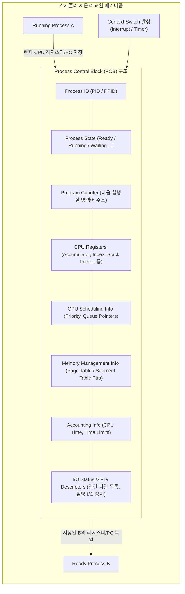

# 프로세스 제어 블록 (PCB, Process Control Block)

---

## I. 프로세스 문맥 유지 및 자원 관리의 핵심체, PCB의 개요

* **정의**: 운영체제가 실행 중인 각 프로세스를 식별, 제어, 관리하기 위해 필요한 모든 메타데이터와 문맥(Context)을 저장하는 커널 공간의 핵심 자료구조
* **배경 및 필요성**:
* **시분할 멀티태스킹 지원**: [[CPU]] [[스케줄링]] 시 선점된 프로세스의 상태를 보존하고 복원하는 [[문맥 교환]](Context Switching)의 기준점
* **커널 자원 추적**: 메모리 주소 매핑, 파일 디스크립터, 입출력 상태 등 프로세스별 할당 자원의 일관성 유지

---

## II. PCB의 구조도 및 핵심 구성요소

### 가. PCB의 구조도 및 문맥 교환(Context Switching) 연계 흐름

* OS 커널 영역([[커널|Kernel]] Space)의 [[프로세스]] 테이블 내에 이중 연결 리스트(Doubly Linked List) 형태로 상주하며, [[인터럽트]] 발생 시 레지스터 상태를 즉시 동기화

### 나. PCB의 핵심 구성 요소

| 구분 | 구성 요소 | 세부 설명 |
| --- | --- | --- |
| **식별자** | PID / PPID | 시스템 내 프로세스를 고유하게 식별하는 프로세스 ID 및 부모 프로세스 ID |
| **실행 상태** | Process State | 현재 수명주기 상태 기록 (New, Ready, Running, Waiting, Terminated) |
| **문맥 보존** | Program Counter (PC) | 해당 프로세스가 CPU 재할당 시 다음에 실행할 명령어(Instruction) 메모리 주소 |
| **문맥 보존** | CPU Registers | 데이터 처리를 위한 범용 레지스터, 누산기, 스택 포인터(SP), 상태 레지스터 값 저장 |
| **스케줄링 정보** | Scheduling Parameters | 프로세스 우선순위(Priority), 스케줄링 큐 포인터, 잔여 타임 퀀텀(Quantum) |
| **[[메모리 관리]]** | Memory Limits / Tables | 기본(Base)/한계(Limit) 레지스터, 페이징 기법의 Page Table 포인터, 세그먼트 테이블 정보 |
| **회계 정보** | Accounting Info | CPU 점유 시간, 실행 시간 합계, 계정 번호, 시스템 자원 사용 상한선 |
| **입출력/자원** | I/O & File Descriptors | 프로세스에 할당된 I/O 장치 목록 및 열려 있는 파일 디스크립터 테이블(File Descriptor Table) |

---

## III. PCB vs TCB 비교 및 운영체제 구현 동향

### 가. PCB와 TCB(Thread Control Block) 비교

| 비교 항목 | PCB ([[PCB(Process Control Block)|Process Control Block]]) | TCB (Thread Control Block) |
| --- | --- | --- |
| **관리 단위** | 프로세스 (자원 소유의 단위) | 스레드 (CPU 스케줄링/실행 단위) |
| **저장 정보** | 독립 [[가상 메모리]] 매핑, 전체 파일/자원 메타데이터 | PC, 스택 포인터, 범용 레지스터, 자체 우선순위 |
| **저장 영역** | 커널 메모리 (완전 독립 공간) | 커널 공간(Kernel Thread) 또는 유저 런타임(User Thread) |
| **문맥 교환 오버헤드** | 메모리 주소 공간 변환([[MMU(Memory Management Unit)|MMU]] 플러시, TLB 무효화)으로 큼 | 주소 공간을 공유하므로 레지스터 세트만 전환되어 작음 |
| **연관 관계** | 1개의 프로세스는 여러 개의 TCB를 포인터로 참조 | 각 TCB는 소속된 단일 PCB를 참조 |

### 나. 최신 동향 및 실무 적용

* **Linux 커널 구조체 (`task_struct`)**: Linux는 프로세스와 스레드를 엄격히 분리하지 않고 `task_struct` 단일 구조체로 통합 관리하며, `clone()` 시스템 콜 플래그(`CLONE_VM`, `CLONE_FILES` 등)를 통해 자원 공유 여부를 결정
* **eBPF 기반 커널 모니터링**: 현대 클라우드/[[컨테이너]] 환경에서는 `task_struct`의 내부 필드를 실시간 추적(eBPF Tracepoint/Kprobe)하여 문맥 교환 지연(Latency), 런큐 지연 시간을 무부하에 가깝게 관측 및 분석 수행

---

### 🔗 연관 토픽

- **소속 도메인**: [[00_운영체제_MOC|⚙️ 운영체제]]
- **세부 분류**: `1. 프로세스 & 스레드 관리`
- **핵심 연관 토픽**:
  - [[프로세스]]
  - [[커널|커널(Kernel)]]
  - [[스케줄링]]
  - [[인터럽트|인터럽트 (Interrupt)]]
  - [[문맥 교환|문맥 교환 (Context Switching)]]
