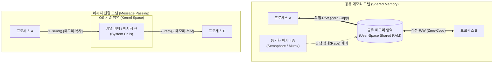

# 프로세스간 통신 (IPC, Inter-Process Communication)

---

## I. 독립 프로세스 간 협업 및 데이터 교환 인프라, IPC의 개요

* **정의**: 독립된 주소 공간을 갖는 둘 이상의 프로세스가 상호 데이터 전달, 작업 동기화, 제어 정보 교환을 수행하기 위해 [[OS(운영체제)|운영체제]]([[커널]])가 제공하는 통신 메커니즘
* **등장 배경 및 필요성**:
* **메모리 보호 격리 극복**: [[가상 메모리]] 체계([[MMU(Memory Management Unit)|MMU]])에 의해 차단된 [[프로세스]] 간 메모리 장벽을 안전하게 우회하여 협업 수행
* **[[모듈화]] 및 확장성**: 기능별 독립 프로세스 분할 구조(Microservices, Client-Server)에서 유기적인 데이터 교환 보장

---

## II. IPC의 아키텍처 및 핵심 통신 기법

### 가. IPC의 양대 아키텍처 모델 및 데이터 흐름

* **공유 메모리**: 초기 매핑 설정 후 커널 개입 없는 직접 메모리 접근으로 초고속 데이터 전송(Zero-Copy) 가능, 동기화 도구 필수 수반
* **메시지 전달**: 시스템 콜 기반 커널 버퍼 복사를 거치며, OS가 동기화 및 큐를 직접 보장하여 충돌 방지 및 안전성 확보

### 나. IPC의 핵심 기술 요소 및 메커니즘

| 구분 | 요소 기술/기법 | 세부 설명 |
| --- | --- | --- |
| **공유 메모리** | Shared Memory (`shmget`/`mmap`) | 물리 메모리를 두 프로세스의 가상 주소 공간에 동시 매핑, 가장 빠른 전송 속도 제공 |
| **공유 메모리** | Semaphore / Mutex | 공유 메모리 동시 접근 시 데이터 일관성 유지를 위한 원자적(Atomic) 상호 배제 동기화 도구 |
| **단방향 스트림** | 익명 파이프 (Anonymous Pipe) | 부모-자식 간 단방향 통신, 커널 버퍼 기반 파일 디스크립터 공유([[FIFO]]) 방식 |
| **단방향 스트림** | 네임드 파이프 (FIFO) | 파일 시스템 노드(특수 파일)를 생성하여 혈연관계가 없는 프로세스 간 단방향 통신 지원 |
| **메시지 교환** | 메시지 큐 (Message [[Queue]]) | 구조화된 메시지 단위 통신(POSIX/System V), 유형(Type)별 선택적 비동기 수신 가능 |
| **양방향 통신** | UNIX 도메인 소켓 (UDS) | 동일 호스트 내 프로세스 간 네트워크 스택(IP/[[TCP]] 오버헤드)을 생략한 고성능 양방향 IPC |
| **분산/원격** | Network Socket (TCP/UDP) | [[프로토콜]] 스택을 통과하여 단일 호스트뿐 아니라 분산 네트워크 환경의 이기종 간 통신 지원 |
| **프로세스 제어** | Signal | 비동기적 사건 발생 알림(SIGINT, SIGKILL, SIGSEGV 등), 정수형 식별자로 커널이 전달 |

---

## III. 공유 메모리 vs 메시지 전달 비교 및 최신 동향

### 가. 공유 메모리 모델과 메시지 전달 모델의 핵심 비교

| 비교 항목 | 공유 메모리 (Shared Memory) | 메시지 전달 (Message Passing) |
| --- | --- | --- |
| **통신 속도** | **최상** (시스템 콜 배제, 직접 메모리 R/W) | **보통/낮음** (커널 버퍼 복사 2회 수반) |
| **커널 개입도** | 초기 세그먼트 생성 시에만 개입 | 모든 통신(`send`/`recv`) 시 시스템 콜로 개입 |
| **동기화 책임** | **개발자 책임** ([[세마포어]], 락 미구현 시 Race 발생) | **운영체제 책임** (커널 레벨에서 버퍼 락/동기화 보장) |
| **데이터 형태** | 원시 바이트/임의 자료구조 공유 | 정형화된 패킷/메시지 블록 단위 교환 |
| **구현 난이도** | 높음 (동기화, [[교착상태]], 메모리 오염 주의) | 낮음 (API 직관성, 독립된 격리 구조) |
| **적합한 분야** | 대용량 그래픽/영상 프레임 공유, 실시간 제어 | 마이크로서비스, 소용량 이벤트 제어, 분산 시스템 |

### 나. 최신 기술 동향 및 실무 적용

* **eBPF/XDP 기반 IPC 가속**: [[컨테이너]] 간 네트워크 소켓 통신 오버헤드를 완화하기 위해 커널 레벨에서 eBPF 소켓 맵(`sockmap`)을 적용, TCP/IP 스택을 우회(Bypass)하여 로컬 IPC 수준으로 대기시간(Latency)을 단축
* **Shared Memory IPC 고도화**: 대규모 언어 모델([[초거대 언어 모델|LLM]]) 서빙 및 고성능 AI 추론 파이프라인에서 프로세스 간 텐서(Tensor) 교환을 위해 Apache Arrow Plasma, Linux `memfd_create` 기반의 고속 무복사(Zero-Copy) 메모리 풀 아키텍처 적용 확산

---

### 🔗 연관 토픽

- **소속 도메인**: [[00_운영체제_MOC|⚙️ 운영체제]]
- **세부 분류**: `1. 프로세스 & 스레드 관리`
- **핵심 연관 토픽**:
  - [[프로세스]]
  - [[커널|커널(Kernel)]]
  - [[OS(운영체제)]]
  - [[FIFO]]
  - [[교착상태|교착상태 (Deadlock)]]
