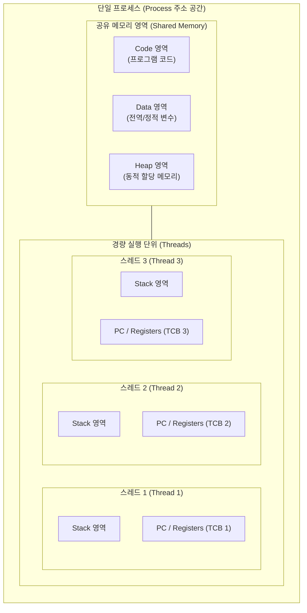

# 프로세스(Process)와 스레드(Thread) 비교

---

## I. 멀티태스킹 실행 환경의 핵심 단위, 프로세스와 스레드의 개요

* **정의**:
* **[[프로세스]]**: 운영체제로부터 독립된 메모리 공간과 시스템 자원을 할당받아 실행되는 작업(Task)의 단위
* **스레드**: 하나의 프로세스 내에서 동작하며, 프로세스의 자원을 공유하면서 독립적인 실행 흐름을 갖는 [[CPU]] 스케줄링의 최소 단위

* **등장 배경 및 필요성**:
* **프로세스의 무거운 오버헤드**: 프로세스 간 생성, IPC 통신, [[문맥 교환]](Context Switching) 시 발생하는 비용 한계 극복
* **경량 동시성(Concurrency) 요구**: 멀티코어 환경에서 자원 낭비를 줄이고 시스템 처리율(Throughput) 및 응답성(Responsiveness) 극대화

---

## II. 프로세스와 스레드의 메모리 구조 및 핵심 요소

### 가. 프로세스 vs 스레드 메모리 공유 및 격리 모델

* 스레드는 Code, Data, Heap 및 OS 자원(파일, 소켓)을 상호 공유하며, 개별 스레드는 독립적인 함수 호출과 실행 흐름 제어를 위해 [[Stack]]과 레지스터(PC)만 독자 보유

### 나. 프로세스와 스레드의 핵심 기술 및 제어 요소

| 구분 | 요소 기술/개념 | 세부 설명 |
| --- | --- | --- |
| **제어 블록** | [[PCB(Process Control Block)|PCB]] vs TCB | 커널이 관리하는 메타데이터 (PCB: [[가상 메모리]]/자원 포인터 포함, TCB: 레지스터/스택 포인터 중심 경량 구조) |
| **자원 격리** | [[MMU(Memory Management Unit)|MMU]] / Page Table | 프로세스는 가상 주소 공간이 완벽히 분리되어 타 프로세스 접근 불가 (스레드는 주소 공간 공유) |
| **문맥 교환** | Context Switch | 프로세스는 Page Table 전환 및 TLB(Translation Lookaside Buffer) 플러시 발생 / 스레드는 레지스터 세트만 전환 |
| **데이터 교환** | 통신 메커니즘 | 프로세스는 커널 개입 IPC(Pipe, Socket, Shared Memory) 필요 / 스레드는 힙(Heap) 메모리를 통한 직접 공유 |
| **동기화 기법** | Synchronization | 스레드 간 공유 자원 Race Condition 방지를 위한 Mutex, Semaphore, Spinlock, Monitor 적용 필수 |
| **실행 스레드 모델** | User vs [[커널|Kernel]] Thread | Many-to-One(유저 레벨), One-to-One(커널 레벨), Many-to-Many(하이브리드) 매핑 아키텍처 |
| **안정성/결함** | Fault Isolation | 단일 프로세스 오류는 타 프로세스로 전파 차단 / 단일 스레드의 비정상 종료(Segfault)는 전체 프로세스 크래시 유발 |
| **복제/생성** | System Call | 프로세스는 `fork()` / `exec()`로 무거운 복제 비용 소요 / 스레드는 `pthread_create()`, `clone()`으로 경량 생성 |

---

## III. 프로세스 vs 스레드 상세 비교 및 현대 시스템 동향

### 가. 프로세스와 스레드의 다각적 비교

| 비교 항목 | 프로세스 (Process) | 스레드 (Thread) |
| --- | --- | --- |
| **개념적 위계** | 자원 할당의 기본 단위 (Container 역할) | CPU 실행/스케줄링의 기본 단위 (Worker 역할) |
| **메모리 구성** | 독립적 메모리 (Code, Data, Heap, Stack 분리) | Stack만 독립, Code/Data/Heap 영역 공유 |
| **문맥 교환 비용** | **높음** (TLB 캐시 무효화, 메모리 매핑 교체) | **낮음** (동일 주소 공간 내 레지스터/SP만 교체) |
| **통신 비용 (IPC)** | **높음** (커널 개입, 시스템 콜 및 버퍼 복사 발생) | **낮음** (공유 메모리 직접 읽기/쓰기, 오버헤드 미미) |
| **동기화 이슈** | 프로세스 간 공유 메모리 외에는 충돌 적음 | 전역/힙 자원 동시 접근에 따른 Race Condition 방지 필수 |
| **결함 격리 (Safety)** | 완벽한 격리 (하나가 죽어도 다른 프로세스 무관) | 공유 공간 침범 시 전체 프로세스 동반 비정상 종료 |
| **생성/종료 속도** | 느림 (OS 자원 할당 및 초기화 과정 수반) | 빠름 (프로세스 내 메모리 일부만 할당하여 시작) |

### 나. 최신 동향 및 아키텍처 진화

* **유저 레벨 경량 동시성 (Green Threads / Virtual Threads)**: 커널 스레드의 1:1 매핑 오버헤드를 극복하기 위해 JVM Virtual Threads(Project Loom), Go Goroutine 등 M:N 유저 공간 [[스케줄링]] 모델 채택 급증
* **컨테이너화와 마이크로서비스**: 프로세스의 완벽한 결함 격리 특성을 Linux Namespaces/Cgroups와 결합하여 [[컨테이너]]([[도커|Docker]]/K8s) 기반의 분산 아키텍처 구현 표준화

---

### 🔗 연관 토픽

- **소속 도메인**: [[00_운영체제_MOC|⚙️ 운영체제]]
- **세부 분류**: `1. 프로세스 & 스레드 관리`
- **핵심 연관 토픽**:
  - [[프로세스]]
  - [[커널|커널(Kernel)]]
  - [[스케줄링]]
  - [[문맥 교환|문맥 교환 (Context Switching)]]
  - [[PCB(Process Control Block)]]
