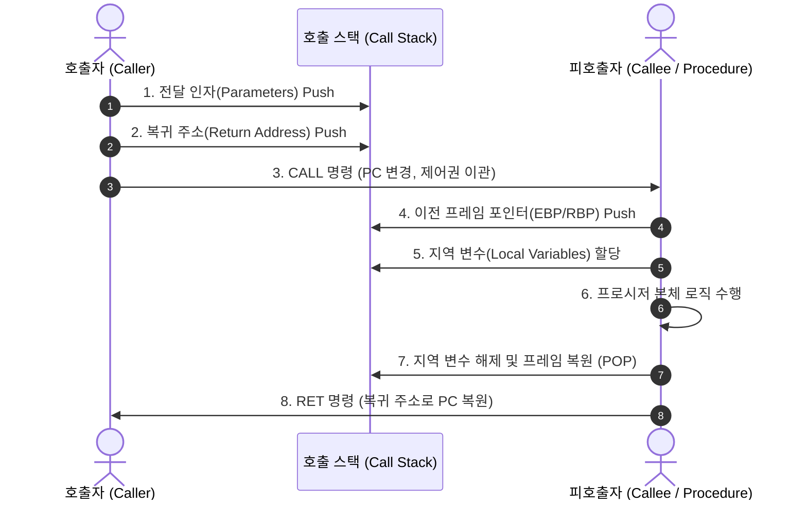

# 프로시저 (Procedure)

---

## I. 모듈화 및 반복 실행 제어의 핵심 단위, 프로시저의 개요

* **정의**: 특정 작업이나 연산을 수행하기 위해 일련의 명령어 집합을 논리적으로 묶어 이름을 부여하고, 호출(Call)을 통해 재사용할 수 있도록 설계된 독립된 서브루틴(Subroutine) 단위
* **등장 배경 및 특징**:
* **구조적 프로그래밍 구현**: 복잡한 소프트웨어를 기능별로 분할하여 복잡도 감소 및 코드 재사용성(Reusability) 극대화
* **제어 흐름 [[추상화]]**: 호출자(Caller)와 피호출자(Callee) 간 스택 프레임([[Stack]] Frame) 기반 문맥 보존 및 제어권 이관

---

## II. 프로시저의 호출 메커니즘 및 핵심 제어 요소

### 가. 프로시저 호출(Call/Return) 및 스택 프레임 동작 원리

* 호출 시 스택 프레임(Stack Frame)을 생성하여 인자 및 복귀 주소를 저장하고, 종료 시 스택을 원상 복구한 뒤 원래 실행 흐름으로 복귀

### 나. 프로시저의 핵심 기술 및 제어 요소

| 구분 | 요소 기술/개념 | 세부 설명 |
| --- | --- | --- |
| **호출 규약** | Calling Convention | 파라미터 전달 순서 및 스택 프레임 정리 주체 정의 (cdecl, stdcall, fastcall) |
| **인자 전달** | Call by Value | 실인자의 '값'을 복사하여 전달, 피호출자의 수정이 호출자 변수에 무영향 |
| **인자 전달** | Call by Reference | 실인자의 '메모리 주소'를 전달하여 직접 참조, 호출자의 원본 데이터 변경 가능 |
| **실행 문맥** | Activation Record | 스택 프레임 단위로 인자, 지역 변수, 복귀 주소, 이전 베이스 포인터를 구조화 |
| **레지스터 제어** | Caller/Callee-Saved | 함수 호출 전후 값 보존 책임에 따른 [[CPU]] 레지스터 분할 관리 (ABI 표준) |
| **[[모듈화]] 기법** | 정보 은닉 (Encapsulation) | 세부 구현 로직을 캡슐화하고 파라미터와 인터페이스만을 통해 상호작용 |
| **분기 제어** | Jump & Link (JAL / CALL) | 프로그램 카운터(PC)를 프로시저 시작 주소로 분기시키고 하드웨어 링크 레지스터 갱신 |
| **부수 효과** | Side Effect | 반환값 외에 전역 변수 변경, 파일 I/O 등 시스템 상태(State)를 변경시키는 현상 |

---

## III. 프로시저 vs 함수(Function) 비교 및 기술 영역별 발전 동향

### 가. 프로시저와 함수의 비교

| 비교 항목 | 프로시저 (Procedure) | 함수 (Function) |
| --- | --- | --- |
| **주요 목적** | 일련의 절차/동작 수행 (Command / Action) | 연산 결과를 단일 값으로 도출 (Value Calculation) |
| **반환값 유무** | 반환값이 없거나(void), 다중 상태/인자 수정 중심 | 반드시 정의된 타입의 단일 결과를 `return` |
| **수학적 순수성** | 상태 변경(부수 효과, Side Effect)을 수반함 | 동일 입력에 동일 출력을 보장하는 참조 투명성 지향 |
| **호출 위치** | 독립된 실행 문장으로 단독 호출 (`CALL proc()`) | 수식(Expression) 내부에서 피연산자로 결합 호출 |
| **DB 관점 비교** | 저장 프로시저(SP): [[트랜잭션]] 완료(`COMMIT`) 가능 | 사용자 정의 함수(UDF): 트랜잭션 제어 불가, 순수 연산 |

### 나. 기술 영역별 확장 및 최신 동향

* **분산 시스템 (RPC $\rightarrow$ gRPC)**: [[프로세스]] 내부 서브루틴 호출을 네트워크 너머의 원격 시스템으로 확장하는 RPC(Remote Procedure Call)가 HTTP/2 및 [[프로토콜]] 버퍼 기반의 고성능 gRPC로 진화하여 [[MSA (Micro Service Architecture)|MSA]] 핵심 통신으로 정착
* **함수형 프로그래밍과의 결합**: 부수 효과를 지닌 절차형 프로시저의 디버깅 난이도를 해소하기 위해, 상태 변경 로직을 최소화하고 순수 함수(Pure Function) 기반 파이프라인으로 구성하는 아키텍처 도입 확산

---

### 🔗 연관 토픽

- **소속 도메인**: [[00_소프트웨어공학_MOC|🏗️ 소프트웨어공학]]
- **세부 분류**: `4. 아키텍처 스타일 & 객체지향 설계 원리`
- **핵심 연관 토픽**:
  - [[모듈화|모듈화 (Modularity)]]
  - [[MSA (Micro Service Architecture)]]
  - [[DDD (Domain Driven Design)]]
  - [[추상화|추상화 (Abstraction)]]
  - [[프로세스]]
