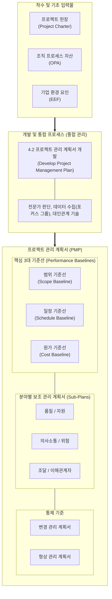

# 프로젝트 관리 계획서 (Project Management Plan, PMP)

---

## I. 프로젝트 성공 완수를 위한 종합 기준선, 프로젝트 관리 계획서의 개요

* **정의**: 프로젝트의 정의, 준비, 통합, 조정을 거쳐 실행·감시 및 통제·종료에 이르는 모든 작업을 지휘하기 위해 작성되는 핵심 산출물이자 통합 기준선(Baseline) 문서
* **배경 및 필요성**:
* **통합적 의사결정 체계 구축**: 범위, 일정, 원가 등 상충되는 제약 조건(Triple Constraints)의 체계적 조율 기준 제공
* **이해관계자 정렬 및 통제**: 변경 요청에 대한 승인 기준선 확립 및 프로젝트 전 수명주기 동안의 단일 진실 공급원(SSOT) 역할 수행

---

## II. 프로젝트 관리 계획서의 수립 프로세스 및 핵심 구성요소

### 가. 프로젝트 관리 계획서의 통합 개발 메커니즘 (PMBOK 기준)

* 프로젝트 헌장을 기반으로 보조 계획서들과 기준선을 점진적 구체화(Progressive Elaboration)하여 통합하고, 공식 승인 후 공식 변경 통제 절차(CCB)를 통해서만 수정 가능

### 나. 프로젝트 관리 계획서의 핵심 구성 요소

| 구분 | 구성 요소 | 세부 설명 |
| --- | --- | --- |
| **기준선 (Baselines)** | 범위 기준선 (Scope Baseline) | 프로젝트 범위 기술서(Scope Statement), [[WBS]](작업분류체계), WBS 사전의 통합 승인본 |
| **기준선 (Baselines)** | 일정 기준선 (Schedule Baseline) | 네트워크 다이어그램([[CPM]]) 및 마일스톤이 반영된 승인된 간트 차트(Gantt Chart) |
| **기준선 (Baselines)** | 원가 기준선 (Cost Baseline) | 시간 경과에 따른 예산 지출 계획(S-Curve) 및 비상예비비(Contingency Reserve) 포함 |
| **보조 계획서** | 품질 / 자원 관리 계획 | 품질 표준(ISO/IEC), QA/QC 기법 명시 및 팀/물적 자원의 확보·배치·개발 계획 수립 |
| **보조 계획서** | 위험 관리 계획서 (Risk Plan) | 위험 식별, 정성적/정량적 분석, [[위험 대응]] 전략(회피, 전가, 완화, 수용) 및 잔여 리스크 관리 |
| **보조 계획서** | 의사소통 / 이해관계자 | 정보 배포 주기/채널 정의 및 이해관계자 분류(파워-관심도 격자), 참여 유도 전략 |
| **통제 기준** | 변경 관리 계획서 (Change Plan) | 기준선 변경 요청 접수, 영향도 평가, CCB(변경통제위원회) 승인/기각 절차 정의 |
| **통제 기준** | [[형상 관리]] 계획서 (Config Plan) | 산출물의 기능적·물리적 특성 추적, 버전 관리 및 변경 이력 [[무결성]] 보장 메커니즘 |

---

## III. 전통적 PMP vs 애자일(Agile) 계획 수립 비교 및 최신 동향

### 가. 전통적 폭포수(Waterfall)와 애자일(Agile) 계획 수립의 비교

| 비교 항목 | 전통적 프로젝트 관리 계획서 (Predictive) | 애자일 릴리즈/반복 계획 (Adaptive) |
| --- | --- | --- |
| **계획 수립 철학** | 초기 확정형 계획 (Up-front Planning) | 적응형 및 점진적 롤링 웨이브 ([[연동계획|Rolling Wave Planning]]) |
| **기준선 성격** | 엄격한 기준선 고정 (엄격한 CCB 승인 필수) | 유동적 백로그(Product Backlog) 우선순위 기반 조정 |
| **상세화 수준** | 초기 전체 일정 및 산출물 세부 명세화 | 로드맵 $\rightarrow$ 릴리즈 계획 $\rightarrow$ 스프린트 이터레이션 단위 상세화 |
| **변경 수용성** | 변경 억제 및 통제 중심 (Scope Creep 방지) | 변경을 가치 창출의 기회로 수용 (Welcome Change) |
| **성과 측정 지표** | [[EVM(Earned Value Management, 획득 가치 관리)|EVM]] (Earned Value Management: CPI, SPI) | 번다운/번업 차트, 개발 속도(Velocity), 리드 타임 |

### 나. 최신 동향 및 테일러링(Tailoring) 방향

* **하이브리드(Hybrid) 프로젝트 관리**: 거버넌스, 계약, 통합 예산 통제는 전통적 PMP(원가/일정 기준선) 체계를 유지하되, 세부 구현 단계는 애자일([[SCRUM|Scrum]]/Kanban) 방식을 결합하는 혼합형 모델 보편화
* **디지털 PMIS 및 AI 기반 예측 통합**: Jira, Confluence, Asana 등 최신 PMIS(Project Management Information System)와 결합하여 PMP의 변경 이력을 실시간 형상 관리하고, [[초거대 언어 모델|LLM]]/AI 에이전트를 통한 위험 예측 및 일정 편차 자동 분석 적용 확산

---

### 🔗 연관 토픽

- **소속 도메인**: [[00_프로젝트관리_MOC|📋 프로젝트관리]]
- **세부 분류**: `1. PMBOK 표준 & 프로젝트 거버넌스`
- **핵심 연관 토픽**:
  - [[PMBOK 프로세스 그룹 (5단계)]]
  - [[연동계획|연동계획 (Rolling Wave Planning)]]
  - [[SCRUM]]
  - [[EVM(Earned Value Management, 획득 가치 관리)]]
  - [[형상 관리]]
