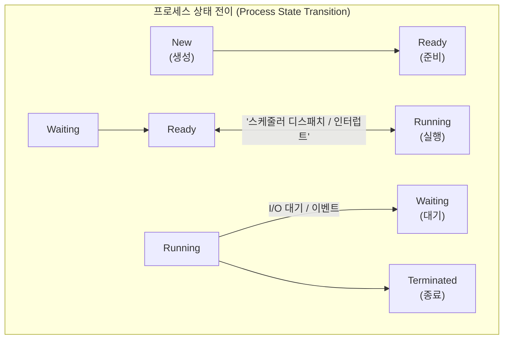

# 프로세스 (Process)

---

## I. 운영체제가 관리하는 실행 단위, 프로세스의 개요

* **정의**: 보조기억장치에 저장된 정적 프로그램(Program)이 메모리에 적재되어 [[OS(운영체제)|운영체제]](OS)로부터 [[CPU]] 시간, 메모리 공간, 시스템 자원을 할당받아 **실행되고 있는 동적 상태의 프로그램**
* **등장 배경**: 컴퓨터 시스템의 발전과 함께 여러 프로그램을 동시에 실행하는 멀티프로그래밍(Multiprogramming) 및 멀티태스킹(Multitasking) 환경이 대두됨에 따라, 각 프로그램이 서로 간섭하지 않고 독립적으로 안전하게 실행될 수 있는 격리된 실행 단위 필요
* **특징**: 고유의 독립된 메모리 공간(Text, Data, BSS, Heap, [[Stack]]) 소유, 운영체제가 관리하는 제어 블록(PCB)을 통해 생명주기 통제, 문맥 교환(Context Switching)을 통한 동시성(Concurrency) 제공

---

## II. 프로세스의 개념도 및 핵심 기술 요소

### 가. 프로세스 상태 전파 및 제어 블록(PCB) 구조

* 프로세스는 생성(New)부터 종료(Terminated)까지 운영체제의 스케줄러와 인터럽트에 의해 상태가 전이되며, 각 프로세스의 메타데이터는 PCB([[PCB(Process Control Block)|Process Control Block]])에 안전하게 보관됨

### 나. 프로세스의 핵심 구성 요소 및 관리 기술

| 구분 | 요소기술(키워드) | 세부 설명 |
| --- | --- | --- |
| **메모리 구조** | [[프로세스]] 주소 공간 | 코드(Text), 전역변수(Data/BSS), 동적할당(Heap), 함수호출 스택(Stack)으로 분리되어 독립적으로 할당 |
| **관리 단위** | PCB (Process Control Block) | 프로세스의 PID, 상태, 프로그램 카운터(PC), CPU 레지스터 값 등 프로세스 제어에 필요한 모든 정보가 담긴 [[커널]] 데이터 구조 |
| **제어 기법** | [[문맥 교환|문맥 교환 (Context Switching)]] | 실행 중인 프로세스가 [[인터럽트]] 등으로 인해 CPU를 양도할 때, 기존 프로세스의 상태를 PCB에 백업하고 새로운 프로세스의 상태를 복구하는 오버헤드 작업 |
| **통신 기법** | IPC (Inter-Process Communication) | 프로세스 간의 독립된 메모리 격리 벽을 넘어 데이터를 교환하기 위한 메커니즘 (파이프, 메시지 큐, 공유 메모리 등) |
| **동기화 기법** | [[세마포어]] / 뮤텍스 (Synchronization) | 공유 자원에 여러 프로세스가 동시에 접근할 때 발생하는 경쟁 상태(Race Condition)를 방지하기 위한 상호 배제 장치 |

---

## III. 스레드와의 비교 및 최신 동향

### 가. 프로세스 (Process) vs 스레드 (Thread) 비교

| 비교 항목 | 프로세스 (Process) | 스레드 (Thread) |
| --- | --- | --- |
| **정의** | 운영체제로부터 자원을 할당받는 **작업의 단위** | 프로세스 내부에서 자원을 공유하며 실행되는 **제어의 흐름** |
| **메모리 공유** | 독립된 메모리 공간을 가지므로 **공유하지 않음** | 코드, 데이터, 힙 영역을 **공유**하며 스택만 독립적으로 가짐 |
| **생성 및 교환 비용** | 무거움 (메모리 할당 및 PCB 오버헤드 큼) | **가벼움** (자원을 공유하므로 문맥 교환 비용이 적음) |
| **안정성** | 하나의 프로세스가 다운되어도 다른 프로세스에 영향 없음 | 하나의 스레드가 예외를 일으키면 **전체 프로세스 종료 가능** |
| **통신 방식** | IPC (복잡하고 오버헤드 발생) | 공유 메모리를 통해 **직접 통신 가능** |

### 나. 프로세스 관리의 최신 동향 및 시사점

* **[[컨테이너]] [[가상화]] 기술로의 진화**: 과거 OS 레벨에서 무거운 프로세스를 통째로 격리하던 방식에서 벗어나, 리눅스의 네임스페이스(Namespace)와 cgroups 기술을 활용해 커널을 공유하면서도 완벽하게 격리된 가벼운 컨테이너 프로세스([[도커|Docker]] 등)가 [[클라우드 네이티브]] 인프라의 표준으로 정착
* **멀티코어와 비동기 프로그래밍 모델 확산**: 하드웨어 코어 수가 급증함에 따라, 무거운 멀티 프로세스 구조 대신 단일 프로세스 내에서 가벼운 스레드나 비동기 이벤트 루프(Event Loop)를 활용하여 I/O 병목을 극복하는 고성능 서버 아키텍처(Node.js, Go 등)가 주류로 활용됨

---

### 🔗 연관 토픽

- **소속 도메인**: [[00_프로젝트관리_MOC|📋 프로젝트관리]]
- **세부 분류**: `5. 애자일 프로젝트 관리 & 개발 운영 (Agile PM)`
- **핵심 연관 토픽**:
  - [[프로세스]]
  - [[컨테이너|컨테이너 (Container)]]
  - [[커널|커널(Kernel)]]
  - [[가상화]]
  - [[OS(운영체제)]]
