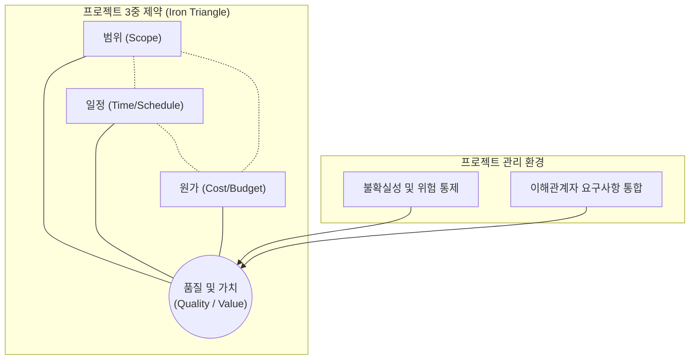

# 프로젝트 관리의 일반적 특징

---

## I. 성공적인 비즈니스 가치 창출을 위한, 프로젝트 관리의 일반적 특징 개요

* **정의**: 고유한 제품, 서비스 또는 결과를 창출하기 위해 한시적으로 투입되는 노력을 의미하며, 이를 기한과 예산 내에서 달성하기 위해 지식, 기술, 도구, 기법을 적용하는 체계적 활동
* **등장 배경**: 급변하는 비즈니스 환경에서의 신규 시장 진입, 기술 혁신, 법적 규제 대응 등 조직의 전략적 목표를 달성하기 위한 구체적인 실행 수단 필요
* **특징 요약**: 명확한 시작과 끝이 존재하는 **한시성(Temporary)**, 기존과 다른 새로운 산출물을 만드는 **유일성(Uniqueness)**, 시간이 지남에 따라 상세화되는 **점진적 구체화(Progressive Elaboration)**

---

## II. 프로젝트 관리의 개념도 및 핵심 특징

### 가. 프로젝트 관리의 3중 제약(Triple Constraint) 개념도

* 프로젝트 관리는 범위, 일정, 원가라는 상호 배타적인 3중 제약 조건을 균형 있게 통제하여 중앙의 목표(품질과 비즈니스 가치)를 달성하는 통합적 조율 과정임

### 나. 프로젝트 및 프로젝트 관리의 핵심 특징 요소

| 구분 | 요소기술(키워드) | 세부 설명 |
| --- | --- | --- |
| **프로젝트 속성** | 한시성 (Temporary) | 명확한 시작 시점과 종료 시점을 가지며, 영구적인 활동이 아닌 일시적인 노력임 |
| **프로젝트 속성** | 유일성 (Uniqueness) | 이전에 수행된 적 없는 고유한 산출물(제품, 서비스, 결과)을 창출함 |
| **프로젝트 속성** | 점진적 구체화 (Progressive Elaboration) | 프로젝트 초기에는 개괄적으로 정의되나, 진행됨에 따라 세부사항이 점차 명확해짐 |
| **관리적 특징** | 제약조건 균형 (Triple Constraint) | 범위, 일정, 원가, 품질, 자원, 위험 등 상호 충돌하는 제약 조건들의 트레이드오프(Trade-off) 관리 |
| **관리적 특징** | 통합성 (Integration) | 착수부터 종료까지 5개 [[프로세스]] 그룹과 다양한 지식 영역을 하나의 통일된 체계로 조율 |
| **관리적 특징** | 불확실성 내포 (Uncertainty & Risk) | 고유한 특성으로 인해 필연적으로 내포되는 알 수 없는 위험을 식별, 분석, 대응하는 과정 |
| **관리적 특징** | 이해관계자 관리 (Stakeholder Focus) | 다양한 요구와 기대치를 가진 이해관계자들을 식별하고, 이들의 만족을 이끌어내는 의사소통 수행 |
| **관리적 특징** | [[테일러링|테일러링 (Tailoring)]] | 프로젝트의 규모, 복잡도, 조직 문화에 맞추어 프로세스, 방법론, 도구를 맞춤화하여 적용 |

---

## III. 프로젝트(Project)와 운영(Operation)의 비교 및 향후 전망

### 가. 프로젝트와 일반 운영(Operation)의 비교

| 비교 항목 | 프로젝트 (Project) | 일반 운영 (Operation / BAU) |
| --- | --- | --- |
| **핵심 목적** | 고유한 비즈니스 목표 달성 및 혁신 | 기존 비즈니스의 지속 및 [[유지보수]] |
| **수행 기간** | 한시적 (시작과 끝이 명확함) | 영구적, 지속적 (Ongoing) |
| **산출물 특성** | 고유하고 유일한 산출물 (Unique) | 표준화되고 동일한 제품/서비스 (Repetitive) |
| **관리 초점** | 변화 관리, 리스크 통제, 인도물 완성 | 프로세스 효율성, 수율 관리, 안정성 유지 |
| **종료 조건** | 목표 달성 또는 달성 불가능 판단 시 종료 | 기업의 비즈니스가 지속되는 한 무한 반복 |

### 나. 프로젝트 관리 패러다임의 향후 전망

* **가치 기반 인도(Value Delivery)**: 단일 산출물의 완성을 넘어서 조직의 전략적 비즈니스 가치와 성과(Outcomes)를 지속적으로 인도하는 방향으로 프로젝트 관리의 목표가 확장됨
* **하이브리드 접근법 확산**: 전통적 예측형(Waterfall) 방식의 한계를 극복하기 위해, 불확실성이 높은 환경에 적합한 애자일([[Agile]]) 방식의 장점을 혼합한 하이브리드 프로젝트 관리 체계(테일러링)의 적용이 가속화되고 있음

---

### 🔗 연관 토픽

- **소속 도메인**: [[00_프로젝트관리_MOC|📋 프로젝트관리]]
- **세부 분류**: `5. 애자일 프로젝트 관리 & 개발 운영 (Agile PM)`
- **핵심 연관 토픽**:
  - [[스크럼|스크럼 (SCRUM)]]
  - [[테일러링|테일러링 (Tailoring)]]
  - [[Kanban (development) 프로세스]]
  - [[Agile]]
  - [[린 방법론|린 (Lean) 방법론]]
