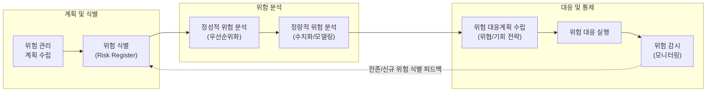

# 프로젝트 위험관리

---

## I. 프로젝트 성공의 핵심 열쇠, 프로젝트 위험관리의 개요

* **정의**: 프로젝트의 목표(일정, 원가, 범위, 품질 등)에 긍정적 또는 부정적 영향을 미치는 불확실한 사건이나 조건을 식별, 분석, 대응, 통제하는 체계적인 관리 [[프로세스]]
* **목적/필요성**: 프로젝트 내재된 불확실성 통제, 부정적 위협(Threat)의 최소화 및 긍정적 기회(Opportunity) 극대화, 프로젝트 성공 확률 향상
* **특징**:
* **연속성**: 프로젝트 전 주기에 걸쳐 반복적이고 지속적으로 수행됨
* **양면성**: 손실을 초래하는 '위협'뿐만 아니라 이익을 창출하는 '기회'도 관리 대상에 포함
* **과학적 의사결정**: 통계적, 수학적 분석 기법을 통해 리스크를 정량화하여 객관적 지표 제공

---

## II. 프로젝트 위험관리의 프로세스 및 핵심 기술 요소

### 가. 프로젝트 위험관리 프로세스 흐름도

* 위험 식별을 통해 도출된 위험 대장(Risk Register)을 기반으로 정성적/정량적 분석을 거쳐 우선순위를 부여하고, 이에 따른 대응 전략을 수립 및 모니터링하는 순환 구조임

### 나. 프로젝트 위험관리의 핵심 구성 요소 및 기법

| 분류 | 요소기술(키워드) | 세부 설명 |
| --- | --- | --- |
| **위험 식별** | 델파이 기법 (Delphi) | 전문가 집단의 익명성을 보장하여 반복적인 피드백을 통해 의견을 수렴하는 식별 기법 |
| **위험 식별** | SWOT 분석 | 프로젝트의 강점(S), 약점(W), 기회(O), 위협(T)을 분석하여 리스크 도출 |
| **정성적 분석** | PI 매트릭스 (Probability & Impact) | 위험의 발생 확률(P)과 프로젝트에 미치는 영향력(I)을 곱하여 우선순위를 등급화 |
| **정량적 분석** | [[몬테카를로 시뮬레이션]] | 확률 분포를 기반으로 컴퓨터 시뮬레이션을 수천 번 반복하여 프로젝트 결과를 예측 |
| **정량적 분석** | EMV (기대금액가치) | 시나리오별 발생 확률과 금전적 영향을 곱하여 도출된 평균 가치 계산 ([[의사결정나무]] 활용) |
| **정량적 분석** | 민감도 분석 (토네이도 다이어그램) | 다른 변수를 고정하고 단일 변수의 변화가 프로젝트에 미치는 영향을 막대그래프로 가시화 |
| **[[위험 대응]]** | 비상 대응 예비비 (Contingency Reserve) | 식별된 위험(Known-Unknowns)에 대응하기 위해 할당된 예산 및 일정 예비비 |
| **위험 감시** | 위험 감사 (Risk Audit) | 위험 관리 프로세스의 효과성과 위험 대응 계획의 적절성을 평가하고 검토하는 활동 |

---

## III. 프로젝트 위험 대응 전략 비교 및 최신 동향

### 가. 부정적 위험(위협)과 긍정적 위험(기회) 대응 전략 비교

| 구분 | 부정적 위험 (위협, Threat) | 긍정적 위험 (기회, Opportunity) |
| --- | --- | --- |
| **전략 1 (근본 조치)** | **회피 (Avoid)**: 위험 원인을 원천적으로 제거 (예: 계획 변경, 범위 축소) | **활용 ([[Exploit]])**: 기회가 반드시 실현되도록 보장 (예: 최고 인력 투입) |
| **전략 2 (제3자 개입)** | **전가 (Transfer)**: 위험의 책임과 영향을 제3자에게 이관 (예: 보험 가입, 외주화) | **공유 (Share)**: 기회를 포착할 수 있는 제3자와 파트너십 구축 (예: 조인트 벤처) |
| **전략 3 (확률/영향 조절)** | **완화 (Mitigate)**: 발생 확률이나 영향력을 수용 가능한 수준으로 감소 | **향상 (Enhance)**: 기회의 발생 확률이나 긍정적 영향을 증가 |
| **전략 4 (현상 유지)** | **수용 (Accept)**: 적극적(비상 계획 수립) 또는 소극적(조치 없음)으로 위험을 감수 | **수용 (Accept)**: 기회가 발생하면 취하되 적극적으로 추구하지는 않음 |
| **공통 (상위 이관)** | **보고 (Escalate)**: 프로젝트 관리자의 권한을 벗어나는 경우 상위 경영진에게 이관 | **보고 (Escalate)**: 프로그램/포트폴리오 수준의 기회일 경우 상위 이관 |

### 나. 위험 관리의 최근 동향 및 향후 전망

* **[[Agile]] 환경의 지속적 위험 관리**: 매 이터레이션(스프린트)마다 회고(Retrospective)를 통해 위험을 재평가하고, 짧은 피드백 루프를 통해 불확실성을 조기에 해소
* **AI 및 예측 분석(Predictive Analytics) 도입**: 머신러닝 모델을 활용하여 과거 프로젝트의 실패 사례와 방대한 리스크 데이터를 학습, 잠재적 위험 발생 확률을 사전에 예측하고 경고하는 지능형 리스크 통제 체계로 발전 중임

---

### 🔗 연관 토픽

- **소속 도메인**: [[00_프로젝트관리_MOC|📋 프로젝트관리]]
- **세부 분류**: `2. 프로젝트 범위 & 일정 관리 (Scope & Schedule)`
- **핵심 연관 토픽**:
  - [[위험 대응]]
  - [[Agile]]
  - [[몬테카를로 시뮬레이션]]
  - [[3점 산정]]
  - [[프로세스]]
