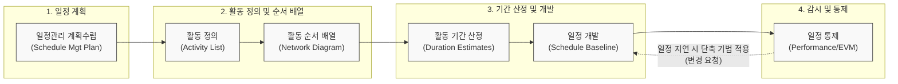

# 프로젝트 일정관리 (Project Schedule Management)

---

## I. 적기 인도를 위한 시간 자원의 최적화, 프로젝트 일정관리의 개요

* **정의**: 프로젝트의 목표를 설정된 기한 내에 성공적으로 완수하기 위해 수행 활동을 정의, 순서를 배열, 기간을 산정하고, 일정을 개발 및 통제하는 [[프로젝트 관리 지식 영역]]
* **필요성**: 정해진 납기 준수를 통한 비즈니스 가치 조기 실현, 한정된 자원의 효율적 할당, 원가 관리([[EVM(Earned Value Management, 획득 가치 관리)|EVM]])를 위한 통제 기준선(Schedule Baseline) 제공
* **특징**:
* **상호 연관성**: 범위 관리([[WBS]])에서 도출된 작업 패키지를 기반으로 시작하여, 원가 및 자원 관리와 밀접하게 연동
* **점진적 구체화**: 프로젝트 초기 개괄적 일정에서 진행에 따라 세부 일정으로 구체화(연동 기획)
* **트레이드오프**: 일정 단축 시 필연적으로 원가 상승(Crashing)이나 위험 증가(Fast Tracking) 수반

---

## II. 프로젝트 일정관리의 개념도 및 핵심 기술 요소

### 가. 프로젝트 일정관리 프로세스 체계도

* 범위 기준선(WBS)을 바탕으로 활동을 도출하고 네트워크 논리를 구성하여 임계경로([[CPM]])를 산출, 최종 승인된 일정 기준선(Baseline)을 토대로 성과 통제 수행

### 나. 프로젝트 일정관리의 핵심 구성 요소 및 기법

| 분류 | 요소기술(기법) | 세부 설명 |
| --- | --- | --- |
| **활동 정의** | 연동 기획 ([[연동계획|Rolling Wave Planning]]) | 점진적 구체화 기법으로, 가까운 시일의 작업은 상세하게 계획하고 먼 미래의 작업은 개괄적으로 계획 |
| **순서 배열** | PDM (선후행 도형법) | 노드(Activity on Node)를 사용하여 활동 간의 의존관계를 4가지 논리(FS, SS, FF, SF)로 시각화 |
| **순서 배열** | 선도(Lead) 및 지연(Lag) | 후속 활동을 선행 활동 완료 전 미리 착수(Lead)하거나, 의도적으로 일정 시간 지연(Lag) 시키는 기법 |
| **기간 산정** | [[3점 산정]] (PERT 기법) | 활동 기간의 낙관치(O), 최우치(M), 비관치(P)를 가중 평균하여 불확실성과 리스크를 감소시키는 기법 |
| **기간 산정** | 모수 산정 (Parametric) | 과거 데이터와 관련 변수(예: 코드 라인 수, 면적 등) 간의 통계적 상관관계를 바탕으로 기간과 원가 산정 |
| **일정 개발** | CPM (임계경로법) | 프로젝트 네트워크 경로 중 총 여유시간(Total Float)이 0인 최장 경로를 식별하여 프로젝트 최단 완료일 결정 |
| **일정 개발** | [[자원 최적화]] (Leveling/Smoothing) | 자원 제약 극복을 위해 자원 평준화(임계경로 변경 및 일정 지연 가능) 및 평활화(여유시간 내 조정) 수행 |
| **일정 개발** | 애자일 릴리즈 계획 | 제품 백로그를 기반으로 타임박스(Timebox) 형태의 이터레이션(스프린트)을 설정하여 반복적 일정 수립 |

---

## III. 일정 단축(Schedule Compression) 기법 비교 및 향후 전망

### 가. 일정 단축 기법 (공정 압축 vs 공정 중첩) 비교

일정 지연을 만회하거나 요구 기일을 맞추기 위해 프로젝트 범위를 축소하지 않고 일정을 단축하는 핵심 기법

| 비교 항목 | 공정 압축 (Crashing) | 공정 중첩 (Fast Tracking) |
| --- | --- | --- |
| **핵심 원리** | 임계경로 상의 활동에 추가 자원 투입 (잔업, 인력 추가) | 순차적으로 수행해야 할 활동들을 병행(동시) 수행 |
| **발생하는 Trade-off** | **비용(Cost)의 급격한 증가** 발생 | **위험(Risk) 및 재작업(Rework) 확률 증가** |
| **적용 대상** | 비용 추가 대비 단축 효과가 큰 활동 위주 | 논리적으로 병행 수행이 가능하고 관계가 유연한 활동 |
| **자원 제약 유무** | 가용 예산 및 추가 투입 가능한 잉여 자원 필요 | 추가 예산보다는 작업 간 의존성 해소가 관건 |

### 나. 일정관리 패러다임의 최신 동향

* **하이브리드(Hybrid) 라이프사이클 적용**: 전체 프로젝트의 마일스톤과 마스터 스케줄은 전통적 CPM 방식으로 통제하고, 세부 실행(IT 개발 등)은 애자일의 스프린트 타임박싱을 혼용하여 일정 유연성 확보
* **AI/Data-driven 예측 기반 일정 통제**: 과거 유사 프로젝트의 방대한 일정, 자원 데이터와 리스크 요인을 머신러닝(ML) 모델이 학습하여 특정 WBS의 지연 확률을 조기 경보(Early Warning)하는 예측형 일정관리 체계로 진화 중임

---

### 🔗 연관 토픽

- **소속 도메인**: [[00_프로젝트관리_MOC|📋 프로젝트관리]]
- **세부 분류**: `2. 프로젝트 범위 & 일정 관리 (Scope & Schedule)`
- **핵심 연관 토픽**:
  - [[3점 산정]]
  - [[WBS|WBS (Work Breakdown Structure)]]
  - [[자원 최적화]]
  - [[CPM|CPM (Critical Path Management)]]
  - [[EVM(Earned Value Management, 획득 가치 관리)]]
