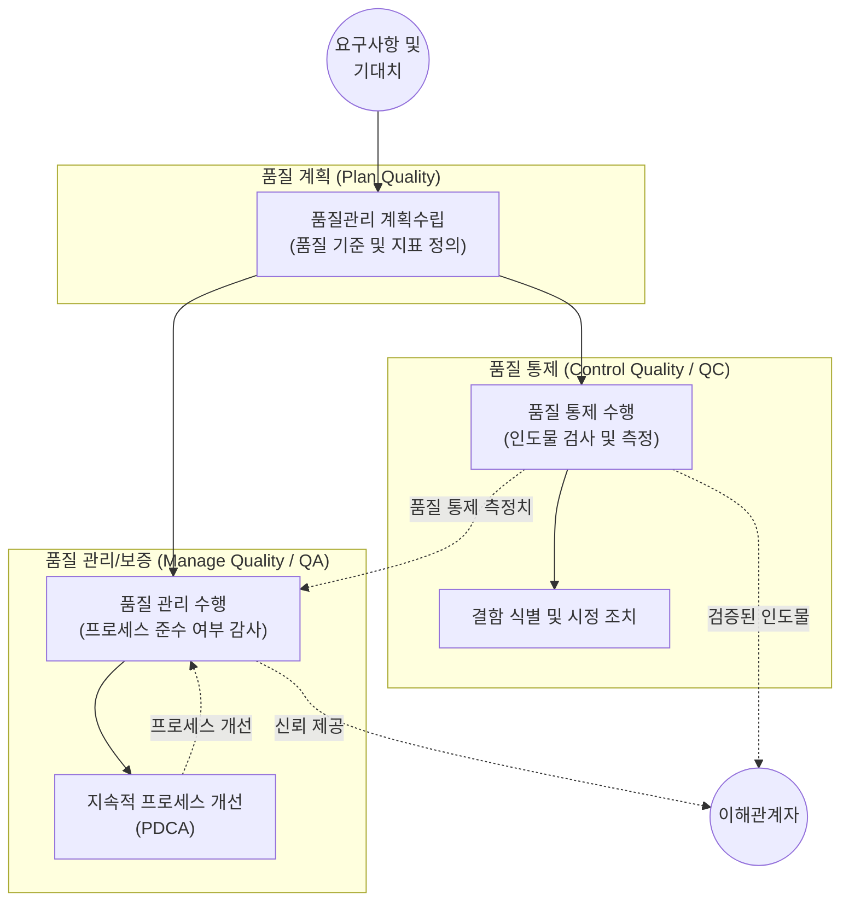

# 프로젝트 품질관리 (Project Quality Management)

---

## I. 이해관계자 요구사항 충족을 위한, 프로젝트 품질관리의 개요

* **정의**: 프로젝트와 인도물이 이해관계자의 요구사항과 기대를 충족하도록 조직의 품질 정책을 통합하고, 품질 계획 수립, 품질 관리(보증), 품질 통제를 수행하는 체계적 활동
* **목적/필요성**: '검사(Inspection)'보다 '예방(Prevention)'을 통한 재작업 비용 최소화, 산출물의 [[무결성]] 확보, 고객 만족도 향상 및 지속적 개선(Continuous Improvement) 달성
* **특징**:
* **무결점 지향**: 요구사항 부합성(Conformance to Requirements)과 사용 적합성(Fitness for Use) 확보
* **품질비용(CoQ) 관리**: 적합 비용(예방, 평가)과 부적합 비용(내부/외부 결함) 간의 최적화 도모
* **경영진의 책임**: 품질 문제의 85% 이상은 관리 체계의 문제로 인식하여 전사적 품질 경영(TQM) 강조

---

## II. 프로젝트 품질관리의 프로세스 및 핵심 기술 요소

### 가. 프로젝트 품질관리 프로세스 개념도 및 동작 원리

* 계획된 품질 기준을 바탕으로 QA(품질 관리)는 '[[프로세스]]'가 올바르게 수행되는지 감사(Audit)하며, QC(품질 통제)는 최종 '산출물'의 결함을 찾아내어 시정하는 상호 보완적 피드백 구조임

### 나. 프로젝트 품질관리의 핵심 기술 요소 및 도구

| 분류 | 요소기술(키워드) | 세부 설명 |
| --- | --- | --- |
| **핵심 원칙** | 품질비용 (CoQ, Cost of Quality) | 품질을 확보하기 위해 소요되는 모든 비용 (예방 비용, 평가 비용, 내부 실패 비용, 외부 실패 비용) |
| **핵심 원칙** | [[PDCA(Plan-Do-Check-Act, Deming Cycle)|PDCA]] 사이클 | 계획(Plan) - 실행(Do) - 점검(Check) - 조치(Act)를 통한 지속적인 품질 개선(데밍) |
| **품질 관리(QA)** | 품질 감사 (Quality Audit) | 프로젝트 활동이 조직의 품질 정책, 프로세스, 절차를 준수하는지 파악하는 독립적인 구조적 검토 |
| **품질 관리(QA)** | DfX (Design for X) | 제품 설계 시 특정 속성(X: [[신뢰성]], 제조 용이성, 조립성 등)을 최적화하기 위한 엔지니어링 지침 |
| **품질 통제(QC)** | 관리도 (Control Chart) | 프로세스가 안정적이고 예측 가능한 범위(UCL, LCL) 내에서 동작하는지 모니터링하는 시계열 그래프 |
| **품질 통제(QC)** | 파레토 차트 (Pareto Chart) | 80/20 법칙에 기반하여, 결함의 주요 원인에 우선순위를 부여하고 집중 개선하기 위한 수직 막대그래프 |
| **품질 통제(QC)** | 인과관계도 (Fishbone/Ishikawa) | 문제(결과)에 영향을 미치는 근본 원인(Root Cause)을 카테고리별로 추적하여 식별하는 계층형 다이어그램 |
| **품질 통제(QC)** | 산점도 (Scatter Diagram) | 두 변수 간의 통계적 상관관계(양, 음, 무관)를 파악하여 품질 문제의 인과성을 분석하는 점 그래프 |

---

## III. 품질 보증(QA)과 품질 통제(QC) 비교 및 품질비용 최신 동향

### 가. 품질 보증(QA, Manage Quality)과 품질 통제(QC, Control Quality) 비교

| 비교 항목 | 품질 보증 (QA / Manage Quality) | 품질 통제 (QC / Control Quality) |
| --- | --- | --- |
| **핵심 목적** | 결함 **예방 (Prevention)** | 결함 **발견 (Inspection/Detection)** |
| **관리 대상** | 작업 과정 및 **프로세스 (Process)** | 최종 결과물 및 **인도물 (Deliverables)** |
| **수행 시점** | 프로젝트 수명주기 전반 (지속적 수행) | 산출물이 완성된 후 또는 마일스톤 단계 |
| **주요 기법** | 품질 감사, DfX, 프로세스 분석 | 인스펙션(검사), 테스트, 7가지 기본 품질 도구 |
| **수행 주체** | 품질 보증팀, 프로젝트 관리자, 경영진 | 품질 통제팀, 테스터, 작업자 |

### 나. 프로젝트 품질관리의 최신 동향 및 향후 전망

* **[[DevSecOps]] 및 Shift-Left Testing 확산**: 소프트웨어 개발 품질관리에서 결함 발견(QC)을 프로젝트 후반부가 아닌 초기 설계 및 코딩 단계로 앞당겨(Shift-Left) 부적합 품질비용(External Failure Cost)을 극적으로 절감하는 자동화 품질 파이프라인 정착
* **AI 기반 결함 예측 및 자율 테스팅**: 정적 코드 분석, 과거 버그 [[데이터베이스]], 코드 커밋 로그 등을 머신러닝으로 분석하여 결함 발생 가능성이 높은 모듈을 자동 식별하고 테스트 케이스를 동적으로 생성하는 AI-Assisted QA 기술 도입 가속화

---

### 🔗 연관 토픽

- **소속 도메인**: [[00_프로젝트관리_MOC|📋 프로젝트관리]]
- **세부 분류**: `1. PMBOK 표준 & 프로젝트 거버넌스`
- **핵심 연관 토픽**:
  - [[무결성]]
  - [[데이터베이스]]
  - [[PDCA(Plan-Do-Check-Act, Deming Cycle)]]
  - [[애자일 선언문]]
  - [[프로세스]]
