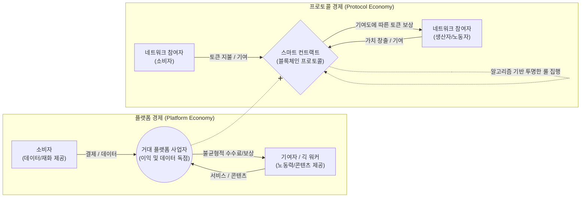

# 프로토콜 경제 (Protocol Economy)

---

## I. 플랫폼 독점의 대안, 공정 분배 기반의 경제 모델 프로토콜 경제의 개요

* **정의**: [[01_IT Tech/블록체인]] 등 탈중앙화 기술을 기반으로, 중앙의 플랫폼 중개 사업자 없이 사전에 합의된 소프트웨어 규칙([[프로토콜]])에 따라 참여자들이 가치를 창출하고 기여도에 비례하여 공정하게 보상을 분배받는 경제 생태계
* **등장 배경**:
* **플랫폼 독점 심화**: 빅테크 기업의 데이터 독점, 과도한 수수료 수취 및 가치 분배의 불균형 발생
* **노동 환경 변화**: 긱 워커(Gig Worker)의 처우 문제 및 플랫폼 종속성 심화 극복 필요
* **기술적 성숙**: 블록체인, 스마트 컨트랙트, 암호화폐 기반의 [[Web 3.0]] 패러다임 도래

* **특징**: 탈중앙화(Decentralization), 합의된 규칙에 의한 투명성(Transparency), 공정한 보상 분배(Tokenomics), 참여자 주도의 민주적 의사결정(DAO)

---

## II. 프로토콜 경제의 개념도 및 핵심 구성 요소

### 가. 프로토콜 경제의 개념도 및 동작 원리

* 중앙 관리자 없이 블록체인 상의 투명한 프로토콜(스마트 컨트랙트)이 중개 역할을 수행하여, 네트워크 참여자(생산자, 소비자) 모두에게 기여도에 따른 가치(토큰)를 공정하게 배분함

### 나. 프로토콜 경제의 핵심 기술 요소

| 분류 | 요소기술(키워드) | 세부 설명 |
| --- | --- | --- |
| **기반 인프라** | 퍼블릭 블록체인 (Public Blockchain) | 누구나 참여할 수 있는 분산 원장 기술로, 거래 내역의 투명성 확보 및 위변조 방지 |
| **실행 로직** | 스마트 컨트랙트 (Smart Contract) | 중개인 없이 사전에 정의된 조건(프로토콜)이 충족되면 자동으로 계약 및 보상이 집행되는 코드 |
| **가치 시스템** | 토크노믹스 (Tokenomics) | 생태계 활성화를 위해 암호화폐(토큰)를 발행하고, 참여자의 기여에 비례하여 보상하는 경제 구조 |
| **지배 구조** | DAO (탈중앙화 자율조직) | 중앙화된 경영진 없이, 거버넌스 토큰을 보유한 구성원들의 투표를 통해 조직의 규칙과 방향성을 결정 |
| **신뢰 검증** | [[합의 알고리즘|합의 알고리즘 (Consensus Algorithm)]] | PoW, PoS 등 네트워크 참여자 간의 이견을 조율하고 데이터의 무결성을 보장하기 위한 수학적 [[알고리즘]] |
| **데이터 저장** | IPFS (InterPlanetary File System) | 중앙 서버의 종속성을 탈피하여 콘텐츠와 데이터를 분산 저장하는 P2P 네트워크 파일 시스템 |
| **인증 기반** | DID (분산 신원 증명) | 플랫폼이 아닌 개인이 자신의 신원 정보(프라이버시)를 직접 통제하고 증명할 수 있는 인증 체계 |
| **경제 요소** | [[NFT (Non Fungible Token)|NFT]] / DeFi | 소유권 증명을 위한 대체 불가능 토큰(NFT) 및 탈중앙화 금융(DeFi)을 통한 자산 유동화 지원 |

---

## III. 플랫폼 경제와 프로토콜 경제 비교 및 향후 전망

### 가. 플랫폼 경제 vs 프로토콜 경제 비교

| 비교 항목 | 플랫폼 경제 (Platform Economy) | 프로토콜 경제 (Protocol Economy) |
| --- | --- | --- |
| **중심축 / 지배 구조** | 중앙 집중형 플랫폼 사업자 (주식회사) | 탈중앙화된 규칙 (DAO 및 스마트 컨트랙트) |
| **가치 및 이익 분배** | 플랫폼 기업이 독점 (소수 주주에게 배당) | 생태계 참여자에게 기여도 비례 배분 (토큰) |
| **데이터 소유권** | 플랫폼 기업이 중앙 서버에 독점 보관 | 사용자 개인 통제 (DID) 및 분산 원장에 저장 |
| **규칙 및 투명성** | 불투명 (블랙박스 알고리즘에 의한 통제) | 투명 (블록체인 상에 코드로 공개됨) |
| **신뢰의 기반** | 플랫폼 브랜드의 인지도와 법적 구속력 | 수학적 알고리즘과 오픈소스 코드 (Trustless) |

### 나. 프로토콜 경제의 한계 및 향후 전망

* **현실적 한계 및 과제**: 블록체인 트릴레마(확장성, 보안성, 탈중앙화)로 인한 대규모 [[트랜잭션]] 처리 지연 문제, 암호화폐 변동성에 따른 보상 가치 불안정, 금융 규제(제도권 편입) 미비
* **전망 및 산업 동향**:
* 플랫폼 독점 규제(디지털 시장법 등)의 대안적 모델로 주목받으며, Web 3.0 시대의 핵심 비즈니스 아키텍처로 부상 중임
* 특정 행위에 보상을 주는 X2E(Play-to-Earn, Move-to-Earn, Create-to-Earn) 모델, 창작자 중심의 크리에이터 이코노미(Creator Economy)를 통해 실질적인 DApp 서비스 기반의 대중화(Mass Adoption)가 가속화되고 있음

---

### 🔗 연관 토픽

- **소속 도메인**: [[00_경영전략_MOC|📈 경영전략]]
- **세부 분류**: `3. 비즈니스 프로세스 혁신 & 디지털 전환 (DX)`
- **핵심 연관 토픽**:
  - [[NFT (Non Fungible Token)]]
  - [[01_IT Tech/블록체인|블록체인 (Block Chain)]]
  - [[합의 알고리즘|합의 알고리즘 (Consensus Algorithm)]]
  - [[01_IT Tech/핀테크|핀테크 (FinTech)]]
  - [[Web 3.0]]
