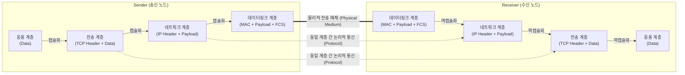

# 프로토콜 (Protocol)

---

## I. 이기종 시스템 간 원활한 통신을 위한 표준 규약, 프로토콜의 개요

* **정의**: 컴퓨터 네트워크 환경에서 서로 다른 시스템(이기종) 간에 데이터를 원활하고 [[신뢰성]] 있게 교환하기 위해 사전에 합의된 통신 규칙, 규약, 절차의 집합
* **등장배경**: 하드웨어 및 운영체제가 서로 다른 시스템 간의 통신 불일치 해소, 통신망의 규모 확대에 따른 상호운용성(Interoperability) 및 통신 신뢰성 확보 필요
* **특징**:
* **프로토콜의 3요소**: 데이터 구조를 정의하는 **구문(Syntax)**, 제어 정보를 담는 **의미(Semantics)**, 전송 속도 및 순서를 정의하는 타이밍(Timing)으로 구성
* **계층화 구조**: 복잡한 네트워크 기능을 모듈화하여 OSI 7계층, [[TCP]]/IP 등 계층적 스택([[Stack]]) 구조로 설계 및 구현됨

---

## II. 프로토콜의 개념도 및 핵심 기술 요소

### 가. 프로토콜의 통신 메커니즘 및 캡슐화 동작 개념도

* 송신 측은 상위 계층에서 하위 계층으로 제어 정보(Header/Trailer)를 덧붙이는 [[캡슐화]](Encapsulation)를 수행하고, 수신 측은 이를 제거하는 역캡슐화(Decapsulation)를 통해 동일 계층 간 논리적 통신을 수행함

### 나. 프로토콜의 핵심 구성 요소 및 주요 기능

| 분류 | 요소기술(키워드) | 세부 설명 |
| --- | --- | --- |
| **기본 3요소** | 구문 (Syntax) | 데이터의 포맷, 부호화 방식, 신호 크기 등 데이터의 구조적 형태 정의 |
| **기본 3요소** | 의미 (Semantics) | 통신 제어, 오류 복구, 동기화 유지를 위한 각 항목의 의미와 제어 정보 |
| **기본 3요소** | 타이밍 (Timing) | 기기 간의 통신 속도 조절(Speed matching) 및 메시지의 전송 순서 정의 |
| **주요 기능** | [[단편화]] 및 재조립 | 대용량의 데이터를 전송망의 최대 전송 단위(MTU) 크기에 맞게 분할 및 병합 |
| **주요 기능** | 캡슐화 (Encapsulation) | 데이터(SDU)에 송수신지 주소, 오류 검출 코드 등의 제어 정보(PCI)를 부가 |
| **주요 기능** | 흐름 제어 (Flow Control) | 수신 측의 버퍼 처리 능력을 초과하지 않도록 송신 측의 데이터 전송 양 조절 (Sliding Window 등) |
| **주요 기능** | 오류 제어 (Error Control) | 전송 도중 발생하는 데이터의 훼손, 분실을 탐지([[CRC]] 등)하고 재전송(ARQ) 처리 |
| **주요 기능** | [[다중화]] (Multiplexing) | 다수의 통신 노드가 하나의 통신 링크(회선)를 분할하여 효율적으로 공유 및 사용 |

---

## III. 주요 프로토콜 아키텍처 비교 및 향후 전망

### 가. 프로토콜 표준 아키텍처 비교 (OSI 7 Layer vs TCP/IP)

| 비교 항목 | OSI 7 계층 (Layer) | TCP/IP 4 계층 (Layer) |
| --- | --- | --- |
| **제정 주체 / 목적** | ISO / 이기종 시스템 간 통신 표준 및 교육용 | DoD (미 국방성) / 실무 인터넷 망의 데이터 전송 |
| **계층 구조** | **7계층** (응용, 표현, [[세션]], 전송, 네트워크, 데이터링크, 물리) | **4계층** (응용, 전송, 인터넷, 네트워크 인터페이스) |
| **신뢰성 보장** | 네트워크 계층과 [[전송 계층]] 모두에서 신뢰성 검증 지원 | 전송 계층(TCP) 중심으로 종단 간([[End-to-End]]) 신뢰성 보장 |
| **현재 위상** | 참조 모델(Reference Model)로서 개념적 기준 제공 | 현재 인터넷 통신의 실질적 산업 표준(De facto Standard) |

### 나. 최신 프로토콜의 발전 동향 및 전망

* **웹 통신의 초저지연 및 고속화 ([[HTTP 3|HTTP/3]] 및 QUIC)**: 기존 TCP의 3-Way Handshake로 인한 지연 및 HOL Blocking(Head-of-Line Blocking) 문제를 해결하기 위해, UDP 기반의 QUIC 프로토콜을 도입하여 연결 설정 지연 최소화 및 다중화 성능 극대화 진행 중
* **IoT 및 엣지([[EDGE|Edge]]) 환경을 위한 경량 프로토콜 확산**: 제한된 전력, 대역폭, 컴퓨팅 자원을 가진 사물인터넷 환경에 적합하도록 패킷 헤더 오버헤드를 극소화한 발행-구독(Pub/Sub) 기반의 MQTT([[MQTT (Message Queuing Telemetry Transport)|Message Queuing Telemetry Transport]])와 RESTful 기반의 **[[CoAP]](Constrained Application Protocol)** 적용이 산업계 전반으로 확대됨

---

### 🔗 연관 토픽

- **소속 도메인**: [[00_네트워크_MOC|🌐 네트워크]]
- **세부 분류**: `1. OSI 7계층 & 데이터링크 계층 (L1/L2)`
- **핵심 연관 토픽**:
  - [[TCP]]
  - [[전송 계층|전송 계층 (Transport Layer)]]
  - [[MQTT (Message Queuing Telemetry Transport)]]
  - [[HTTP 3|HTTP/3]]
  - [[CoAP|CoAP (Constrained Application Protocol)]]
