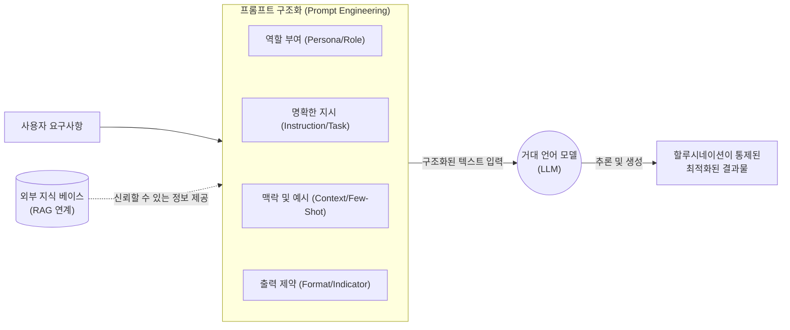

# 프롬프트 엔지니어링 (Prompt Engineering)

---

## I. 거대 언어 모델(LLM)의 성능 극대화를 위한 최적의 대화 설계 기법, 프롬프트 엔지니어링의 개요

* **정의**: 생성형 AI([[초거대 언어 모델|LLM]] 등)가 사용자의 의도를 정확히 파악하고 고품질의 결과물을 생성할 수 있도록, 입력 텍스트(프롬프트)를 구조화하고 최적화하는 기술 및 [[프로세스]]
* **필요성**: AI의 환각(Hallucination) 현상 최소화, 값비싼 모델 재학습([[Fine-Tuning]]) 없이 원하는 도메인 지식 반영, 의도된 형식과 일관된 품질의 답변 유도
* **특징**:
* **In-Context Learning**: 파라미터 업데이트 없이 입력된 문맥 내에서 패턴을 인지하고 학습
* **반복적 정제 (Iterative Refinement)**: 결과물을 모니터링하고 프롬프트를 지속적으로 튜닝하는 반복 과정 수반
* **도메인 융합**: AI 기술에 대한 이해와 특정 산업/도메인 지식의 융합이 필수적임

---

## II. 프롬프트 엔지니어링의 개념도 및 핵심 기술 요소

### 가. 프롬프트 엔지니어링의 구성도 및 동작 원리

* 사용자의 모호한 요구사항을 역할, 지시, 맥락, 출력 형식의 4가지 프레임워크로 구조화하고, 필요시 외부 지식(RAG)을 결합하여 LLM의 추론 성능을 극대화함

### 나. 프롬프트 엔지니어링의 핵심 기술 요소

| 구분 | 요소기술(기법) | 세부 설명 |
| --- | --- | --- |
| **기본 샷(Shot) 기법** | Zero-Shot Prompting | 예시 제공 없이 지시사항만으로 모델의 사전 학습된 지식을 활용하여 답변을 유도 |
| **기본 샷(Shot) 기법** | Few-Shot Prompting | 1개 또는 소수의 입출력 예제쌍을 문맥에 제공하여 모델이 출력 패턴을 모방하도록 유도 |
| **추론 강화 기법** | [[COT|CoT]] (Chain of Thought) | "차근차근 생각해 보자(Think step-by-step)" 등의 지시를 통해 중간 논리 과정을 전개하도록 유도 |
| **추론 강화 기법** | [[ToT]] (Tree of Thoughts) | CoT를 확장하여 여러 추론 경로(Tree)를 동시에 탐색하고 자체 평가하여 최적의 해답을 도출 |
| **행동 연계 기법** | ReAct (Reason + Act) | LLM이 추론(Reasoning)을 수행하고 필요한 정보를 외부 도구(API, 검색 등)에서 가져오는 행동(Action)을 결합 |
| **구조화 기법** | Role Prompting | LLM에 특정 [[페르소나]](예: "당신은 20년 차 IT 기술사입니다")를 부여하여 전문적이고 일관된 톤의 답변 유도 |
| **흐름 제어 기법** | Prompt Chaining | 복잡한 단일 작업을 여러 개의 단순한 프롬프트 단계로 분할하고, 앞의 출력을 다음의 입력으로 파이프라인화 |
| **자동화 기법** | DSPy / Prompt Search | 프롬프트를 수동으로 작성하지 않고, 머신러닝 최적화 기법을 사용하여 시스템이 프롬프트를 자동 최적화 |

---

## III. LLM 성능 향상 기법 비교 및 프롬프트 엔지니어링의 향후 전망

### 가. 프롬프트 엔지니어링과 파인튜닝(Fine-Tuning) 비교

| 비교 항목 | 프롬프트 엔지니어링 (Prompt Engineering) | 파인튜닝 (Fine-Tuning) |
| --- | --- | --- |
| **핵심 원리** | 입력되는 문맥(Context)의 최적화 | 모델의 내부 파라미터(가중치)를 자체를 업데이트 |
| **필요 자원/비용** | 매우 낮음 (별도의 컴퓨팅 인프라 불필요) | 높음 ([[GPU]] 등 대규모 컴퓨팅 자원 및 고품질 데이터 셋 필요) |
| **모델 변경 여부** | 변경 없음 (Frozen Model) | [[모델 구조]] 및 가중치 변경됨 |
| **데이터 요구량** | 데이터 불필요 또는 극소량 (Few-shot) | 수백~수만 건의 정제된 도메인 특화 데이터 필수 |
| **적용 시기** | 지시사항 변경이 잦거나 빠른 프로토타이핑 시 | 특정 도메인의 뉘앙스, 어조, 전문 지식의 영구적 내재화 필요 시 |

### 나. 프롬프트 엔지니어링의 최신 동향 및 전망

* **RAG(검색 증강 생성)와의 결합 표준화**: 기업의 프라이빗 데이터를 안전하게 활용하기 위해 프롬프트 엔지니어링과 벡터 DB 기반의 RAG를 결합하는 하이브리드 접근법이 엔터프라이즈 AI 아키텍처의 표준으로 자리 잡음
* **Agentic AI로의 진화**: 사용자가 수동으로 프롬프트를 튜닝하는 단계를 넘어, LLM 기반의 자율 에이전트(Agent)가 스스로 프롬프트를 계획, 평가, 수정하고 도구를 호출하는 '에이전틱 워크플로우'의 핵심 기반 기술로 발전 중임

---

### 🔗 연관 토픽

- **소속 도메인**: [[00_인공지능_MOC|🤖 인공지능]]
- **세부 분류**: `4. 거대언어모델 (LLM) & 생성형 AI`
- **핵심 연관 토픽**:
  - [[COT|COT(Chain of Thought)]]
  - [[Fine-Tuning]]
  - [[LLMOps]]
  - [[ToT|tot Tree of thought]]
  - [[프롬프트 튜닝|프롬프트 튜닝(Prompt Tuning)]]
