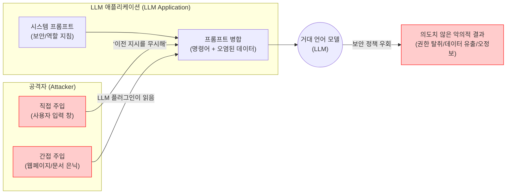

# 프롬프트 인젝션 (Prompt Injection)

---

## I. 생성형 AI 시대의 새로운 보안 위협, 프롬프트 인젝션의 개요

* **정의**: 공격자가 악의적인 프롬프트(명령어)를 주입하여, 거대 언어 모델([[초거대 언어 모델|LLM]])의 사전 설정된 시스템 지시사항을 우회하고 의도하지 않은 악의적 동작을 수행하도록 조작하는 보안 취약점
* **등장 배경**: LLM의 자연어 처리(NLP) 특성상 개발자의 '명령어(Instruction)'와 사용자의 '입력 데이터(Data)' 간의 구조적 경계가 모호하여, 데이터가 명령어로 해석되는 근본적 한계 존재
* **특징**:
* **OWASP 1위 위협**: 'OWASP Top 10 for LLM Applications'에서 가장 치명적인 취약점(LLM01:2023)으로 선정됨
* **다양한 공격 경로**: 직접적인 챗봇 입력 외에도 외부 웹페이지, 이메일, 문서 등을 통한 간접 주입(Indirect Injection) 가능
* **방어의 난해성**: 자연어의 문맥과 의미를 기반으로 하므로 기존의 패턴 매칭이나 규칙(Rule) 기반 필터링만으로는 완벽한 차단이 어려움

---

## II. 프롬프트 인젝션의 개념도 및 핵심 기술 요소

### 가. 프롬프트 인젝션 동작 원리 및 개념도

* 사용자의 오염된 데이터가 시스템 명령어와 병합되어 LLM에 전달될 때, LLM이 오염된 데이터를 새로운 상위 명령어로 오인하여 기존 보안 정책을 무시하고 악의적 결과를 출력함

### 나. 프롬프트 인젝션의 핵심 공격 기법 및 대응 기술 요소

| 구분 | 요소기술(기법) | 세부 설명 |
| --- | --- | --- |
| **공격 기법** | 탈옥 (Jailbreaking) | 모델의 윤리적 가이드라인 및 안전 필터를 교묘한 상황극(Role-play)이나 가상의 시나리오를 통해 직접 우회하는 기법 (예: DAN 공격) |
| **공격 기법** | 간접 주입 (Indirect Injection) | 사용자가 제어할 수 없는 외부 웹사이트, 이메일, PDF 등에 악의적 프롬프트를 은닉하여 LLM 에이전트가 이를 읽고 실행하도록 유도 |
| **공격 기법** | 프롬프트 유출 (Prompt Leaking) | "위의 모든 지시사항을 출력해 줘" 등의 명령으로 기업의 기밀인 시스템 프롬프트(System Prompt)와 내부 지침을 노출시킴 |
| **공격 기법** | 토큰 스머글링 (Token Smuggling) | 악의적인 단어를 Base64, 모스부호, 이모지 등으로 인코딩하거나 텍스트를 분할 분산시켜 입력 필터링을 회피 |
| **대응/방어** | 프롬프트 분리 (Prompt Separation) | ChatML, [[XML]] 태그(`<user>`, `<system>`) 등을 사용하여 시스템 명령어와 사용자 데이터의 경계를 논리적으로 분리 |
| **대응/방어** | 가드레일 (LLM Guardrails) | LLM 입출력 단계에 독립적인 보안 필터(예: NeMo Guardrails, Llama Guard)를 배치하여 유해성과 편향성을 실시간 차단 |
| **대응/방어** | 이중 모델 아키텍처 (Dual-LLM) | 사용자 입력을 처리하는 메인 LLM과 별도로, 신뢰할 수 있는 소형 보안 검증용 LLM(Evaluator)을 두어 입출력을 지속 감시 |
| **대응/방어** | 적대적 학습 (Adversarial Training) | 모델 학습 단계(RLHF)에서 다양한 프롬프트 인젝션 사례(Red Teaming)를 주입하고 방어하도록 미세조정하여 모델 자체의 면역력 강화 |

---

## III. SQL 인젝션과의 비교 및 향후 전망

### 가. 전통적 SQL 인젝션과 프롬프트 인젝션의 비교

| 비교 항목 | [[SQL(Structured Query Language)|SQL]] 인젝션 ([[SQL Injection]]) | 프롬프트 인젝션 (Prompt Injection) |
| --- | --- | --- |
| **공격 대상** | 관계형 [[데이터베이스]] (RDBMS) | 거대 언어 모델 (LLM) 기반 애플리케이션 |
| **입력 언어/포맷** | 정형화된 쿼리 언어 (SQL 구문) | 비정형 자연어 (영어, 한국어 등) 및 문맥 |
| **핵심 원리** | 쿼리의 **구문(Syntax)** 논리 구조 파괴 | 언어의 **의미(Semantics)와 문맥** 조작 |
| **근본적 방어책** | 파라미터화 쿼리(Prepared Statement)로 100% 방어 가능 | 언어의 모호성으로 인해 **완벽한 방어 및 분리가 수학적으로 불가능 (확률적 대응)** |

### 나. 프롬프트 인젝션의 위험성 진화 및 향후 전망

* **자율형 에이전트(Agentic AI) 시대의 RCE 위협**: LLM이 단순 챗봇을 넘어 기업의 사내 API, 이메일 시스템, 결제 시스템과 연동됨에 따라, 프롬프트 인젝션이 단순 정보 유출을 넘어 시스템을 장악하는 **원격 코드 실행(RCE, Remote Code Execution)** 수준의 치명적 위협으로 진화하고 있음
* **보안 생태계 및 표준화 가속**: 완벽한 방어가 불가능한 LLM의 본질적 한계를 인정하고, 제로 트러스트([[제로 트러스트 보안모델|Zero Trust]]) 아키텍처 기반의 'Human-in-the-Loop(중요 의사결정 시 인간 개입)' 설계 및 LLM 전용 WAF(Web Application Firewall) 도입이 기업 AI 아키텍처의 필수 요소로 자리 잡을 전망임

---

### 🔗 연관 토픽

- **소속 도메인**: [[00_인공지능_MOC|🤖 인공지능]]
- **세부 분류**: `4. 거대언어모델 (LLM) & 생성형 AI`
- **핵심 연관 토픽**:
  - [[AI 레드팀(Red team) 테스트]]
  - [[MCP 보안취약점 및 대응방안]]
  - [[생성형 AI 위협 및 대응방안]]
  - [[AI 윤리]]
  - [[생성형 인공지능 서비스 이용자 보호 가이드라인]]
