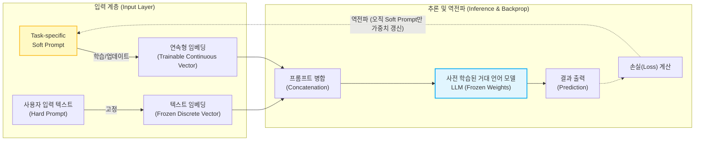

# 프롬프트 튜닝 (Prompt Tuning)

---

## I. 거대 언어 모델(LLM)의 파라미터 효율적 미세조정 기법, 프롬프트 튜닝의 개요

* **정의**: 사전 학습된 [[초거대 언어 모델]](LLM)의 가중치(Weight)는 고정(Freeze)한 채, 입력 데이터 앞단에 학습 가능한 연속형 임베딩(Continuous Soft Prompt) 벡터만을 추가하여 목적에 맞게 모델을 최적화하는 [[PEFT|PEFT(Parameter-Efficient Fine-Tuning)]] 기법
* **등장 배경**: 전체 파라미터를 업데이트하는 파인튜닝(Full [[Fine-Tuning]])의 천문학적인 컴퓨팅 자원 및 메모리 한계 극복, 사람이 직접 작성하는 하드 프롬프트(Hard Prompt)의 수작업 한계 및 컨텍스트 길이 제한 극복
* **특징**:
* **매개변수 효율성**: 모델 전체 파라미터의 0.1% 미만에 해당하는 프롬프트 벡터만 학습하므로 자원 소모 극소화
* **작업별 유연성(Task-switching)**: 단일 LLM 인스턴스를 유지하며, 작업(Task)별로 가벼운 소프트 프롬프트 벡터만 교체하여 다중 작업(Multi-task) 동시 지원 가능

---

## II. 프롬프트 튜닝의 아키텍처 및 핵심 기술 요소

### 가. 프롬프트 튜닝의 개념도 및 동작 원리

* 사용자의 자연어 입력(이산적)은 고정된 임베딩으로 변환하고, 그 앞에 학습 가능한 실수형 텐서(Soft Prompt)를 이어붙여(Concat) 모델에 입력한 뒤, [[역전파]] 과정에서 LLM의 가중치는 고정하고 Soft Prompt의 벡터 값만 갱신함

### 나. 프롬프트 튜닝의 핵심 기술 및 구성 요소

| 구분 | 요소기술(키워드) | 세부 설명 |
| --- | --- | --- |
| **튜닝 모델** | PEFT (Parameter-Efficient Fine-Tuning) | 초대형 언어 모델의 전체 가중치 중 극히 일부의 파라미터만 학습하여 튜닝 비용을 절감하는 방법론 총칭 |
| **프롬프트 구조** | Soft Prompt (연속형 프롬프트) | 사람이 읽을 수 있는 텍스트가 아닌, 기계가 이해하고 최적화할 수 있는 연속적인(Continuous) 실수형 벡터 배열 |
| **프롬프트 구조** | Hard Prompt (이산형 프롬프트) | 기존 프롬프트 엔지니어링에서 사용하는 '단어(Token)' 기반의 이산적인 자연어 텍스트 입력 |
| **모델 상태** | Frozen LLM (가중치 동결) | 모델의 망각(Catastrophic Forgetting) 현상을 방지하고 연산량을 줄이기 위해 기존 LLM의 내부 파라미터를 고정 |
| **학습 메커니즘** | Backpropagation (역전파) | 출력된 결과와 정답 간의 손실(Loss)을 계산하고 역전파하여, 입력단의 Soft Prompt 벡터값만 반복적으로 업데이트 |
| **응용 아키텍처** | P-Tuning | Soft Prompt가 단순 연속 벡터임에 따른 최적화 불안정성을 해결하기 위해 프롬프트 인코더([[LSTM (Long Short-Term Memory)|LSTM]], MLP 등)를 추가 적용한 기법 |
| **응용 아키텍처** | Prefix Tuning | [[트랜스포머]] 아키텍처의 입력단 뿐만 아니라, 모든 은닉층(Hidden Layer)의 앞부분에 학습 가능한 Prefix(접두사)를 추가하는 기법 |
| **배포/운영** | Task-specific Vector Serving | 번역, 요약, 분류 등 각 태스크별로 수 MB 수준의 작은 벡터(Soft Prompt)만 저장해두고 런타임에 스위칭하여 서빙 |

---

## III. 프롬프트 튜닝과 타 LLM 최적화 기법 비교 및 향후 전망

### 가. 프롬프트 엔지니어링 vs 프롬프트 튜닝 vs 파인튜닝(Full Fine-Tuning) 비교

| 비교 항목 | [[프롬프트 엔지니어링]] | 프롬프트 튜닝 (Prompt Tuning) | 전체 파인튜닝 (Full Fine-Tuning) |
| --- | --- | --- | --- |
| **입력 형태** | 이산적 (Discrete 자연어 토큰) | 연속적 (Continuous 실수형 벡터) | 튜닝된 파라미터 내재화 |
| **학습 주체 / 방법** | 사람 (수작업 시행착오) / **학습 없음** | 기계 ([[경사하강법]]) / **입력 벡터만 학습** | 기계 (경사하강법) / **모델 전체 학습** |
| **컴퓨팅/저장 비용** | 매우 낮음 | **낮음 (효율적 연산 및 소용량 저장)** | 매우 높음 (대규모 [[GPU]] 클러스터 필요) |
| **가중치(Weight)** | 변경 없음 (Frozen) | **LLM은 동결, 프롬프트만 업데이트** | LLM 전체 파라미터 업데이트 |
| **성능 (모델 크기별)** | 모델 크기가 작을 경우 성능 저조 | **초거대 모델(10B 이상)에서 파인튜닝에 필적** | 모든 크기의 모델에서 최고 성능 |

### 나. 프롬프트 튜닝의 최신 동향 및 향후 전망

* **LoRA([[LoRA(Low-rank adaptation)|Low-Rank Adaptation]])와의 결합**: 최근 PEFT 분야에서는 입력 벡터만 튜닝하는 프롬프트 튜닝과 모델 내부의 가중치 행렬을 저랭크로 분해하여 학습하는 LoRA 기법을 상호 보완적으로 혼용하여, 최적의 가성비(Cost-Effectiveness)와 성능을 도출하는 튜닝 파이프라인이 엔터프라이즈 환경에 정착 중임
* **서비스형 튜닝(Tuning-as-a-Service) 확산**: 클라우드 기반 LLM 제공 기업([[CSP]])들이 고객의 프라이버시 데이터를 모델 외부에 유지한 채, 고객별/산업별 Soft Prompt 벡터만 독립적으로 호스팅하여 다중 테넌트(Multi-Tenant) 환경에서 안전하고 저렴하게 맞춤형 AI를 제공하는 비즈니스 모델로 확장되고 있음

---

### 🔗 연관 토픽

- **소속 도메인**: [[00_인공지능_MOC|🤖 인공지능]]
- **세부 분류**: `4. 거대언어모델 (LLM) & 생성형 AI`
- **핵심 연관 토픽**:
  - [[Fine-Tuning]]
  - [[프롬프트 엔지니어링|프롬프트 엔지니어링(Prompt Engineering)]]
  - [[PEFT|PEFT(Parameter-Efficient Fine-Tuning)]]
  - [[초거대 언어 모델|초거대 언어 모델(Large Language Model)]]
  - [[역전파|역전파(Backpropagation)]]
