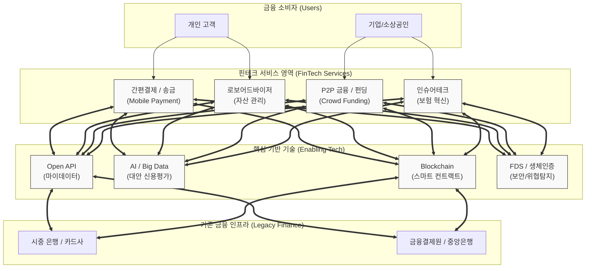

# 핀테크 (FinTech)

---

## I. 금융 산업의 파괴적 혁신, 핀테크의 개요

* **정의**: 금융(Finance)과 기술(Technology)의 합성어로, [[인공지능]](AI), 빅데이터, 클라우드, [[01_IT Tech/블록체인]] 등의 첨단 IT 기술을 결합하여 기존 금융 서비스를 혁신하거나 새로운 금융 비즈니스 모델을 창출하는 산업 및 기술
* **등장 배경 및 필요성**:
* **소비자 요구 변화**: 복잡한 금융 절차 탈피, 모바일 기반 비대면(Untact) 금융 서비스 및 초개인화된 사용자 경험(UX) 요구 증대
* **빅블러(Big Blur) 현상 심화**: 금융과 비금융 산업 간의 경계가 붕괴되며, IT 빅테크 기업의 금융업 진출 가속화

* **특징**:
* **탈중개화(Disintermediation)**: 기존 금융기관(은행 등)의 중개 과정 없이 수요자와 공급자를 직접 연결하여 수수료 등 거래 비용 절감
* **초개인화(Hyper-personalization)**: [[마이데이터]](MyData)와 AI 기반의 정밀한 신용 평가를 통해 고객 맞춤형 자산 관리 서비스 제공

---

## II. 핀테크의 개념도 및 핵심 구성 요소

### 가. 핀테크 융합 생태계 및 동작 개념도

* 핀테크 서비스 플랫폼은 Open API와 마이데이터를 통해 기존 금융망과 연동되며, AI와 블록체인을 기반으로 사용자에게 탈중앙화되고 개인화된 혁신 금융 서비스를 제공함

### 나. 핀테크의 핵심 기술 및 서비스 요소

| 구분 | 요소기술(키워드) | 세부 설명 |
| --- | --- | --- |
| **서비스 영역** | 지급 결제 (Payment) | [[NFC]], [[최소 신장 트리|MST]], QR코드 등을 활용하여 공인인증서 없이 빠르고 간편하게 결제 및 송금을 처리하는 서비스 (예: 삼성페이, 토스) |
| **서비스 영역** | P2P 대출 (P2P Lending) | 금융기관을 거치지 않고 온라인 플랫폼을 통해 대출자와 투자자를 직접 연결하는 크라우드펀딩 기반 대출 서비스 |
| **서비스 영역** | 로보어드바이저 (Robo-Advisor) | 로봇(Robot)과 자문가(Advisor)의 합성어로, AI 알고리즘과 빅데이터 분석을 통해 투자자의 성향에 맞는 자산 포트폴리오를 자동 추천 및 운용 |
| **서비스 영역** | 인슈어테크 (InsurTech) | IoT, 웨어러블 기기, 텔레매틱스 데이터를 분석하여 맞춤형 보험 상품을 설계하고, 사고 발생 시 스마트 컨트랙트로 자동 보상 처리 |
| **핵심 기술** | Open API / 마이데이터 | 여러 금융기관에 흩어진 고객의 신용, 금융, 통신 데이터를 표준화된 API 형태로 집적하고 개방하여 새로운 부가가치를 창출 |
| **핵심 기술** | 대안 신용평가 모델 (CSS) | 통신비 납부 이력, 온라인 쇼핑 내역, SNS 활동 등 비금융 데이터를 AI로 분석하여 씬파일러(Thin Filer)에 대한 정밀한 신용 등급 산정 |
| **핵심 기술** | 블록체인 / 분산원장 | 송금 수수료 절감, 데이터 위변조 방지, 스마트 컨트랙트를 통한 조건부 자동 거래 집행 및 디지털 자산(토큰) 관리 |
| **보안 기술** | FDS (이상거래탐지시스템) | 결제자의 기기 정보, 접속 위치, 평소 거래 패턴 등의 데이터를 머신러닝으로 분석하여 사기(Fraud) 결제를 실시간으로 차단 |

---

## III. 핀테크와 테크핀의 비교 및 향후 전망

### 가. 핀테크(FinTech)와 테크핀(TechFin) 비즈니스 모델 비교

| 비교 항목 | 핀테크 (FinTech) | 테크핀 (TechFin) |
| --- | --- | --- |
| **핵심 정의** | **금융 회사**가 IT 기술을 주도적으로 도입하여 서비스 혁신 | **IT 빅테크 기업**이 막대한 유저 플랫폼을 기반으로 금융업에 진출 |
| **주도 사업자** | 전통 시중 은행, 금융 지주사, 핀테크 스타트업 | 빅테크 및 플랫폼 기업 (네이버, 카카오, 애플, 아마존) |
| **경쟁 우위 요소** | 금융 인가 라이선스, 자본력, 기존 금융망 인프라 | 방대한 플랫폼 유저, 비금융 데이터, 고도화된 UI/UX |
| **목적 및 방향성** | 금융 상품의 고도화, 비대면 채널 확대 | 이커머스 등 자사 생태계 강화, 결제 락인(Lock-in) 효과 극대화 |

### 나. 핀테크 생태계의 최신 동향 및 향후 전망

* **임베디드 금융(Embedded Finance) 및 BaaS의 확산**: 금융 서비스가 단독 앱으로 존재하는 것을 넘어, 비금융 플랫폼(쇼핑, 모빌리티, 배달 앱 등)에 결제, 대출, 보험 기능이 내재화되는 임베디드 금융이 BaaS(Banking as a Service) API를 통해 표준화되어 급격히 성장 중임
* **[[Web 3.0]] 기반 탈중앙화 금융(DeFi) 및 [[CBDC]] 연계**: 중앙은행 발행 디지털 화폐(CBDC) 실증 테스트가 본격화됨에 따라, 핀테크 생태계는 토큰 증권(STO)과 스마트 컨트랙트 기반의 디파이(DeFi) 영역으로 확장되며 국경 없는 [[프로토콜]] 경제로 패러다임이 전환되고 있음

---

### 🔗 연관 토픽

- **소속 도메인**: [[00_경영전략_MOC|📈 경영전략]]
- **세부 분류**: `3. 비즈니스 프로세스 혁신 & 디지털 전환 (DX)`
- **핵심 연관 토픽**:
  - [[CBDC]]
  - [[Web 3.0]]
  - [[프롭테크|프롭테크 (PropTech)]]
  - [[프로토콜 경제|프로토콜 경제(Protocol Economy)]]
  - [[NFC]]
