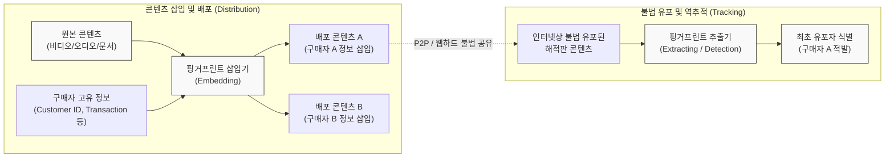

# 핑거프린팅 (Fingerprinting)

---

## I. 불법 유포자 식별 및 추적을 위한, 핑거프린팅의 개요

* **정의**: 디지털 콘텐츠에 저작권자 정보뿐만 아니라 구매자(사용자)의 고유 정보(ID, IP 등)를 삽입하여, 불법 복제 및 유포 발생 시 최초 유포자를 추적할 수 있는 저작권 보호 기술
* **등장 배경/필요성**:
* **워터마킹의 한계**: 소유권 증명 목적의 워터마킹만으로는 실제 불법 행위를 저지른 최초 유포자를 식별하여 처벌하기 곤란함
* **디지털 자산 보호 강화**: 멀티미디어, 전자문서 등의 불법 유출 시 사후 추적을 통한 법적 제재 근거 확보 필요

* **특징**:
* **개인화된 산출물**: 동일한 원본 콘텐츠라도 구매자에 따라 미세하게 다른 고유의 핑거프린트가 삽입되어 배포됨
* **공모 공격 취약성**: 여러 구매자가 각자의 콘텐츠를 비교하여 차이점(핑거프린트)을 식별하고 제거하는 공격(Collusion Attack)에 노출될 수 있음

---

## II. 핑거프린팅의 개념도 및 핵심 기술 요소

### 가. 핑거프린팅의 배포 및 추적 동작 개념도

* 정상적인 배포 과정에서는 사용자별 맞춤형 식별자를 은닉하여 제공하며, 불법 유포된 파일이 발견되면 추출기를 통해 해당 콘텐츠를 최초로 유출한 구매자를 찾아냄

### 나. 핑거프린팅의 핵심 기술 및 구성 요소

| 구분 | 요소기술(키워드) | 세부 설명 |
| --- | --- | --- |
| **핵심 요구사항** | 비가시성 (Invisibility) | 삽입된 구매자 정보가 인간의 시각/청각으로 인지되지 않아 원본 품질을 저하시키지 않아야 함 |
| **핵심 요구사항** | 강인성 (Robustness) | 압축(JPEG, MP3), 필터링, 포맷 변환 등 의도적 또는 비의도적 변형 공격에도 정보가 소실되지 않아야 함 |
| **주요 위협/공격** | 공모 공격 (Collusion Attack) | 동일 콘텐츠를 구매한 다수의 사용자가 핑거프린트를 상호 비교하여 차이점을 찾아 제거하거나 조작하는 공격 |
| **위협 방어 기술** | 공모 방지 코드 (ACC) | 공모 공격이 발생하더라도 생성된 코드를 기반으로 공모자 중 최소 1명 이상을 역추적할 수 있도록 설계된 부호(Code) 체계 |
| **위협 방어 기술** | 비대칭 핑거프린팅 | 판매자도 구매자의 핑거프린트 원문을 알 수 없도록 공개키(PKI) [[암호화]] 프로토콜을 적용하여 판매자의 악의적 조작 방지 |
| **삽입 [[알고리즘]]** | 공간 영역 삽입 (LSB) | 이미지 픽셀의 최하위 비트(Least Significant Bit)를 조작하여 데이터를 삽입 (구현이 단순하나 압축 공격에 취약) |
| **삽입 알고리즘** | 주파수 영역 삽입 | 영상을 주파수 대역으로 변환(DCT, DWT, FFT)한 후, 시각적으로 덜 민감한 중/저주파수 대역에 데이터를 삽입하여 강인성 확보 |
| **보안 응용 영역** | 브라우저 핑거프린팅 | 콘텐츠 보안을 넘어, 웹 환경에서 [[쿠키]](Cookie) 없이 접속 기기의 해상도, 폰트, OS 속성 등을 조합해 사용자를 특정하는 식별 기술 |

---

## III. 핑거프린팅과 워터마킹의 비교 및 최근 기술 동향

### 가. 핑거프린팅과 워터마킹(Watermarking) 비교

| 비교 항목 | 디지털 핑거프린팅 (Digital Fingerprinting) | [[디지털 워터마킹]] (Digital Watermarking) |
| --- | --- | --- |
| **적용 목적** | 불법 복제 방지 및 **최초 유포자 추적** | 콘텐츠 **저작권자(소유자) 증명** 및 보호 |
| **삽입되는 정보** | **구매자(사용자)** 고유 식별 정보 | **저작권자(창작자 또는 배포사)** 정보 |
| **콘텐츠의 형태** | 배포되는 **구매자마다 미세하게 다른** 형태 | 모든 구매자에게 **동일한** 형태 |
| **가장 치명적 공격** | 여러 버전 비교를 통한 **공모 공격(Collusion)** | 데이터 훼손을 위한 **변형 공격(압축, 자르기 등)** |
| **주요 적용 사례** | 사내 기밀문서 추적, 극장판 시사용 영화 배포 | 상업용 이미지 소유권 표기, 지폐/신분증 위조 방지 |

### 나. 핑거프린팅의 최근 기술 동향 및 향후 전망

* **AI/[[딥러닝]] 기반 강인성 향상**: 기존 주파수 변환 방식의 한계를 극복하기 위해, [[CNN]]/[[GAN (Generative Adversarial Network)|GAN]] 등 딥러닝 모델을 활용하여 압축비율이 높은 환경이나 동영상 스트리밍 플랫폼에서도 소실되지 않는 지능형 핑거프린트 삽입 및 추출 기술이 상용화되고 있음
* **보안 영역의 확장 (디바이스/브라우저 핑거프린팅)**: 서드파티 쿠키(3rd-Party Cookie) 지원 중단(Cookie-less)에 따라 웹/광고 생태계에서는 캔버스 핑거프린팅(Canvas Fingerprinting) 등 디바이스의 고유 속성을 추출하여 사용자를 비식별 추적하는 기술로 그 의미가 확장되고 있으며, 이에 대응하는 프라이버시 보호 기술(Anti-Fingerprinting) 창과 방패의 대결로 진화 중임

---

### 🔗 연관 토픽

- **소속 도메인**: [[00_보안_MOC|🛡️ 보안]]
- **세부 분류**: `6. 개인정보보호 & 프라이버시 강화 기술`
- **핵심 연관 토픽**:
  - [[디지털 워터마킹|디지털 워터마킹(Digital Watermarking)]]
  - [[DRM(Digital Right Management)]]
  - [[암호화|암호화 (Encryption)]]
  - [[딥러닝]]
  - [[비식별화]]
