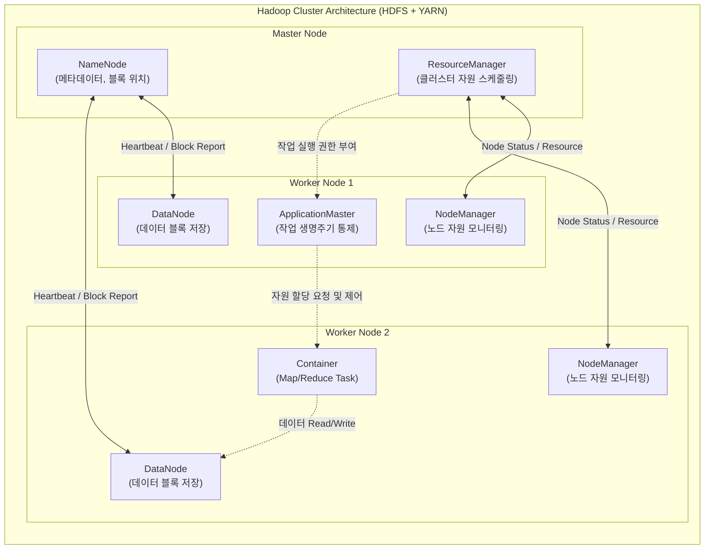

# 하둡 (Hadoop)

---

## I. 저비용 대규모 분산 데이터 처리 플랫폼, 하둡의 개요

* **정의**: 범용 하드웨어(Commodity Hardware)로 구성된 클러스터 환경에서 대규모 비정형 데이터 세트를 분산 저장하고 병렬 처리하기 위한 아파치(Apache) 오픈소스 [[프레임워크]]
* **등장 배경 및 필요성**:
* **데이터 폭증**: RDBMS의 스케일업(Scale-up) 방식으로는 기하급수적으로 증가하는 빅데이터 처리에 한계 도달
* **비용 절감**: 고가의 유닉스/스토리지 장비 대신 저렴한 범용 x86 서버 기반의 스케일아웃(Scale-out) 아키텍처 필요

* **특징**:
* **내결함성(Fault Tolerance)**: 데이터 블록의 3중 복제(Replication)를 통해 노드 장애 시에도 데이터 유실 방지
* **데이터 [[지역성]](Data Locality)**: 데이터가 저장된 노드(DataNode)로 연산(MapReduce)을 이동시켜 네트워크 부하 최소화
* **자원 관리 유연성**: YARN 도입(Hadoop 2.0~)으로 MapReduce 외 다양한 분산 처리 엔진 동시 구동 지원

---

## II. 하둡의 아키텍처 및 핵심 기술 요소

### 가. 하둡 클러스터 아키텍처 및 동작 원리 (Hadoop 2.0 기준)

* Master Node(NameNode, ResourceManager)가 클러스터 전체의 메타데이터와 자원을 통제하며, Worker Node(DataNode, NodeManager)에서 실제 데이터 저장 및 병렬 연산(Container)을 수행함

### 나. 하둡의 핵심 구성 요소 (분산 저장, 자원 관리, 분산 처리)

| 구분 | 요소기술(키워드) | 세부 설명 |
| --- | --- | --- |
| **분산 저장 ([[HDFS]])** | NameNode | 파일 시스템의 네임스페이스 관리, 메타데이터(파일 이름, 권한, 블록 매핑 정보)를 메모리에 유지 |
| **분산 저장 (HDFS)** | DataNode | 실제 데이터 블록(기본 128MB)을 로컬 디스크에 저장하고, 주기적으로 NameNode에 하트비트 전송 |
| **자원 관리 (YARN)** | Resource Manager | 클러스터 전체의 컴퓨팅 자원([[CPU]], Memory)을 스케줄링하고 전역적인 자원 할당 수행 |
| **자원 관리 (YARN)** | Node Manager | 개별 워커 노드의 자원 사용량을 모니터링하고 [[컨테이너]](Container)의 생성 및 생명주기 관리 |
| **자원 관리 (YARN)** | Application Master | 제출된 특정 애플리케이션 1개의 실행, 자원 협상, 상태 모니터링 및 오류 복구를 전담 |
| **분산 처리** | MapReduce (Map) | 입력 데이터를 분할(Split)하여 Key-Value 쌍 형태로 데이터를 필터링하고 매핑(Mapping) 연산 수행 |
| **분산 처리** | MapReduce (Reduce) | Map의 출력 결과를 셔플링/소팅(Shuffling & Sorting)한 후 집계, 병합하여 최종 결과물 도출 |
| **클러스터 제어** | Zookeeper | 분산 환경에서 노드 간의 동기화, 상태 정보 유지, 리더 선출 등을 수행하는 코디네이션 시스템 |

---

## III. 하둡과 스파크(Spark) 비교 및 빅데이터 생태계 전망

### 가. 디스크 기반 하둡(MapReduce)과 인메모리 기반 스파크(Spark) 비교

| 비교 항목 | 하둡 (Hadoop MapReduce) | 아파치 스파크 (Apache Spark) |
| --- | --- | --- |
| **데이터 처리 기반** | **디스크(Disk) I/O 기반** 연산 | **인메모리(In-Memory) 기반** 연산 |
| **데이터 공유 구조** | 매 단계마다 결과를 HDFS 디스크에 저장 및 읽기 | RDD, DataFrame을 메모리에 캐싱하여 [[재사용]] |
| **처리 속도** | 대규모 디스크 I/O 발생으로 상대적 느림 | 인메모리 처리로 MR 대비 최대 100배 빠른 속도 |
| **지원 연산 방식** | 주로 배치(Batch) 처리 프레임워크 | 배치, 실시간 스트리밍, [[SQL(Structured Query Language)|SQL]], 머신러닝 통합 지원 |
| **주요 활용 분야** | 대용량 로그 단순 집계, 장기 보관 아카이빙 처리 | 반복적 [[알고리즘]](머신러닝), 실시간 데이터 분석 |

### 나. 하둡 생태계(Ecosystem)의 최신 동향 및 향후 전망

* **데이터 레이크(Data Lake) 인프라로의 정착**: 빅데이터 처리 엔진의 주도권은 스파크(Spark) 등 인메모리 기반으로 넘어갔으나, 저비용 대용량 분산 파일 시스템인 **HDFS와 YARN은 여전히 기업 데이터 레이크의 핵심 기반 저장소 및 자원 관리자로 확고히 자리매김**하고 있음
* **[[클라우드 네이티브]](Cloud-Native) 플랫폼으로의 진화**: 온프레미스 기반의 복잡한 하둡 클러스터 구축 대신, 스토리지(S3, GCS)와 컴퓨팅을 분리하고 필요할 때만 클러스터를 동적으로 생성/소멸시키는 클라우드 관리형 하둡 서비스(AWS EMR, GCP Dataproc) 적용이 엔터프라이즈 환경의 표준으로 정착 중임

---

### 🔗 연관 토픽

- **소속 도메인**: [[00_디지털서비스_MOC|🚀 디지털서비스]]
- **세부 분류**: `4. 데이터 플랫폼 & 개방형 API 생태계`
- **핵심 연관 토픽**:
  - [[지역성|지역성(Locality)]]
  - [[HDFS]]
  - [[클라우드 네이티브]]
  - [[컨테이너|컨테이너 (Container)]]
  - [[프레임워크]]
