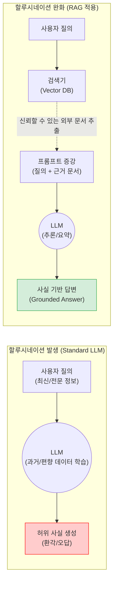

# 할루시네이션 (Hallucination)

---

## I. 신뢰성 있는 AI 구현의 최대 장애물, 할루시네이션의 개요

* **정의**: 거대 언어 모델([[초거대 언어 모델|LLM]])이 주어진 데이터나 객관적 사실에 근거하지 않고, 마치 사실인 것처럼 그럴듯하게 거짓 정보나 허위 사실을 날조하여 생성하는 현상
* **발생 원인**:
* **언어 모델의 본질적 한계**: LLM은 팩트 체킹(Fact-checking) 기계가 아닌, 통계적 확률에 기반하여 다음 토큰(단어)을 예측하도록 설계된 생성 모델임
* **학습 데이터의 결함**: 오래된 지식, 편향된 정보, 인터넷상의 검증되지 않은 잘못된 텍스트 학습
* **과대적합(Over-optimization)**: [[강화학습]](RLHF) 과정에서 인간에게 유창하고 그럴듯하게 보이도록 과도하게 보상되어 진실성보다 문장력을 우선시함

* **특징**:
* 정답을 모르는 상황에서도 "모른다"고 답하지 않고 자신감 있게 허위 답변을 생성하여 사용자의 오판을 유도 (의료, 법률, 금융 등 고위험 도메인 적용의 최대 장벽)

---

## II. 할루시네이션의 발생 메커니즘 및 완화(Mitigation) 기술 요소

### 가. 할루시네이션 발생 및 RAG 기반 통제 개념도

* 일반적인 LLM은 내부 매개변수에만 의존하여 지식의 공백이 있을 때 허위 사실을 날조하나, 검색 증강 생성(RAG) 등의 외부 지식 주입 체계를 통해 모델을 근거(Grounding) 기반으로 통제 가능

### 나. 할루시네이션 완화 핵심 기술 요소

| 분류 | 요소기술(키워드) | 세부 설명 |
| --- | --- | --- |
| **데이터 계층** | 고품질 데이터 정제 | 학습 데이터 수집 시 중복 제거, 노이즈 필터링, 사실 기반 문서 위주의 큐레이션을 통한 원천 결함 제거 |
| **데이터 계층** | 지식 그래프 (Knowledge Graph) | 개체 간의 관계를 수학적으로 구조화(트리플)하여, 언어 모델이 추론 시 의미론적 정확성과 팩트 체킹의 기준으로 활용 |
| **모델 계층** | RLHF (인간 피드백 강화학습) | 보상 모델(Reward Model) 설계 시 유창성뿐만 아니라 '사실성(Helpful and Honest)'에 높은 가중치를 두어 파라미터 미세조정 |
| **추론/외부 연계** | RAG (검색 증강 생성) | 모델 외부에 있는 최신 [[신뢰성]] 문서(Vector DB)를 검색하여, 생성 전 프롬프트에 컨텍스트로 제공함으로써 환각 방지 |
| **추론/외부 연계** | Tool Use / Function Calling | LLM이 직접 대답하지 않고 웹 브라우징, 계산기, 사내 API 등 외부 검증 도구를 호출하여 사실 확인 후 답변 |
| **프롬프트 계층** | [[COT|CoT]] (Chain of Thought) | "차근차근 생각해 보자"는 지시를 통해 중간 논리 과정을 단계별로 전개하도록 유도하여 논리적 비약에 의한 환각 방지 |
| **프롬프트 계층** | 자가 일관성 (Self-Consistency) | 다수의 상이한 추론 경로(답변)를 생성한 뒤 가장 다수결로 수렴하는 답변을 최종 선택하여 환각 발생 확률 최소화 |
| **검증 계층** | 가드레일 (LLM Guardrails) | NeMo Guardrails 등을 활용하여 사용자 입력과 LLM 출력 단에서 환각, [[편향]], 민감 정보가 포함되었는지 실시간 필터링 |

---

## III. 할루시네이션의 유형 비교 및 향후 전망

### 가. 할루시네이션의 주요 유형 비교 (내재적 vs 외재적)

| 비교 항목 | 내재적 할루시네이션 (Intrinsic) | 외재적 할루시네이션 (Extrinsic) |
| --- | --- | --- |
| **개념/형태** | 제공된 원본 데이터(프롬프트)와 **논리적으로 모순**되거나 상충되는 결과 생성 | 제공된 원본 데이터에 없는 새로운 사실을 **무에서 창조(날조)**하여 생성 |
| **주요 원인** | LLM의 논리적 추론 및 독해 능력 부족, 디코딩 알고리즘의 오류 | 지식 부족, 과도한 상상력(Over-generation), 거짓된 사실의 통계적 빈도 높음 |
| **예시** | (문서: A는 50세) → "A는 30세입니다." | (문서: A의 직업 요약) → "A는 B대학교를 졸업했습니다." (없는 정보) |
| **완화 접근법** | CoT, 논리성 및 문맥 이해 능력 강화를 위한 모델 파인튜닝 | RAG 연계, "문서에 기반하여 답하라", "모르면 모른다 하라"는 엄격한 시스템 프롬프트 제어 |

### 나. 할루시네이션 해결을 위한 최신 동향 및 향후 전망

* **에이전틱 워크플로우(Agentic Workflow)로의 진화**: 단일 프롬프트를 통한 1회성 생성을 넘어, 자율 에이전트가 답변을 생성한 후 웹 검색기나 코드 인터프리터(Code Interpreter)를 호출하여 스스로 교차 검증(Cross-validation)하고 수정(Self-Correction)하는 아키텍처가 표준화되고 있음
* **설명 가능한 AI([[XAI]])와 인용구(Citation) 제공**: 환각의 완벽한 0% 차단은 기술적으로 불가능하므로, LLM이 생성한 각 문장마다 근거가 되는 원본 문서의 출처(Reference Link)를 명시적으로 제공하여 사용자가 직접 팩트체크할 수 있도록 지원하는 'Human-in-the-Loop(인간 개입)' 생태계가 엔터프라이즈 AI의 필수 요건으로 부상 중임

---

### 🔗 연관 토픽

- **소속 도메인**: [[00_인공지능_MOC|🤖 인공지능]]
- **세부 분류**: `1. 수학 · 통계학 & 데이터 전처리`
- **핵심 연관 토픽**:
  - [[AI 시스템 테스트]]
  - [[자연어처리|자연어처리 (NLP)]]
  - [[XAI]]
  - [[유사도|유사도(Similarity)]]
  - [[편향]]
