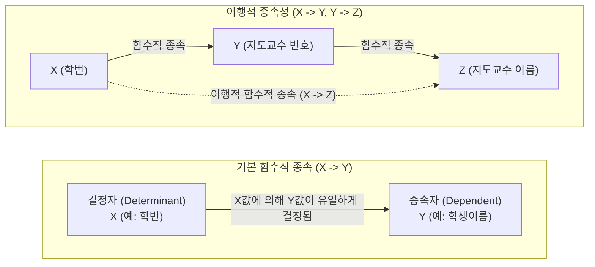

# 함수적 종속성 (Functional Dependency)

---

## I. 관계형 데이터베이스 정규화의 이론적 기반, 함수적 종속성의 개요

* **정의**: 관계형 데이터베이스의 릴레이션에서 특정 속성(집합) $X$의 값이 다른 속성(집합) $Y$의 값을 유일하게 결정할 때, 속성 $Y$는 속성 $X$에 함수적으로 종속된다고 하며 기호로 $X \rightarrow Y$로 표기하는 논리적 제약조건
* **목적/필요성**: 데이터 중복 최소화, 데이터 삽입/삭제/갱신 시 발생하는 이상현상([[Anomaly(이상현상)|Anomaly]]) 방지, 정규화(Normalization) 수행을 위한 이론적 근거 및 기준 제공
* **특징**:
* **결정자와 종속자**: 기준이 되는 속성 $X$를 결정자(Determinant), 구속받는 속성 $Y$를 종속자(Dependent)로 규정
* **상태의 독립성**: 릴레이션의 현재 [[인스턴스]](데이터) 상태뿐만 아니라 속성이 가진 본질적인 의미와 모든 가능한 인스턴스를 포괄하여 성립해야 함

---

## II. 함수적 종속성의 개념도 및 주요 유형

### 가. 함수적 종속성의 개념도 및 동작 원리

* 릴레이션 내에서 학번($X$)을 알면 학생이름($Y$)을 유일하게 식별할 수 있는 관계를 나타내며, 연쇄적인 종속 관계를 통해 이행적 종속성 등 다양한 논리적 구조를 형성함

### 나. 함수적 종속성의 핵심 기술 및 주요 유형

| 분류 | 요소기술(키워드) | 세부 설명 |
| --- | --- | --- |
| **기본 유형** | 완전 함수적 종속 (Full FD) | 종속자 $Y$가 결정자 $X$의 '전체' 속성 집합에만 종속되며, $X$의 어떠한 진부분 집합에도 종속되지 않는 상태 |
| **기본 유형** | 부분 함수적 종속 (Partial FD) | 결정자 $X$가 복합키(여러 속성)일 때, 종속자 $Y$가 결정자 $X$의 '일부' 속성만으로도 결정되는 상태 |
| **확장 유형** | 이행적 함수적 종속 (Transitive) | $X \rightarrow Y$ 이고 $Y \rightarrow Z$ 일 때, 논리적으로 $X \rightarrow Z$ 가 성립하는 연쇄적인 종속 관계 |
| **확장 유형** | 다중값 종속 (Multivalued, MVD) | $X$의 한 값이 $Y$의 여러 값(집합)을 결정하는 상태로, 기호로 $X \rightarrow\rightarrow Y$로 표기 |
| **추론 규칙** | 반사의 공리 (Reflexivity) | 암스트롱의 공리 중 하나로, $Y \subseteq X$ 이면 $X \rightarrow Y$ 가 항상 성립 (자명한 종속) |
| **추론 규칙** | 첨가의 공리 (Augmentation) | $X \rightarrow Y$ 이면, 임의의 속성 집합 $Z$에 대해 $XZ \rightarrow YZ$ 가 성립 |
| **추론 규칙** | 이행의 공리 (Transitivity) | $X \rightarrow Y$ 이고 $Y \rightarrow Z$ 이면, $X \rightarrow Z$ 가 성립 |
| **분해 조건** | 무손실 조인 분해 (Lossless Join) | 릴레이션을 분해할 때, 공통 속성이 적어도 하나의 분해된 릴레이션에서 결정자 역할을 해야 정보 손실을 방지 |

---

## III. 정규화와 함수적 종속성의 매핑 및 데이터 모델링 동향

### 가. 함수적 종속성 제거를 통한 정규화(Normalization) 단계 매핑

| 정규화 단계 | 제거 대상 (함수적 종속성 유형) | 정규화 후 도달 상태 |
| --- | --- | --- |
| **제1정규형 $\rightarrow$ 제2정규형** | **부분 함수적 종속** 제거 | 모든 비주요 속성이 기본키에 **완전 함수적 종속**됨 |
| **제2정규형 $\rightarrow$ 제3정규형** | **이행적 함수적 종속** 제거 | 기본키가 아닌 속성 간의 종속성을 제거하여 분리 |
| **제3정규형 $\rightarrow$ [[BCNF]]** | 후보키가 아닌 **결정자 함수적 종속** 제거 | 릴레이션의 모든 결정자가 반드시 후보키(Candidate Key)가 됨 |
| **BCNF $\rightarrow$ 제4정규형** | 원치 않는 **다중값 종속 (MVD)** 제거 | A가 B와 C를 각각 다중값으로 결정할 때 별도 릴레이션으로 분리 |

### 나. 최신 데이터 아키텍처 환경에서의 종속성 관리 동향

* **의도적 반정규화(De-normalization)의 활용**: 데이터 웨어하우스(DW)나 실시간 빅데이터 분석 환경에서는 [[조인|조인(Join)]] 연산으로 인한 성능 저하를 막기 위해, 함수적 종속성 원칙을 의도적으로 위배(중복 허용)하여 조회 성능을 극대화함
* **스키마리스(Schemaless) [[NoSQL (CAP 이론 BASE 속성)|NoSQL]] 확산**: 관계형 DB의 엄격한 함수적 종속성 통제 대신, [[JSON]] 기반의 문서형(Document) DB나 컬럼형(Column-family) DB를 도입하여 유연하고 확장 가능한 데이터 모델링 패러다임이 엔터프라이즈 환경에서 병행 사용되고 있음

---

### 🔗 연관 토픽

- **소속 도메인**: [[00_데이터베이스_MOC|🗄️ 데이터베이스]]
- **세부 분류**: `1. 데이터 모델링 & 관계형 DB 설계`
- **핵심 연관 토픽**:
  - [[Anomaly(이상현상)]]
  - [[BCNF|BCNF (Boyce-Codd Normal Form 3.5NF)]]
  - [[데이터베이스 정규화|데이터베이스 정규화(Normalization)]]
  - [[NoSQL (CAP 이론 BASE 속성)]]
  - [[조인|조인(Join)]]
