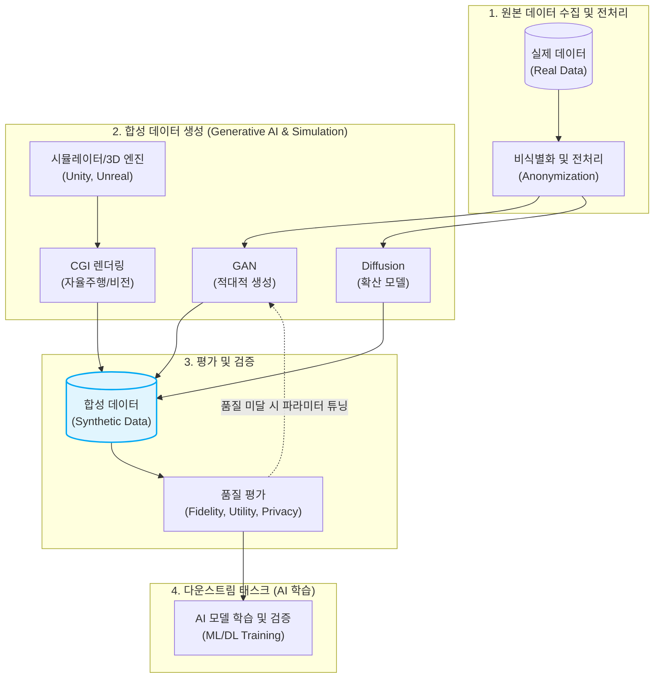

# 합성 데이터 (Synthetic Data)

---

## I. AI 학습의 데이터 부족 한계 극복 및 프라이버시 보호, 합성 데이터의 개요

* **정의**: 실제 세계의 데이터가 가진 통계적 특성과 패턴을 알고리즘이나 AI(생성 모델)가 학습하여 인위적으로 새롭게 생성한 고품질의 가상 데이터
* **등장 배경 및 필요성**:
* **프라이버시 규제 대응**: GDPR, [[데이터 3법]] 등 강력한 개인정보 보호 규제로 인한 원본 데이터 수집 및 활용의 제약 극복
* **데이터 레이블링 비용 절감**: [[Smart Car(자율주행)|자율주행]], 의료 등 고비용의 수작업 레이블링(Ground Truth) 과정을 자동화하여 AI 개발 단가 절감
* **데이터 불균형 해소**: 현실에서 구하기 힘든 엣지 케이스([[EDGE|Edge]] Case) 및 희소(Long-tail) 데이터를 생성하여 모델의 강건성 확보

* **특징**:
* **재식별 위험 원천 차단**: 실제 인물의 정보가 포함되지 않아 프라이버시 침해 이슈로부터 자유로움
* **완벽한 정답지 포함**: 3D 엔진이나 시뮬레이터로 생성 시 완벽한 픽셀 단위의 레이블링([[Annotation]])이 함께 자동 생성됨

---

## II. 합성 데이터의 개념도 및 핵심 기술 요소

### 가. 합성 데이터 생성 파이프라인 및 동작 개념도

* 원본 데이터의 분포를 모사하는 AI 생성 모델 방식과 물리 법칙을 따르는 시뮬레이션 방식을 통해 데이터를 생성하고, 통계적 유사성(Fidelity) 및 유용성(Utility)을 평가한 후 최종 AI 학습에 투입함

### 나. 합성 데이터의 핵심 기술 및 구성 요소

| 구분 | 요소기술(키워드) | 세부 설명 |
| --- | --- | --- |
| **생성 [[알고리즘]]** | [[GAN (Generative Adversarial Network)|GAN]] (생성적 적대 신경망) | 생성자(Generator)와 판별자(Discriminator)가 상호 경쟁하며 실제와 구별할 수 없는 고품질 데이터를 생성하는 모델 |
| **생성 알고리즘** | Diffusion Model (확산 모델) | 원본 데이터에 노이즈를 점진적으로 추가한 뒤, 이를 다시 복원(Denoising)하는 과정을 학습하여 정교한 이미지/비디오 생성 |
| **생성 알고리즘** | [[VAE]] (변이형 오토인코더) | 데이터를 저차원의 잠재 공간(Latent Space)으로 압축한 후, 이 공간의 확률 분포에서 샘플링하여 새로운 데이터를 복원 생성 |
| **텍스트/정형 생성** | [[초거대 언어 모델|LLM]] 기반 프롬프팅 | 거대 언어 모델(LLM)에 특정 역할과 스키마를 부여(Few-shot 등)하여 금융, 의료 분야의 가상 텍스트 및 테이블(정형) 데이터 생성 |
| **시뮬레이션 기반** | 3D 렌더링 / Digital Twin | 물리 엔진(Unity, Unreal)을 사용하여 자율주행차의 악천후 주행, 로봇 비전 등 현실에서 획득하기 위험한 엣지 케이스 데이터 시뮬레이션 |
| **프라이버시 보호** | 차등 정보보호 (Differential Privacy) | 합성 데이터에 수학적인 노이즈를 주입하여, 생성된 데이터를 통해 특정 개인의 원본 정보가 역추론되는 것을 원천 방지 |
| **품질 평가 지표** | 충실도 (Fidelity) | 생성된 합성 데이터가 원본 데이터의 통계적 속성(다변량 분포, 상관관계 등)을 얼마나 잘 보존하고 있는지 측정 |
| **품질 평가 지표** | 유용성 (Utility) | 합성 데이터로 학습시킨 AI 모델의 성능(정확도, F1-score 등)이 원본으로 학습시킨 모델의 성능과 얼마나 유사한지 평가 |

---

## III. 원본 데이터와 비교 및 향후 전망

### 가. 원본 데이터(Real Data)와 합성 데이터(Synthetic Data) 비교

| 비교 항목 | 원본 데이터 (Real Data) | 합성 데이터 (Synthetic Data) |
| --- | --- | --- |
| **획득 방식** | 물리적 환경에서 직접 센싱 및 수집 | 알고리즘(AI), 시뮬레이터를 통한 가상 생성 |
| **프라이버시 위협** | 매우 높음 (엄격한 [[비식별화]] 및 마스킹 필수) | **거의 없음** (가상의 존재이므로 규제 회피 가능) |
| **레이블링(정답) 비용** | 수작업에 의한 막대한 시간과 비용 발생 | **비용 거의 없음** (데이터 생성 시 레이블도 자동 생성) |
| **데이터 편향성** | 수집 환경에 따라 특정 클래스에 편향됨 | 파라미터 조정을 통해 **원하는 분포로 강제 밸런싱 가능** |
| **희소 사례(Edge Case)** | 수집 자체가 위험하거나 불가능 (예: 교통사고 찰나) | 시나리오 기반으로 **무한대 복제 및 생성 가능** |

### 나. 합성 데이터 기술의 최신 동향 및 향후 전망

* **AI 학습 데이터 패러다임의 전환**: 글로벌 IT 리서치 기관 가트너(Gartner)는 2030년까지 AI 모델 학습에 사용되는 데이터의 압도적 다수가 원본 데이터가 아닌 '합성 데이터'로 대체될 것으로 전망함
* **합성 데이터 서비스(SDaaS)의 부상**: 기업이 보안 규제(망분리 등)로 인해 외부 데이터를 반입하지 못하는 환경에서, 내부의 민감 데이터를 합성 데이터로 치환하여 AI 모델 연구 및 외부 기관과의 협업을 가능케 하는 SDaaS(Synthetic Data as a Service) 비즈니스가 엔터프라이즈 [[MLOps]]의 필수 인프라로 자리 잡고 있음

---

### 🔗 연관 토픽

- **소속 도메인**: [[00_인공지능_MOC|🤖 인공지능]]
- **세부 분류**: `1. 수학 · 통계학 & 데이터 전처리`
- **핵심 연관 토픽**:
  - [[GAN (Generative Adversarial Network)]]
  - [[VAE|VAE(Variational Autoencoder)]]
  - [[데이터 유형]]
  - [[MLOps]]
  - [[편향]]
