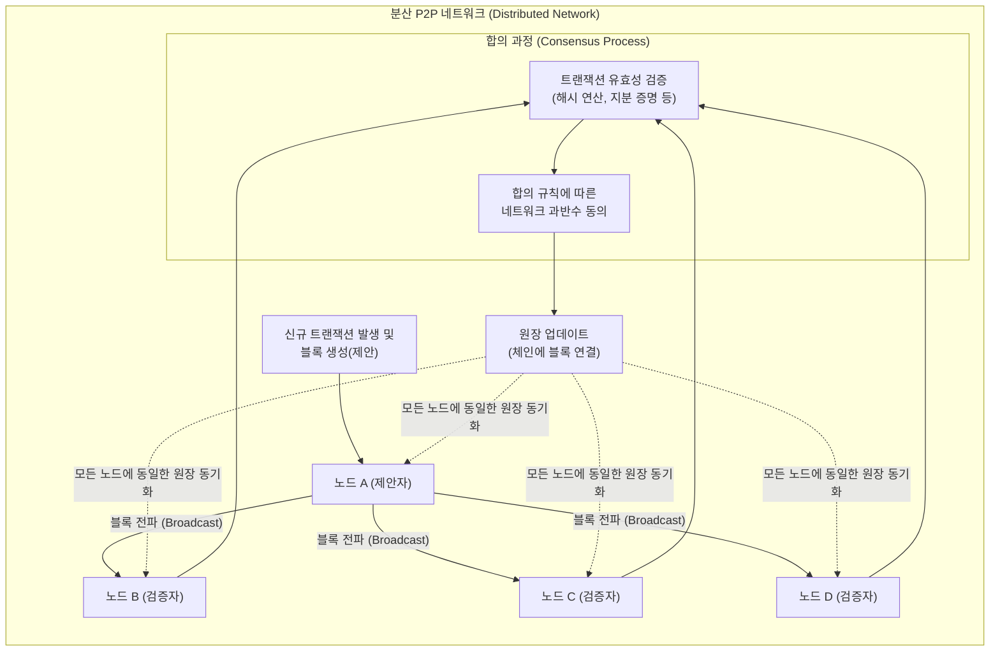

# 합의 알고리즘 (Consensus Algorithm)

---

## I. 신뢰 분산 네트워크의 핵심, 합의 알고리즘의 개요

* **정의**: 중앙 통제 기관(TTP)이 없는 분산 P2P 네트워크 환경에서, 다수의 분산된 노드들이 원장 데이터의 무결성을 검증하고 단일화된 상태(State)에 도달하도록 규정하는 수학적/암호학적 규칙 체계
* **등장 배경 및 필요성**:
* **비잔틴 장군 문제([[BGP]]) 해결**: 네트워크 내 악의적이거나 고장 난 노드가 존재하더라도 전체 시스템의 신뢰성을 보장해야 함
* **이중 지불(Double Spending) 방지**: 디지털 자산의 특성상 복제 및 중복 사용을 막고 데이터의 일관성(Consistency) 유지 필요

* **특징**:
* **탈중앙화(Decentralization)**: 단일 실패점(SPOF) 없이 참여 노드 간 동등한 권한 분산
* **최종성(Finality)**: 합의가 완료된 데이터(블록)는 위변조나 역전이 불가능한 불가역성 보장
* **암호경제학(Crypto-Economics)**: 퍼블릭 블록체인의 경우 올바른 합의 참여를 유도하기 위한 경제적 보상(토큰)과 패널티 구조 내재화

---

## II. 합의 알고리즘의 동작 개념도 및 핵심 기술 요소

### 가. 블록체인 합의 알고리즘 동작 개념도

* 제안자 노드가 생성한 블록을 네트워크에 전파하면, 각 검증자 노드들이 사전에 약속된 합의 [[알고리즘]](PoW, PoS, PBFT 등)을 통해 유효성을 검증하고 블록체인에 영구적으로 기록함

### 나. 합의 알고리즘의 핵심 기술 유형 및 특징

| 분류 | 알고리즘(키워드) | 세부 설명 |
| --- | --- | --- |
| **퍼블릭망 (경쟁)** | PoW (작업 증명) | 목표 해시값을 찾기 위한 컴퓨팅 연산력(Hash Power)을 경쟁하여 가장 먼저 퍼즐을 푼 노드에게 블록 생성 권한 부여 (예: 비트코인) |
| **퍼블릭망 (지분)** | PoS (지분 증명) | 노드가 보유한 암호화폐의 지분(Stake) 양과 보유 기간에 비례하여 블록 생성 권한을 확률적으로 부여 (예: 이더리움 2.0) |
| **퍼블릭망 (위임)** | DPoS (위임 지분 증명) | 암호화폐 소유자들이 투표를 통해 소수의 대표 노드(BP)를 선출하고, 선출된 대표들만이 합의를 수행하여 처리 속도 극대화 (예: EOS) |
| **프라이빗망 (투표)** | PBFT (실용적 비잔틴 장애 허용) | 리더(Primary)를 중심으로 다단계 투표(Pre-prepare, Prepare, Commit)를 거쳐 네트워크 노드의 2/3 이상 동의 시 합의 도달 |
| **프라이빗망 (비경쟁)** | Raft / Paxos | 악의적 노드가 없다는 가정 하에 충돌 장애(CFT, Crash Fault Tolerance)만을 해결하기 위해 설계된 리더 기반의 분산 시스템 합의 알고리즘 |
| **기타 하이브리드** | PoA (권위 증명) | 신원 인증을 거쳐 검증된 권위 있는 소수의 노드만이 트랜잭션과 블록을 승인하는 방식 (컨소시엄 [[01_IT Tech/블록체인]] 등 적용) |

---

## III. 주요 합의 알고리즘 비교 및 향후 전망

### 가. 퍼블릭 및 프라이빗 블록체인 합의 알고리즘 비교

| 비교 항목 | PoW (Proof of Work) | PoS (Proof of Stake) | PBFT (Practical BFT) |
| --- | --- | --- | --- |
| **적용 네트워크** | 퍼블릭 블록체인 (개방형) | 퍼블릭 블록체인 (개방형) | 프라이빗/컨소시엄 (허가형) |
| **합의 결정 기준** | 컴퓨팅 연산력 (해시파워) | 암호화폐 예치 지분량 | 노드 간 메시지 투표 |
| **에너지 효율성** | 매우 낮음 (막대한 전력 소모) | 높음 (연산 경쟁 불필요) | 높음 (투표 기반 처리) |
| **최종성 (Finality)** | 확률적 최종성 (포크 발생 가능성) | 확률적/결정적 최종성 혼용 | **결정적 최종성** (즉각적 확정) |
| **처리 속도 (TPS)** | 매우 낮음 (수~수십 TPS) | 중간 (수백~수천 TPS) | 높음 (수천 TPS 이상) |

### 나. 합의 알고리즘의 최신 동향 및 향후 전망

* **친환경(ESG) 알고리즘으로의 패러다임 전환**: 과도한 전력 소비 문제로 인해 이더리움의 머지(The Merge, PoW $\rightarrow$ PoS 전환) 사례처럼, 대규모 퍼블릭 블록체인들이 에너지 효율적인 PoS 또는 그 파생 모델로 전환하는 추세가 가속화되고 있음
* **블록체인 트릴레마(Trilemma) 극복을 위한 하이브리드 모델 부상**: 확장성(Scalability), 보안성(Security), 탈중앙화(Decentralization)를 동시에 만족시키기 위해, 서로 다른 합의 알고리즘의 장점을 결합한 이종(Hybrid) 알고리즘(예: BFT-DPoS) 적용이 차세대 메인넷의 핵심 아키텍처로 자리매김하고 있음

---

### 🔗 연관 토픽

- **소속 도메인**: [[00_디지털서비스_MOC|🚀 디지털서비스]]
- **세부 분류**: `2. 블록체인 & 분산원장 · Web3`
- **핵심 연관 토픽**:
  - [[01_IT Tech/블록체인|블록체인 (Block Chain)]]
  - [[BGP|BGP(Border Gateway Protocol)]]
  - [[CBDC]]
  - [[블록체인 플랫폼|블록체인 (Block Chain) 플랫폼]]
  - [[프로토콜 경제|프로토콜 경제(Protocol Economy)]]
