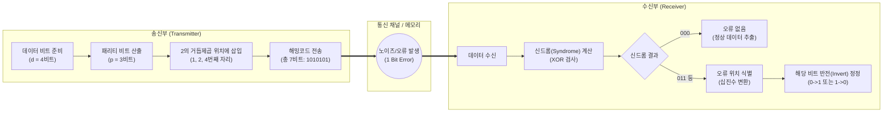

# 해밍코드 (Hamming Code)

---

## I. 신뢰성 있는 데이터 전송을 위한 자가 정정 코드, 해밍코드의 개요

* **정의**: 데이터 전송 과정에서 발생하는 1비트의 오류를 수신 측에서 스스로 검출(Detection)하고 정정(Correction)할 수 있는 선형 블록 기반의 전진 오류 정정(FEC, Forward Error Correction) 코드
* **필요성 및 등장배경**:
* **전송 효율 향상**: 수신 측에서 오류를 직접 정정하므로, 송신 측으로의 재전송(ARQ) 요청 불필요 (지연 시간 최소화)
* **단일 비트 오류 대응**: 메모리 소자 미세화 및 고속 통신 환경에서 빈번하게 발생하는 단일 비트 반전(Soft Error) 문제 해결 필요

* **특징**:
* **패리티 비트 최적화**: 중복(Redundancy) 비트를 최소화하면서 오류 위치를 정확히 식별하기 위해 $2^p \ge d + p + 1$ 공식 활용 (p: 패리티 비트 수, d: 데이터 비트 수)
* **단일 오류 정정(SEC)**: 최소 해밍 거리가 3으로, 1비트 오류를 완벽히 정정 가능

---

## II. 해밍코드의 개념도 및 핵심 기술 요소

### 가. 해밍코드 동작 원리 및 오류 정정 메커니즘 개념도

* 송신 측은 2의 거듭제곱 위치에 패리티 비트를 삽입하고, 수신 측은 패리티 그룹별 XOR 연산을 통해 도출된 신드롬(Syndrome) 워드의 십진수 값으로 오류가 발생한 비트 위치를 즉시 찾아내어 반전시킴

### 나. 해밍코드의 핵심 구성 및 기술 요소

| 분류 | 요소기술(키워드) | 세부 설명 |
| --- | --- | --- |
| **구조 설계** | 패리티 산출식 | $2^p \ge d + p + 1$ 부등식을 만족하는 최소의 패리티 비트 수($p$)를 산정하는 수학적 기준 |
| **비트 배치** | 2의 거듭제곱 (Power of 2) | 패리티 비트는 항상 전체 코드워드의 $1, 2, 4, 8, \dots, 2^n$ 번째 위치에 할당됨 |
| **연산 논리** | 짝수/홀수 패리티 (Parity) | 각 패리티 그룹 내 1의 개수를 짝수(Even) 또는 홀수(Odd)로 맞추기 위한 검사 비트 논리 |
| **오류 식별** | 신드롬 워드 (Syndrome) | 수신된 데이터의 패리티 검사 결과를 결합한 이진수로, 0이면 무오류, 0이 아니면 오류 비트의 인덱스를 지시 |
| **연산 방식** | 배타적 논리합 (XOR) | 패리티 비트 생성 및 수신단 신드롬 계산 시 사용되는 논리 연산 (동일하면 0, 다르면 1) |
| **오류 정정** | 비트 반전 (Bit Inversion) | 신드롬이 가리키는 위치의 비트 값이 0이면 1로, 1이면 0으로 논리값을 뒤집어 데이터 정정 |
| **기능 확장** | SEC-DED | 전체 비트에 대한 전체 패리티 비트를 1개 추가하여, 1비트 정정(SEC) 및 2비트 오류 검출(DED) 수행 |
| **이론적 기반** | 해밍 거리 (Hamming Distance) | 두 송수신 코드워드 간에 서로 다른 비트의 수 (해밍코드는 최소 거리가 3으로 설계됨) |

---

## III. 해밍코드와 타 오류 제어 기법 비교 및 적용 동향

### 가. 해밍코드(FEC)와 순환중복검사(CRC) 비교

| 비교 항목 | 해밍코드 (Hamming Code) | [[CRC]] (Cyclic Redundancy Check) |
| --- | --- | --- |
| **오류 제어 방식** | **전진 오류 정정 (FEC)** / 자체 정정 | **후진 오류 제어 ([[BEC (Backward Error Correction)|BEC]])** / 재전송(ARQ) 요구 |
| **핵심 목적** | 오류 **검출 및 즉각 정정** | 오류 **검출** (다중 비트 및 버스트 오류에 강함) |
| **수학적 연산** | 비트 단위 배타적 논리합(XOR) | 다항식(Polynomial) 나눗셈 연산 (Modulo-2) |
| **오류 처리 능력** | 단일 비트(1 Bit) 정정 및 이중 비트 검출 | 프레임 단위의 다수 비트 및 버스트(Burst) 오류 검출 |
| **주요 적용 분야** | [[ECC]] 메모리(DRAM), [[캐시 메모리]], SSD | 이더넷 프레임(FCS), 무선 통신망([[MAC]] 계층) |

### 나. 해밍코드의 최신 산업 적용 동향 및 전망

* **On-Die ECC 기본 탑재**: 반도체 미세 공정이 10nm 이하로 진입하면서 발생하는 DRAM 셀의 누설 전류 및 우주 방사선에 의한 소프트 에러(Soft Error)를 방지하기 위해, 최신 DDR5 및 [[HBM]](고대역폭 메모리) 내부에 해밍코드 기반의 On-Die ECC 알고리즘이 하드웨어 레벨에서 기본 탑재되어 수율과 무결성을 보장하고 있음
* **초고속 인터커넥트의 [[신뢰성]] 보장**: PCIe 5.0/6.0 및 [[CXL]](Compute Express Link)과 같은 차세대 초고속 인터페이스에서 신호 무결성을 보장하기 위해 초저지연성을 특징으로 하는 해밍코드 파생형 FEC 기술이 핵심 PHY 계층 표준으로 채택되어 활용 중임

---

### 🔗 연관 토픽

- **소속 도메인**: [[00_네트워크_MOC|🌐 네트워크]]
- **세부 분류**: `1. OSI 7계층 & 데이터링크 계층 (L1/L2)`
- **핵심 연관 토픽**:
  - [[CRC|CRC(Cyclic Redundancy Check)]]
  - [[BEC (Backward Error Correction)]]
  - [[데이터 링크 계층|데이터 링크 계층 (Data Link Layer)]]
  - [[Data Link(2) 레이어]]
  - [[프로토콜]]
