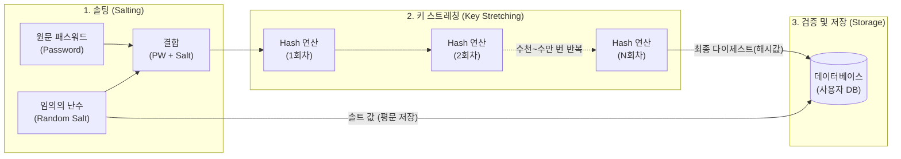

# 해시 솔트(Salt)와 키 스트레칭(Key Stretching)

---

## I. 안전한 패스워드 저장을 위한 필수 보안 기법, 해시 솔트와 키 스트레칭의 개요

* **정의**: 단방향 해시 함수의 취약점(레인보우 테이블, 무차별 대입 등)을 보완하기 위해, 원문 패스워드에 임의의 무작위 문자열을 추가(Salt)하고 이를 수천 번 이상 반복 해싱(Key Stretching)하여 [[암호화]] 강도를 극대화하는 암호학적 보안 기법
* **도입 배경/필요성**:
* **레인보우 테이블(Rainbow Table) 무력화**: 동일한 패스워드는 동일한 해시값을 갖는 약점을 노린 미리 계산된 [[해시 테이블]] 공격 방어
* **크래킹 시간 지연**: 하드웨어([[GPU]], ASIC 등)의 컴퓨팅 연산 능력 급증에 따른 무차별 대입 공격(Brute-force) 및 사전 대입 공격(Dictionary Attack) 방어

* **특징**:
* **무작위성 확보**: 사용자마다 서로 다른 솔트 값을 부여하여, 동일한 패스워드라도 최종 해시 다이제스트가 완전히 다르게 생성됨
* **의도적인 연산 부하**: 키 스트레칭을 통해 1회 검증 시 소요되는 [[CPU]]/메모리 자원과 시간을 고의로 증가시켜 대규모 오프라인 크래킹을 불가능하게 만듦

---

## II. 솔트 및 키 스트레칭의 개념도 및 핵심 기술 요소

### 가. 해시 솔트와 키 스트레칭의 동작 메커니즘 개념도

* 임의로 생성된 솔트(Salt)를 원문 패스워드와 결합한 후, 단방향 해시 함수(SHA-256 등)를 여러 번 반복 적용(Key Stretching)하여 최종 생성된 다이제스트와 솔트를 데이터베이스에 함께 저장함

### 나. 패스워드 보안 강화를 위한 핵심 기술 요소

| 분류 | 요소기술(키워드) | 세부 설명 |
| --- | --- | --- |
| **기반 요소** | 솔트 (Salt) | 패스워드에 덧붙이는 32비트 이상의 고유한 난수 데이터로, 암호학적으로 안전한 난수 생성기(CSPRNG)를 통해 생성 |
| **기반 요소** | 키 스트레칭 (Key Stretching) | 솔팅된 패스워드의 해시 다이제스트를 입력값으로 삼아 다시 해싱하는 과정을 수천~수십만 번(Iteration) 반복하는 기법 |
| **기반 [[알고리즘]]** | 단방향 해시 (One-way Hash) | 입력값의 길이에 상관없이 고정된 길이의 결괏값을 출력하며, 결과값에서 입력값을 역산할 수 없는 암호화 함수 (SHA-2, SHA-3 등) |
| **파생 알고리즘** | PBKDF2 | 미국 국립표준기술연구소(NIST) 승인 알고리즘으로, 솔트와 패스워드를 [[HMAC]] 기반으로 반복 해싱하는 표준 규격 |
| **파생 알고리즘** | Bcrypt | 블로피시(Blowfish) 암호에 기반하며, 반복 횟수를 지정하는 Work Factor를 통해 시스템 성능에 맞게 연산 속도 조절 가능 |
| **파생 알고리즘** | Scrypt | 컴퓨팅 연산량(CPU)뿐만 아니라 대규모 메모리(Memory-hard)를 강제로 요구하여, 전용 하드웨어(ASIC)를 이용한 크래킹을 억제 |
| **파생 알고리즘** | Argon2 | 패스워드 해싱 대회(PHC) 우승 알고리즘으로, 메모리 비용, 시간 비용, 병렬성을 개별적으로 세밀하게 조절 가능한 최신 표준 |

---

## III. 주요 패스워드 해싱 알고리즘 비교 및 향후 전망

### 가. 키 스트레칭 기반 주요 해싱 알고리즘 비교

| 비교 항목 | PBKDF2 | Bcrypt | Scrypt | Argon2 |
| --- | --- | --- | --- | --- |
| **설계 기반** | HMAC 기반 반복 연산 | Blowfish 암호 기반 | 병렬 처리 억제 (Memory-hard) | PHC 우승 (유연성 극대화) |
| **GPU / ASIC 저항성** | **취약함** (병렬 연산에 유리) | 보통 (연산 위주 방어) | **우수함** (높은 메모리 요구) | **매우 우수함** (캐시 타이밍 공격 방어) |
| **주요 조정 변수** | 반복 횟수 (Iteration) | 연산 비용 (Work Factor) | 연산 비용, 메모리 요구량 | 시간, 메모리, 병렬 처리 수준 |
| **활용도 및 위상** | 기존 시스템과의 높은 호환성 및 표준 | 광범위한 웹 [[프레임워크]] 기본 내장 | 고강도 보안 요구 시스템 | 최신 및 차세대 애플리케이션 표준 권고 |

### 나. 패스워드 보안 기술의 최신 동향 및 향후 전망

* **메모리 하드(Memory-Hard) 알고리즘의 표준화**: GPU나 암호 화폐 채굴용 ASIC 장비를 활용한 초고속 병렬 무차별 대입 공격을 무력화하기 위해, 연산 속도 제어를 넘어 거대한 메모리 대역폭을 강제하는 Scrypt 및 Argon2id 의 도입이 엔터프라이즈 보안의 필수 표준으로 정착 중임
* **패스워드리스(Passwordless) 아키텍처로의 전환 가속**: 서버 측의 해시 크래킹 위협을 근본적으로 제거하기 위해, 솔트 및 키 스트레칭 메커니즘을 넘어 [[생체 인증]] 및 공개키 기반의 **FIDO2 / WebAuthn 인증(Passkey)** 등 사용자 기기 기반의 탈비밀번호 생태계로 인증 패러다임이 진화하고 있음

---

### 🔗 연관 토픽

- **소속 도메인**: [[00_보안_MOC|🛡️ 보안]]
- **세부 분류**: `2. 현대 암호학 & 키 관리 · 전자서명`
- **핵심 연관 토픽**:
  - [[생체 인증|생체 인증(텔레바이오 인증)]]
  - [[암호화|암호화 (Encryption)]]
  - [[GPU]]
  - [[AES]]
  - [[동형 암호|동형 암호 (Homomorphic Encryption)]]
