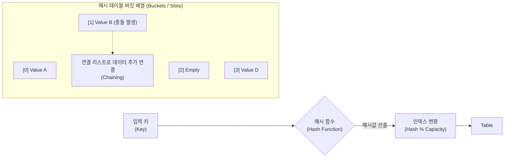

# 해시 테이블 (Hash Table)

---

## I. 빠르고 효율적인 데이터 검색의 핵심, 해시 테이블의 개요

* **정의**: 임의의 길이의 키(Key)를 해시 함수(Hash Function)를 통해 고정된 길이의 해시값으로 변환하고, 이를 인덱스([[RDBMS 인덱스(index)|Index]])로 사용하여 데이터(Value)를 저장 및 검색하는 $O(1)$의 시간 복잡도를 갖는 핵심 자료구조
* **필요성/등장배경**: 대용량 데이터 환경에서 순차 탐색($O(N)$)이나 [[이진 탐색 트리]]($O(\log N)$)가 가지는 탐색 속도의 한계를 극복하고, 메모리 주소를 직접 참조하여 비약적인 검색 성능 확보
* **특징**:
* **공간-시간 트레이드오프(Space-Time Tradeoff)**: 메모리 공간을 다소 낭비하더라도 검색 속도를 극대화하는 구조
* **해시 충돌(Hash Collision)의 필연성**: 비둘기집 원리(Pigeonhole Principle)에 의해 무한한 키 공간을 유한한 버킷(Bucket) 배열로 매핑하므로 충돌이 불가피함

---

## II. 해시 테이블의 개념도 및 핵심 기술 요소

### 가. 해시 테이블의 탐색 동작 및 충돌 해결 개념도

* 입력된 키를 해시 함수로 연산하여 고유한 인덱스를 도출한 뒤 배열에 접근하며, 동일한 인덱스에 매핑되는 '충돌' 발생 시 별도의 [[알고리즘]](체이닝, 개방 주소법 등)을 통해 데이터를 안전하게 저장함

### 나. 해시 테이블의 핵심 기술 요소

| 구분 | 요소기술(키워드) | 세부 설명 |
| --- | --- | --- |
| **기반 요소** | 해시 함수 (Hash Function) | 입력 키를 고정된 해시값으로 변환하는 알고리즘 (Division, Multiplication, SHA 방식 등) |
| **기반 요소** | 버킷(Bucket)과 슬롯(Slot) | 해시 테이블 내에서 데이터가 저장되는 1차원 배열의 공간 단위 (일반적으로 1개의 버킷 내에 여러 슬롯 존재 가능) |
| **성능 지표** | 로드 팩터 (Load Factor) | 저장된 데이터의 개수($N$)를 버킷의 개수($K$)로 나눈 비율로, 테이블의 포화 상태를 나타내는 지표 |
| **충돌 해결** | 체이닝 (Chaining) | 동일한 인덱스로 해싱된 데이터를 연결 리스트(Linked List)나 레드-블랙 트리(Red-Black Tree)를 사용하여 체인처럼 연결 |
| **충돌 해결** | 선형 탐사 (Linear Probing) | 개방 주소법(Open Addressing)의 일환으로, 충돌 시 순차적으로 이동하며(+1, +2...) 비어있는 다음 버킷을 찾아 저장 |
| **충돌 해결** | 이중 해싱 (Double Hashing) | 개방 주소법의 클러스터링(군집화) 현상을 방지하기 위해 2개의 서로 다른 해시 함수를 사용하여 탐사 보폭을 난수화 |
| **공간 제어** | 동적 재해싱 (Dynamic Rehashing) | 로드 팩터가 임계치(주로 0.7~0.75)를 초과하면, 버킷 크기를 약 2배로 확장하고 모든 데이터를 다시 해싱하여 재배치 |
| **동시성 제어** | 락 스트라이핑 (Lock Striping) | 멀티스레드 환경에서 버킷(Segment) 단위로 잠금(Lock)을 분산 적용하여 병목을 줄이는 동시성 제어 기법 |

---

## III. 해시 충돌 해결 기법 비교 및 최근 알고리즘 동향

### 가. 해시 충돌 해결 알고리즘 비교 (체이닝 vs 개방 주소법)

| 비교 항목 | 체이닝 (Chaining / 닫힌 주소법) | 개방 주소법 (Open Addressing) |
| --- | --- | --- |
| **저장 위치** | 충돌 시 테이블 **외부**의 포인터로 연결 | 충돌 시 테이블 **내부**의 빈 공간을 탐색(Probing) |
| **메모리 활용도** | 포인터 저장을 위한 추가 메모리 오버헤드 발생 | 추가 메모리 없음 (연속된 배열 공간 활용) |
| **캐시 효율성 ([[지역성]])** | 포인터를 따라 메모리를 점프하므로 **캐시 효율(Locality)이 낮음** | 연속된 메모리 블록을 스캔하므로 **캐시 히트율이 높음** |
| **데이터 삭제** | 연결 리스트에서 노드를 삭제하므로 매우 용이함 | 삭제된 자리를 표시(Tombstone/Dummy)해야 하므로 복잡함 |
| **사용 사례** | Java의 `HashMap` (Java 8 이후 트리를 병용) | Python의 `dict`, 최신 인메모리 DB 및 최적화 라이브러리 |

### 나. 최신 해시 테이블 알고리즘 패러다임 동향 및 전망

* **캐시 최적화를 위한 Swiss Table (스위스 테이블) 확산**: 2017년 Google Abseil 라이브러리에서 최초 제안된 **Swiss Table** 방식이 업계의 표준으로 급부상 중임. 1바이트의 컨트롤 바이트(Control Byte) 메타데이터와 SIMD(단일 명령 다중 데이터) 명령어를 활용하여 개방 주소법의 탐색 성능을 비약적으로 끌어올린 방식으로, 최근 **Rust의 표준 `HashMap`과 Go 1.24의 내장 `map` 알고리즘으로 채택**되어 극단적인 메모리 효율과 속도를 제공하고 있음
* **초고성능 동시성 맵 (Concurrent Hash Map) 보편화**: 멀티코어 환경이 기본이 됨에 따라, 데이터를 쓸 때 전체 테이블을 잠그는(Global Lock) 대신, Compare-And-Swap (CAS) 연산을 활용한 무잠금(Lock-free) 알고리즘이나 버킷별로 락을 쪼개는 기법이 Java, C++ 등의 코어 언어 표준으로 완전히 정착됨

---

### 🔗 연관 토픽

- **소속 도메인**: [[00_컴퓨터구조_MOC|💻 컴퓨터구조]]
- **세부 분류**: `2. 캐시 & 메모리 계층 구조 · 스토리지`
- **핵심 연관 토픽**:
  - [[빅오 표기법|빅오 표기법 (O-Notation)]]
  - [[O-Notation (O-표기법)]]
  - [[해싱과 충돌해결방법]]
  - [[이진 탐색 트리|이진 탐색 트리(Binary Search Tree)]]
  - [[선형 자료구조와 비선형 자료구조]]
