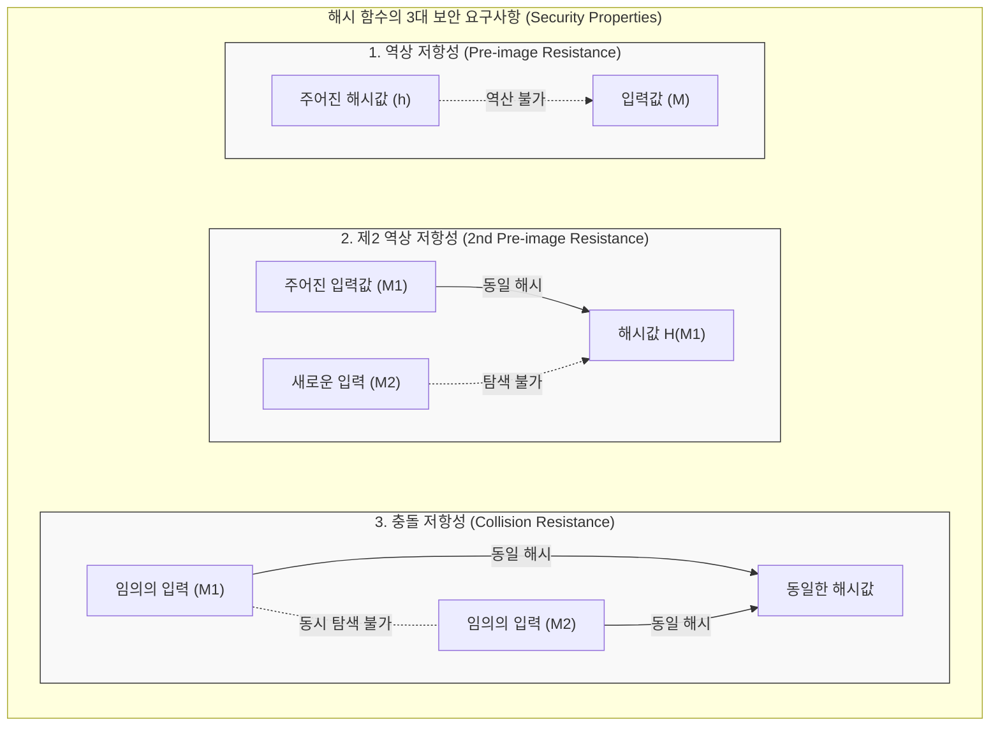

# 해시 함수의 안전성

---

## I. 데이터 무결성과 인증의 핵심, 해시 함수의 안전성 개요

* **정의**: 임의의 길이의 메시지를 입력받아 고정된 길이의 해시값(다이제스트)으로 변환하는 단방향 해시 함수가, 악의적인 위협과 암호학적 분석 공격으로부터 본연의 기능([[기밀성]], [[무결성]])을 유지하는 방어 능력
* **필요성**: 전자서명, 패스워드 [[암호화]], [[01_IT Tech/블록체인]] 등 현대 암호 시스템의 기반 구조로서 위변조 방지 및 데이터 무결성 검증을 위한 [[신뢰성]] 확보 필수
* **특징**:
* **단방향성(One-Wayness)**: 출력값에서 입력값을 역산출하는 것이 수학적으로 불가능해야 함
* **충돌 회피(Collision Free)**: 서로 다른 두 입력이 동일한 해시값을 갖는 경우를 찾아낼 수 없어야 함
* **눈사태 효과(Avalanche Effect)**: 입력 데이터의 단 1비트만 변경되어도 출력 해시값의 절반 이상이 예측 불가능하게 변경됨

---

## II. 해시 함수 안전성의 개념도 및 핵심 평가 기준

### 가. 해시 함수의 3대 안전성 평가 기준 개념도

* 임의의 다이제스트에서 원문을 찾는 '역상 저항성', 특정 원문과 동일한 해시를 갖는 다른 원문을 찾는 '[[제2 역상 저항성]]', 동일한 해시를 갖는 임의의 두 쌍을 찾는 '충돌 저항성'을 모두 만족해야 함

### 나. 해시 함수 안전성의 핵심 기술 및 평가 요소

| 구분 | 평가 요소(키워드) | 세부 설명 |
| --- | --- | --- |
| **기본 안전성** | 역상 저항성 (Pre-image Resistance) | 특정 해시값 $h$가 주어졌을 때, $H(M) = h$를 만족하는 원본 메시지 $M$을 찾는 것이 계산상 불가능한 특성 (단방향성 보장) |
| **기본 안전성** | 제2 역상 저항성 (2nd Pre-image) | 메시지 $M_1$이 주어졌을 때, $H(M_1) = H(M_2)$를 만족하는 다른 메시지 $M_2$를 찾는 것이 계산상 불가능한 특성 (약한 충돌 내성) |
| **기본 안전성** | 충돌 저항성 (Collision Resistance) | $H(M_1) = H(M_2)$를 만족하는 임의의 서로 다른 두 메시지 쌍 $(M_1, M_2)$를 찾아내는 것이 계산상 불가능한 특성 (강한 충돌 내성) |
| **품질 지표** | 눈사태 효과 (Avalanche Effect) | 입력값의 극히 미세한 변화(1비트)가 출력 해시 다이제스트 전체(약 50%)에 걸쳐 연쇄적이고 큰 변화를 일으키는 특성 |
| **취약점 대응** | 길이 확장 공격 (Length Extension) 방어 | 공격자가 원문을 몰라도 $H(M)$의 결과와 길이를 이용해 $H(M \parallel padding \parallel data)$를 계산하는 공격에 대한 방어 (SHA-3 스펀지 구조 등) |
| **취약점 대응** | 생일 공격 (Birthday Attack) 저항성 | '생일 역설' 확률론을 이용하여 동일한 해시를 가진 두 메시지 쌍을 찾는 충돌 공격에 대비하여 해시 출력 길이를 충분히 크게 설계 |
| **응용 안전성** | 키 스트레칭 및 솔팅 (Salting) | 무차별 대입 및 레인보우 테이블 공격을 무력화하기 위해 랜덤 값(Salt)을 추가하고 수천 번 반복 해싱(PBKDF2 등)하여 해시를 강화 |
| **미래 안전성** | 양자 내성 (Post-Quantum) | 그로버 [[알고리즘]](Grover's Algorithm)에 의한 탐색 공간 축소($\sqrt{N}$)에 대비하여 출력 비트를 최소 256비트 이상으로 확장 보장 |

---

## III. 안전성에 따른 해시 함수 진화 및 양자 보안 동향

### 가. 주요 해시 알고리즘 안전성 진화 아키텍처 비교

| 비교 항목 | SHA-1 | SHA-2 (SHA-256, 512 등) | SHA-3 (Keccak) |
| --- | --- | --- | --- |
| **설계 구조** | MD (Merkle-Damgård) 구조 | MD (Merkle-Damgård) 구조 | **Sponge (스펀지) 구조** |
| **출력 길이** | 160비트 | 224, 256, 384, 512비트 | 가변(224, 256, 384, 512비트) |
| **안전성 (충돌)** | 2017년 구글에 의해 충돌 검증(SHAttered) | 현재까지 심각한 충돌 미발견 (표준) | 충돌 저항성 입증, 구조적 안전성 |
| **길이 확장 공격** | 취약함 | **일부 취약함** (보완 필요) | **원천 방어** (내부 상태 용량 활용) |
| **현재 위상** | **사용 금지 (Deprecated)** | 전 세계적 범용 표준 | 차세대 암호 표준 및 IoT 경량 환경 |

### 나. 양자 컴퓨팅 시대의 해시 함수 안전성 전망

* **그로버 알고리즘(Grover's Algorithm) 위협**: 양자 컴퓨터의 특성상 무차별 탐색 속도가 기하급수적으로 빨라져, 256비트 해시 함수(SHA-256)의 실질 보안 강도가 절반인 128비트로 감소함
* **안전성 보장을 위한 차세대 아키텍처 도입**: 양자 내성 암호(PQC) 기반의 정보보안 인프라 전환에 발맞추어, 해시 함수의 출력 길이를 최소 256비트 이상(SHA-384, SHA-512)으로 2배 확장하고 구조적으로 독립된 SHA-3(Sponge Construction)의 채택이 금융 및 국가 주요 망에서 가속화되고 있음

---

### 🔗 연관 토픽

- **소속 도메인**: [[00_보안_MOC|🛡️ 보안]]
- **세부 분류**: `1. 정보보안 원칙 & 거버넌스 · 인증`
- **핵심 연관 토픽**:
  - [[암호화|암호화 (Encryption)]]
  - [[기밀성]]
  - [[무결성]]
  - [[제2 역상 저항성]]
  - [[01_IT Tech/블록체인|블록체인 (Block Chain)]]
