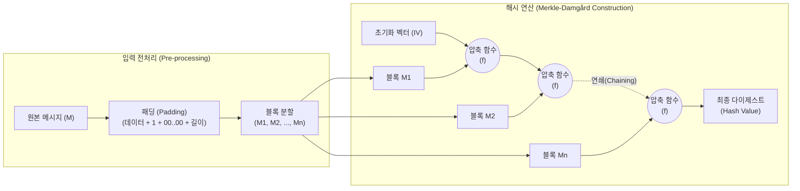

# 해시함수 (알고리즘 측면)

---

## I. 데이터 무결성 보장을 위한 수학적 변환, 해시함수의 개요

* **정의**: 임의의 가변 길이 데이터를 입력받아, 내부의 패딩(Padding) 및 압축 함수(Compression Function) 연산을 거쳐 고정된 길이의 다이제스트(Digest)로 변환하는 단방향(One-way) 암호학적 [[알고리즘]]
* **필요성**: 데이터 전송 및 저장 시 위변조 여부 검증, 패스워드의 안전한 저장, 블록체인의 작업 증명(PoW) 및 머클 트리(Merkle Tree) 구성 등 암호 시스템의 기반 역할 수행
* **알고리즘적 특징**:
* **압축성 (Compression)**: 무한한 입력 공간($2^L$)을 유한한 출력 공간($2^n$)으로 매핑 ($L > n$)
* **결정론적 (Deterministic)**: 동일한 입력값에 대해서는 항상 동일한 다이제스트를 출력
* **눈사태 효과 (Avalanche Effect)**: 입력 데이터의 1비트만 변경되어도 비트 논리 연산(XOR 등)의 연쇄 반응을 통해 출력 해시값의 최소 50% 이상이 변경됨

---

## II. 해시함수 알고리즘의 설계 구조 및 핵심 기술 요소

### 가. 해시함수 알고리즘의 동작 개념도 (Merkle-Damgård 구조 기반)

* 가변 길이의 메시지를 블록 크기의 배수가 되도록 패딩(Padding)한 후 일정한 크기(예: 512비트)의 블록으로 분할하며, 이전 블록의 결과값과 현재 블록을 압축 함수(Compression Function)로 반복 연산(Chaining)하여 최종 해시값을 도출함

### 나. 해시함수 알고리즘의 세대별 주요 규격 및 특징

| 구분 | 알고리즘(키워드) | 세부 설명 |
| --- | --- | --- |
| **1세대 (폐기)** | MD5 (Message Digest 5) | 128비트 출력 길이, 다수의 충돌쌍 발견으로 현재 암호학적 용도로 사용 전면 금지 (파일 체크섬 등 비보안 용도로만 제한적 사용) |
| **2세대 (폐기)** | SHA-1 | 160비트 출력 길이, 2017년 구글의 SHAttered 공격으로 충돌(Collision)이 증명되어 주요 브라우저 및 인증서 환경에서 퇴출 |
| **3세대 (표준)** | SHA-2 (SHA-256, 512) | 미국 NSA가 설계한 현행 글로벌 표준, Merkle-Damgård 구조 유지, 32비트/64비트 워드 기반의 복잡한 논리 연산(AND, XOR, ROTR, SHR) 적용 |
| **4세대 (차세대)** | SHA-3 (Keccak) | NIST 해시 공모전 우승 알고리즘, 스펀지(Sponge) 구조 채택으로 기존 MD 구조가 가진 길이 확장 공격(Length Extension Attack) 취약점 원천 해결 |
| **경량 알고리즘** | LSH (Lightweight Secure Hash) | 한국(KISA)에서 개발한 경량 해시함수로, SIMD(단일 명령 다중 데이터) 명령어를 활용하여 IoT 등 저사양 환경에서 연산 속도를 극대화 |
| **특수 목적** | Argon2 / Bcrypt | 솔팅(Salting) 및 키 스트레칭(Key Stretching) 알고리즘을 내장하여, 무차별 대입(Brute-force) 시 메모리와 [[CPU]] 비용을 강제하는 패스워드 전용 해시 |

---

## III. 핵심 알고리즘 설계 아키텍처 비교 및 최신 동향

### 가. 해시함수 아키텍처 비교 (Merkle-Damgård vs Sponge)

| 비교 항목 | Merkle-Damgård 구조 (SHA-2) | Sponge 구조 (SHA-3) |
| --- | --- | --- |
| **핵심 원리** | 입력 블록과 이전 출력값을 **단방향 압축 함수**로 연산 | 내부 상태(State)를 비트레이트(r)와 용량(c)으로 나누어 **흡수(Absorbing)와 짜내기(Squeezing)** 연산 수행 |
| **연산 함수** | 압축 함수 (Compression Function) | 순열 함수 (Permutation Function, $f$-function) |
| **상태 관리** | 중간 해시 결과값만 전달 | 거대한 내부 상태(State)를 유지하며 갱신 |
| **보안 취약점** | **길이 확장 공격(Length Extension Attack)**에 취약함 | 내부 상태 용량(Capacity)을 은닉하여 **길이 확장 공격 완벽 방어** |
| **출력 유연성** | 고정된 출력 길이 (256, 512비트 등) | 짜내기(Squeezing) 횟수에 따라 **임의의 길이(XOF)로 출력 가능** |

### 나. 해시함수 알고리즘의 최신 동향 및 전망

* **영지식 증명([[영지식증명|ZKP]]) 최적화 해시 알고리즘 부상**: 블록체인의 확장성 해결 및 프라이버시 보호를 위한 ZK-Rollup 생태계가 커짐에 따라, 증명 생성 연산에 특화된 산술 회로 친화적(Arithmetic Circuit-Friendly) 해시함수인 **Poseidon, Rescue** 등이 널리 활용되고 있음
* **양자 내성(Quantum-Resistant) 확보를 위한 비트 확장**: 양자 컴퓨터의 그로버(Grover) 알고리즘 적용 시 해시함수의 탐색 시간이 $O(\sqrt{N})$으로 대폭 단축되므로, 실질적인 128비트 보안 강도를 유지하기 위해 SHA-256에서 **SHA-384 이상의 고비트 해시함수**로 국가 및 엔터프라이즈 인프라의 전환 작업이 가속화되고 있음

---

### 🔗 연관 토픽

- **소속 도메인**: [[00_보안_MOC|🛡️ 보안]]
- **세부 분류**: `1. 정보보안 원칙 & 거버넌스 · 인증`
- **핵심 연관 토픽**:
  - [[알고리즘]]
  - [[암호화|암호화 (Encryption)]]
  - [[암호 알고리즘]]
  - [[영지식증명|영지식증명(Zero Knowledge Proof)]]
  - [[대칭키 암호화]]
