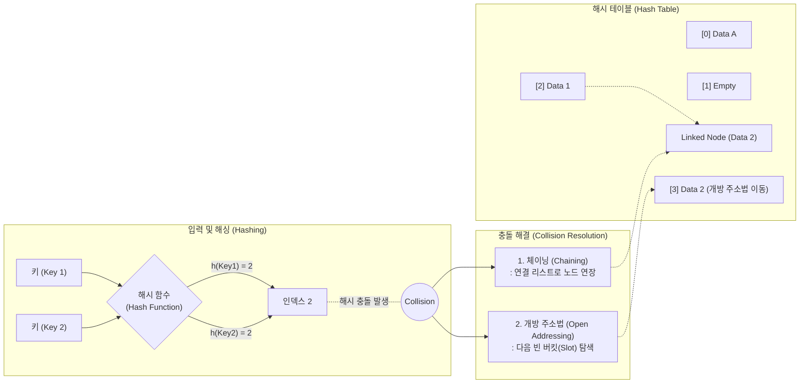

# 해싱과 충돌해결방법

---

## I. O(1)의 빠른 데이터 탐색을 위한 자료구조, 해싱의 개요

* **정의**: 임의의 길이의 키(Key)를 해시 함수(Hash Function)로 연산하여 고정된 길이의 해시값(인덱스)으로 변환하고, 이를 [[해시 테이블]](Hash Table)에 저장/검색하는 기법
* **필요성 및 등장배경**:
* **초고속 검색 필요**: 대용량 데이터 환경에서 순차 탐색($O(N)$)이나 이진 탐색($O(\log N)$)의 성능 한계를 극복하고 $O(1)$의 검색 속도 확보
* **메모리 효율화**: 무한한 키 공간을 유한한 배열(버킷)로 매핑하여 저장 공간을 효율적으로 활용

* **특징**:
* **비둘기집 원리(Pigeonhole Principle)**: 키 공간이 해시 테이블 크기보다 크기 때문에, 서로 다른 두 개의 키가 동일한 인덱스로 매핑되는 해시 충돌(Hash Collision)이 필연적으로 발생함
* **충돌 해결 필수**: 안정적인 검색 성능 보장을 위해 해시 함수의 균등성(Uniformity) 확보와 충돌 해결 알고리즘이 필수적임

---

## II. 해싱의 동작 원리 및 충돌 해결 메커니즘

### 가. 해싱 프로세스 및 해시 충돌 발생 개념도

* 해시 함수를 통해 동일한 인덱스로 두 개 이상의 키가 할당될 때 충돌이 발생하며, 테이블 외부로 확장하는 체이닝 기법과 내부의 빈 공간을 활용하는 개방 주소법으로 이를 해결함

### 나. 해시 충돌 해결 방법 및 핵심 기술 요소

| 분류 | 해결 기법 (키워드) | 세부 설명 |
| --- | --- | --- |
| **폐쇄 주소법** | 체이닝 (Chaining) | 충돌 발생 시 해당 버킷에 연결 리스트(Linked List)를 생성하여 데이터를 추가 연결하는 방식 (동적 메모리 할당) |
| **개방 주소법** | 선형 탐사 (Linear Probing) | 충돌 발생 시 인덱스를 고정폭(+1, +2...)으로 이동하며 비어있는 다음 버킷을 찾아 저장 (1차 군집화/Clustering 취약) |
| **개방 주소법** | 제곱 탐사 (Quadratic Probing) | 충돌 발생 시 이동폭을 제곱수($1^2, 2^2, 3^2...$)로 늘려가며 빈 버킷을 탐색 (2차 군집화 취약) |
| **개방 주소법** | 이중 해싱 (Double Hashing) | 최초 해시 함수로 인덱스를 찾고, 충돌 시 제2의 해시 함수를 사용하여 탐사 보폭을 난수화 (군집화 문제 최소화) |
| **성능 지표** | 로드 팩터 (Load Factor) | 해시 테이블에 저장된 데이터의 개수($N$)를 전체 버킷의 개수($K$)로 나눈 비율 (통상 0.7~0.75 수준 유지 필요) |
| **공간 제어** | 재해싱 (Dynamic Rehashing) | 로드 팩터 임계치를 초과하여 성능 저하가 예상될 때, 버킷 크기를 2배로 확장하고 데이터를 새로운 해시 함수로 재배치 |
| **해시 함수** | 제산법 (Division Method) | 키 값을 테이블 크기(M)로 나눈 나머지($h(k) = k \pmod M$)를 인덱스로 사용하는 가장 기본적인 해시 기법 |

---

## III. 충돌 해결 기법 비교 및 최근 동향

### 가. 체이닝(Chaining)과 개방 주소법(Open Addressing) 비교

| 비교 항목 | 체이닝 (Chaining) | 개방 주소법 (Open Addressing) |
| --- | --- | --- |
| **충돌 데이터 저장 위치** | 해시 테이블 **외부** (포인터로 연결) | 해시 테이블 **내부** (빈 공간 탐사) |
| **메모리 활용성** | 포인터 유지를 위한 추가 메모리 오버헤드 발생 | 추가 메모리 불필요 (연속된 배열 공간만 사용) |
| **캐시 효율 (Locality)** | 포인터를 추적하므로 캐시 [[지역성]](Cache Hit)이 낮음 | 연속된 메모리 블록을 조회하므로 캐시 효율이 높음 |
| **적재율(Load Factor) 제약** | 적재율이 1을 초과해도 테이블 확장이 필수는 아님 | 적재율이 1 이상일 수 없으며, 통상 0.7 초과 시 급격한 성능 저하 |
| **데이터 삭제** | 연결 리스트 노드 삭제로 구현 용이 | 삭제 위치에 Dummy(Tombstone) 마킹 처리가 필요하여 복잡 |

### 나. 해싱 최적화를 위한 최신 알고리즘 동향

* **하이브리드 체이닝 구조 도입**: Java 8 이후의 `HashMap`은 체이닝 방식을 사용하되, 하나의 버킷에 8개 이상의 데이터가 해시 충돌을 일으키면 연결 리스트(Linked List)를 레드-블랙 트리(Red-Black Tree)로 자동 변환하여, 최악의 경우 검색 시간 복잡도를 $O(N)$에서 $O(\log N)$으로 최적화함
* **SIMD 기반 개방 주소법 확산**: Google Abseil 라이브러리에서 제안된 **스위스 테이블(Swiss Table)** 아키텍처는 개방 주소법의 탐사 성능을 극대화하기 위해, 1바이트의 컨트롤 메타데이터와 SIMD(단일 명령 다중 데이터) 명령어를 결합하여 16개의 버킷을 한 번의 [[CPU]] 사이클로 병렬 탐색하며, 최신 인메모리 DB 및 시스템 프로그래밍 언어(Rust, Go)의 표준 해시로 채택되고 있음

---

### 🔗 연관 토픽

- **소속 도메인**: [[00_컴퓨터구조_MOC|💻 컴퓨터구조]]
- **세부 분류**: `2. 캐시 & 메모리 계층 구조 · 스토리지`
- **핵심 연관 토픽**:
  - [[해시 테이블]]
  - [[CPU]]
  - [[지역성|지역성(Locality)]]
  - [[페이지 교체 알고리즘|페이지 교체 알고리즘 (Paging Replacement Algorithm)]]
  - [[선형 자료구조와 비선형 자료구조]]
