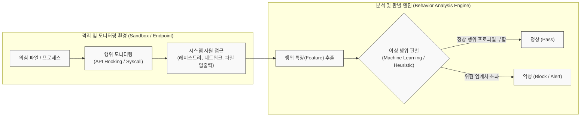

# 행위기반 탐지기법 (Behavior-based Detection)

---

## I. 알려지지 않은 위협(Zero-day) 대응의 핵심, 행위기반 탐지기법의 개요

* **정의**: 악성코드나 해킹 공격의 알려진 서명(Signature)을 비교하지 않고, 프로그램이나 네트워크의 실행 '행위(Behavior)' 패턴을 동적으로 분석하여 비정상적이거나 악의적인 활동을 식별하는 보안 탐지 기법
* **등장 배경 및 필요성**:
* **시그니처 기반 탐지의 한계**: 백신(AV)이나 IDS의 정적 패턴 매칭으로는 파일 형태를 지속적으로 바꾸는 [[다형성]](Polymorphic) 악성코드 탐지 불가
* **고도화된 위협 증가**: 제로데이(Zero-day) 취약점 악용, [[랜섬웨어]](Ransomware) 및 은밀하게 장기간 침투하는 APT(지능형 지속 위협) 공격 급증

* **특징**:
* **동적 분석(Dynamic Analysis)**: 파일의 실제 실행(Run-time) 단계에서 발생하는 [[프로세스]], 레지스트리, 네트워크 변경 사항을 추적
* **선제적 방어(Proactive Defense)**: [[데이터베이스]](DB) 업데이트 없이도 이전에 알려지지 않은(Unknown) 신규 위협 탐지 가능
* **오탐(False Positive)의 위험**: 정상적인 프로그램의 특이한 동작을 악성으로 오인할 확률이 존재하여 AI/ML 기반의 프로파일링 고도화 필수

---

## II. 행위기반 탐지기법의 개념도 및 핵심 기술 요소

### 가. 행위기반 탐지기법의 동작 메커니즘 개념도

* 의심 파일을 가상 격리 환경에서 실행시키고 API 후킹을 통해 파일 시스템, 네트워크, 레지스트리 등의 자원 접근 행위를 수집한 뒤, 머신러닝 엔진이 이상 여부를 최종 판별함

### 나. 행위기반 탐지기법의 핵심 기술 요소

| 구분 | 요소기술(키워드) | 세부 설명 |
| --- | --- | --- |
| **수집 및 감시** | API 후킹 (API Hooking) | [[OS(운영체제)|운영체제]](OS)가 응용 프로그램에 제공하는 함수 호출(API)을 중간에서 가로채어 어떤 자원에 접근하는지 모니터링 |
| **수집 및 감시** | 시스템 콜 트레이싱 (Syscall Tracing) | [[커널]] 모드에서 발생하는 시스템 호출을 추적하여 파일 생성/삭제, 프로세스 인젝션 등의 저수준(Low-level) 행위 감시 |
| **분석 환경** | [[샌드박스|샌드박스 (Sandbox)]] | 실제 시스템에 피해를 주지 않도록 논리적으로 완전히 분리된 가상 환경에서 의심 파일을 강제 실행시키는 기술 |
| **탐지 [[알고리즘]]** | 휴리스틱 분석 (Heuristic) | 사전에 정의된 '악성 행위 규칙(Rule)'(예: system32 폴더 내 실행파일 자가 복제 등)을 기반으로 점수를 부여하여 탐지 |
| **탐지 알고리즘** | 이상 탐지 ([[Anomaly(이상현상)|Anomaly]] Detection) | 머신러닝(ML)을 활용하여 시스템의 정상(Normal) 상태 프로파일을 학습한 후, 이를 벗어나는 통계적 이상치를 탐지 |
| **협력 대응** | 위협 인텔리전스 ([[CTI]]) 연동 | 글로벌 위협 정보(IoC: 침해 지표)를 실시간으로 참조하여 판별 엔진의 정확도(Accuracy)를 향상 |
| **플랫폼 융합** | [[EDR(Endpoint Detection and Response)|EDR]] (엔드포인트 탐지 및 대응) | 단말기(PC, 서버) 레벨에서 발생하는 모든 행위 가시성을 확보하고, 실시간 행위 분석과 침해 대응을 통합 수행 |

---

## III. 탐지 기법 비교 및 최신 동향

### 가. 행위기반 탐지(이상 탐지)와 시그니처 기반 탐지(오용 탐지) 비교

| 비교 항목 | 행위기반 탐지 (Behavior-based) | 시그니처 기반 탐지 (Signature-based) |
| --- | --- | --- |
| **검사 기준** | 런타임 시의 **동작 패턴 및 행위** 이상 | 파일의 고유 **해시(Hash), 바이트 패턴** 일치 여부 |
| **탐지 대상** | 신종, 변종 악성코드 및 **제로데이(Zero-day)** 위협 | **이미 알려진(Known)** 악성코드 |
| **시스템 오버헤드** | 동적 분석 및 실행 모니터링으로 **부하 높음** | 단순 패턴 매칭으로 **부하 낮음(빠름)** |
| **오탐/미탐 특성** | 오탐율(False Positive) **상대적 높음**, 미탐율 낮음 | 오탐율 **매우 낮음**, 변종에 대한 미탐율(False Negative) 높음 |
| **대표 솔루션** | EDR, 샌드박스 기반 APT 대응 솔루션 | 전통적 안티바이러스(백신), 레거시 IDS/IPS |

### 나. 행위기반 탐지기법의 최신 동향 및 향후 전망

* **AI/Deep Learning 융합과 [[XDR]]로의 진화**: 단일 엔드포인트(EDR)의 행위 분석을 넘어, 네트워크(NDR), 클라우드 인프라 전체의 원격 측정 데이터를 통합 수집하고 AI 연관 분석을 수행하는 **XDR (Extended Detection and Response)** 체계로 발전 중임
* **회피 기술(Anti-Analysis) 대응 고도화**: 악성코드들이 샌드박스 환경을 인지하고 잠복기(Sleep)를 가지거나 행위를 멈추는 회피(Evasion) 기법을 고도화함에 따라, 시스템 시간을 조작하거나 커널 레벨에서 은밀하게 모니터링하는 **안티-회피(Anti-Evasion)** 기술이 최신 행위기반 솔루션의 핵심 경쟁력으로 부상하고 있음

---

### 🔗 연관 토픽

- **소속 도메인**: [[00_보안_MOC|🛡️ 보안]]
- **세부 분류**: `3. 네트워크 & 엔드포인트 · 인프라 보안`
- **핵심 연관 토픽**:
  - [[EDR(Endpoint Detection and Response)]]
  - [[샌드박스|샌드박스 (Sandbox)]]
  - [[랜섬웨어]]
  - [[XDR|XDR(eXtended Detection Response)]]
  - [[CTI]]
