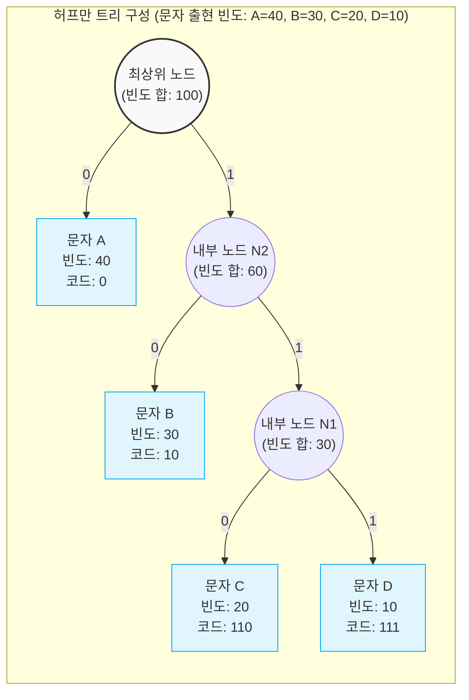

# 허프만 코딩 (Huffman Coding)

---

## I. 최적의 가변 길이 무손실 압축 기법, 허프만 코딩의 개요

* **정의**: 데이터 내 각 문자의 출현 빈도(Frequency)를 기반으로, 빈도가 높은 문자는 짧은 길이, 빈도가 낮은 문자는 긴 길이의 이진 코드를 할당하여 전체 데이터 크기를 줄이는 무손실 데이터 압축 [[알고리즘]]
* **필요성**: 데이터 전송 및 저장 비용 최소화, 섀넌(Shannon)의 정보 엔트로피(Entropy) 한계에 근접한 압축 효율 달성 필요
* **특징**:
* **접두어 속성 (Prefix Code)**: 어떤 문자의 코드도 다른 문자 코드의 접두어가 되지 않도록 설계하여 디코딩 시 모호성 방지
* **탐욕적 접근 (Greedy Algorithm)**: 매 순간 출현 빈도가 가장 적은 두 개의 노드를 결합하는 최적의 선택을 반복하여 전체 트리 구성

---

## II. 허프만 코딩의 개념도 및 핵심 기술 요소

### 가. 허프만 트리 구성 및 인코딩 동작 개념도

* 가장 빈도수가 낮은 두 노드(C, D)를 묶어 부모 노드(N1)를 생성하는 탐욕 알고리즘을 반복하여 루트 노드까지 도달한 후, 좌측 간선에 '0', 우측 간선에 '1'을 부여하여 가변 길이 코드를 생성함

### 나. 허프만 코딩의 핵심 구성 및 기술 요소

| 분류 | 요소기술(키워드) | 세부 설명 |
| --- | --- | --- |
| **자료 구조** | 허프만 트리 (Huffman Tree) | 리프(Leaf) 노드는 원본 문자, 내부(Internal) 노드는 자식 노드 빈도의 합으로 구성된 완전 이진 트리 구조 |
| **자료 구조** | 우선순위 큐 (Priority [[Queue]]) | 트리를 구성할 때 가장 빈도가 낮은 두 개의 노드를 $O(\log N)$ 시간 복잡도로 빠르게 추출하기 위한 최소 힙(Min-Heap) |
| **코드 구조** | 가변 길이 부호화 (VLC) | 고정된 길이(예: ASCII 8비트) 대신, 문자의 발생 확률(정보량)에 반비례하여 동적으로 코드 길이를 할당 |
| **코드 구조** | 접두어 코드 (Prefix-free Code) | 한 문자에 부여된 코드가 다른 문자의 앞부분과 일치하지 않도록 보장하여, 데이터의 순차적(Left-to-right) 디코딩 가능 |
| **알고리즘** | [[그리디 알고리즘|탐욕 알고리즘]] (Greedy) | 전체를 고려하지 않고 국소적으로 가장 최적의 선택(최소 빈도 2개 병합)을 반복하여 글로벌 최적해(압축률) 달성 |
| **연산 과정** | 빈도 테이블 스캔 | 압축을 수행하기 전 원본 데이터를 1회 전체 스캔하여 문자별 발생 횟수를 산출하는 전처리 과정 필수 |
| **최적화** | 적응형 허프만 (Adaptive Huffman) | 전체 데이터를 미리 스캔하지 않고, 데이터 압축 진행과 동시에 동적으로 빈도를 갱신하고 트리를 재구성하는 기법 |

---

## III. 허프만 코딩과 타 압축 기법 비교 및 적용 동향

### 가. 무손실 압축 알고리즘 비교 (허프만 코딩 vs LZW)

| 비교 항목 | 허프만 코딩 (Huffman Coding) | LZW (Lempel-Ziv-Welch) |
| --- | --- | --- |
| **압축 기반/원리** | **통계적 압축** (문자별 출현 빈도 기반) | **사전식 압축** (문자열의 반복 패턴 기반) |
| **사전(Dictionary) 생성** | 데이터 압축 전 **전체 1회 스캔** 필수 (정적) | 인코딩 과정 중 **사전을 동적으로 갱신** |
| **알고리즘 특징** | 가장 단순한 문자 단위 가변 길이 매핑 | 긴 문자열 패턴을 슬라이딩 윈도우 기반 색인 번호로 치환 |
| **압축 효율 대상** | 문자 간 출현 빈도수 격차가 큰 데이터 | 유사하거나 긴 패턴이 자주 반복되는 데이터 |
| **주요 활용 표준** | **JPEG, MP3, ZIP** (엔트로피 인코딩 구간) | **GIF, TIFF, PDF** (이미지 및 문서 압축) |

### 나. 허프만 코딩의 최신 활용 동향 및 전망

* **하이브리드 압축 엔진의 핵심 모듈로 정착**: 현대의 무손실 압축 기법(ZIP, GZIP 등에 사용되는 **Deflate 알고리즘**)은 단일 기법을 넘어서 L77(사전식 압축)로 먼저 중복 패턴을 제거한 후, 최종 산출물을 허프만 코딩으로 한 번 더 통계적 압축을 수행하는 하이브리드 아키텍처의 최종단 코어(Core)로 확고히 자리매김함
* **멀티미디어 및 신경망 모델 압축 적용**: 영상/음성 압축(HEVC, VVC 등)의 엔트로피 코딩 표준뿐만 아니라, 최근 [[온디바이스 AI]] 환경에서 경량화를 위해 신경망 파라미터(Weight)를 양자화(Quantization)한 뒤 허프만 코딩으로 최종 압축하는 **[[딥러닝]] 모델 경량화(Model Compression)** 기법으로 그 활용 범위를 확장하고 있음

---

### 🔗 연관 토픽

- **소속 도메인**: [[00_컴퓨터구조_MOC|💻 컴퓨터구조]]
- **세부 분류**: `3. 고성능 AI 가속기 & 입출력 시스템`
- **핵심 연관 토픽**:
  - [[그리디 알고리즘|그리디 (탐욕) 알고리즘]]
  - [[알고리즘]]
  - [[딥러닝]]
  - [[Queue]]
  - [[세마포어|세마포어(Semaphore)]]
