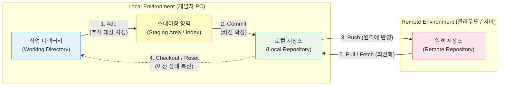

# 형상 관리 도구 (Configuration Management Tool)

---

## I. 지속적 통합 및 배포(CI/CD)의 핵심 인프라, 형상 관리 도구의 개요

* **정의**: 소프트웨어 생명주기([[SDLC]]) 전 과정에서 발생하는 소스코드, 문서, 인프라 설정(IaC) 등 모든 산출물의 변경 이력을 버전 단위로 식별, 기록, 통제하는 체계적인 자동화 시스템
* **필요성**: 다수의 개발자가 동일한 코드를 수정할 때 발생하는 병행성(Concurrency) 문제 해결, 특정 시점(Baseline)으로의 신속한 롤백(Roll-back) 지원, 산출물 [[무결성]] 보장
* **특징**:
* **독립적 병렬 개발**: 브랜치(Branch) 생성 및 병합(Merge)을 통한 충돌 없는 모듈별 동시 개발
* **단일 진실 공급원(SSOT)**: 팀 내 모든 이해관계자가 최신의 동일한 코드베이스를 기반으로 소통 및 배포 수행

---

## II. 형상 관리 도구의 아키텍처 및 핵심 기술 요소

### 가. 분산형 형상 관리 도구(Git 중심)의 동작 원리 및 개념도

* 개발자는 로컬 환경에서 코드를 수정(Working Directory)하고, 반영할 파일을 임시 공간(Staging Area)에 올린 후, 로컬 저장소에 커밋(Commit)하여 버전을 확정한 뒤 중앙 원격 저장소(Remote Repository)로 동기화함

### 나. 형상 관리 도구의 핵심 구성 요소 및 기능

| 구분 | 요소기술(키워드) | 세부 설명 |
| --- | --- | --- |
| **저장소 관리** | Repository (저장소) | 프로젝트의 모든 파일과 변경 이력(메타데이터)이 저장되는 [[데이터베이스]] 공간 (로컬 및 원격) |
| **상태 전이** | Staging Area ([[RDBMS 인덱스(index)|Index]]) | 커밋을 수행하기 전 변경된 파일들의 상태를 임시로 기록하고 준비하는 버퍼 영역 |
| **버전 제어** | Commit / Checkout | 변경 사항을 영구적으로 저장소에 기록(Commit)하거나, 특정 버전의 파일 상태로 작업 공간을 되돌리는(Checkout) 기능 |
| **[[병행 제어]]** | Branch (브랜치) | 원본 코드(Main/Master)에 영향을 주지 않고 독립적으로 새로운 기능 개발이나 버그 수정을 진행하기 위한 분기점 |
| **병행 제어** | Merge (병합) | 독립된 브랜치에서 완료된 작업 내역을 다시 원본 코드(Main 브랜치)로 합치는 기능 (Fast-forward, 3-way 병합 등) |
| **충돌 통제** | Conflict Resolution | 두 개 이상의 브랜치에서 동일한 파일의 동일한 라인을 수정하여 병합 시 발생하는 충돌(Conflict)을 식별하고 수동/자동 해결 |
| **이력 추적** | Blame ([[Annotation]]) | 소스코드의 특정 라인을 누가, 언제, 어떤 커밋 번호로 수정했는지 추적하여 결함 원인(Root Cause)을 신속히 파악 |
| **자동화 연계** | Webhook / Trigger | 커밋이나 푸시 이벤트 발생 시 젠킨스(Jenkins) 등 CI/CD 파이프라인 도구로 신호를 전송하여 자동 빌드/테스트를 유발 |

---

## III. 형상 관리 도구의 유형 비교 및 최신 동향

### 가. 중앙 집중형(CVCS)과 분산형(DVCS) 형상 관리 도구 비교

| 비교 항목 | 중앙 집중형 (CVCS) | 분산형 (DVCS) |
| --- | --- | --- |
| **시스템 아키텍처** | **단일 중앙 서버** 기반 구조 | **중앙 서버 + 개별 로컬 저장소** 구조 |
| **네트워크 의존성** | 항상 네트워크에 연결되어야 커밋 가능 | **오프라인 상태**에서도 커밋, 로그 조회 등 작업 가능 |
| **성능 및 속도** | 파일 단위 델타(Delta) 방식 (속도 느림) | 스냅샷(Snapshot) 기반 (브랜치 생성 및 병합 매우 빠름) |
| **[[HA(High Availability)|가용성]] (SPOF)** | 중앙 서버 다운 시 전체 [[형상 관리]] 마비 | 로컬에 전체 이력이 있어 서버 다운 시에도 즉각 복구 가능 |
| **대표적인 도구** | **SVN (Subversion)**, CVS | **Git**, Mercurial |

### 나. 형상 관리 도구의 최신 패러다임 동향 및 전망

* **GitOps 체계의 [[클라우드 네이티브]] 표준화**: [[쿠버네티스]](Kubernetes) 등 마이크로서비스([[MSA (Micro Service Architecture)|MSA]]) 환경에서 애플리케이션 코드뿐만 아니라 인프라 및 배포 설정(Manifest)까지 Git 저장소를 단일 진실 공급원(SSOT)으로 삼아, 형상 변경 즉시 운영망에 선언적(Declarative)으로 동기화하는 GitOps가 엔터프라이즈 데브옵스의 핵심으로 부상함
* **AI 결합형 지능형 형상 통제**: GitHub Copilot, GitLab Duo 등 거대 언어 모델([[초거대 언어 모델|LLM]])이 형상 관리 도구에 직접 내장되어, 개발자의 변경 내역을 요약하여 커밋 메시지를 자동 생성하고, 복잡한 Merge Conflict(충돌) 발생 시 AI가 의미론적으로 코드를 분석하여 최적의 병합 코드를 추천해 주는 방향으로 진화하고 있음

---

### 🔗 연관 토픽

- **소속 도메인**: [[00_소프트웨어공학_MOC|🏗️ 소프트웨어공학]]
- **세부 분류**: `1. 소프트웨어 개발 생명주기(SDLC) & 방법론`
- **핵심 연관 토픽**:
  - [[형상 관리]]
  - [[SDLC]]
  - [[무결성]]
  - [[클라우드 네이티브]]
  - [[MSA (Micro Service Architecture)]]
