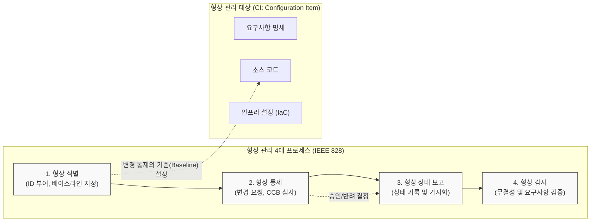

# 형상 관리 (Configuration Management)

---

## I. 성공적인 소프트웨어 인도를 위한, 형상 관리의 개요

* **정의**: 소프트웨어 생명주기([[SDLC]]) 전 과정에서 발생하는 모든 산출물(소스코드, 문서, 설정 등)의 변경 사항을 체계적으로 식별, 통제, 감사, 기록하여 가시성을 확보하는 일련의 관리 활동
* **목적/필요성**:
* **[[무결성]] 및 추적성 확보**: 요구사항과 최종 산출물 간의 일치성 보장 및 변경 이력 추적
* **동시성 제어 (Concurrency Control)**: 다수의 개발자가 동일한 모듈을 수정할 때 발생하는 충돌 방지 및 협업 효율성 증대
* **신속한 복구 (Roll-back)**: 장애 및 결함 발생 시 정상적으로 작동하던 과거의 특정 시점(Baseline)으로 즉각적인 원복 지원

* **특징**: 베이스라인(Baseline) 기반의 통제, 변경 요청(CR)에 대한 공식적인 심사(CCB) 수행, 최근 [[DevOps]] 및 CI/CD 파이프라인과 완벽히 통합되어 자동화되는 추세

---

## II. 형상 관리의 프로세스 및 핵심 기술 요소

### 가. 형상 관리 프로세스 및 동작 개념도

* 프로젝트 산출물을 형상 항목(CI)으로 식별하여 기준선(Baseline)을 설정하고, 변경 요청(CR) 발생 시 형상통제위원회(CCB)의 승인을 거쳐 변경을 통제하며, 그 결과를 지속적으로 보고 및 감사함

### 나. 형상 관리의 핵심 구성 요소 및 기법

| 분류 | 요소기술(키워드) | 세부 설명 |
| --- | --- | --- |
| **기준 수립** | 베이스라인 (Baseline) | 변경 통제의 공식적인 기준이 되는 시점으로, 특정 단계의 완료를 공식적으로 승인한 형상 항목들의 집합 |
| **기준 수립** | 형상 항목 (CI) | 형상 관리의 대상이 되는 최소 단위 (프로젝트 계획서, 설계 문서, 소스코드, 테스트 케이스, DB [[스키마]] 등) |
| **통제 기구** | CCB (형상통제위원회) | 변경 요청(CR)의 타당성, 비용, 일정을 평가하여 승인/반려를 최종 결정하는 프로젝트 내 합의 기구 |
| **버전 제어** | 브랜칭 및 머지 (Branch / Merge) | 원본 코드에서 분기(Branch)하여 독립적으로 작업한 후, 검증이 완료되면 다시 메인 코드와 병합(Merge)하는 기법 |
| **버전 제어** | 커밋 및 롤백 (Commit / Roll-back) | 로컬의 변경 사항을 저장소에 확정하여 반영(Commit)하거나, 오류 시 이전 정상 상태로 되돌리는(Roll-back) 기능 |
| **상태 보고** | 메타데이터 (Metadata) 이력 관리 | 작성자, 수정 일시, 변경 내용 및 사유 등의 메타데이터를 형상 저장소에 기록하여 추적성(Traceability) 제공 |
| **형상 감사** | 물리적 / 기능적 감사 | 승인된 변경 사항이 물리적인 코드에 모두 반영되었는지, 그리고 요구하는 기능을 정확히 수행하는지 독립적 검증 |
| **최신 확장** | 인프라 형상 관리 (IaC) | 애플리케이션 코드뿐만 아니라 서버 환경, 네트워크 설정 등을 코드(Terraform, Ansible 등)로 작성하여 형상 통제 |

---

## III. 형상 관리 도구의 진화 비교 및 향후 전망

### 가. 중앙 집중형(CVCS)과 분산형(DVCS) 형상 관리 도구 비교

| 비교 항목 | 중앙 집중형 (CVCS) | 분산형 (DVCS) |
| --- | --- | --- |
| **핵심 구조** | **단일 중앙 저장소** 의존 | **중앙 저장소 + 개별 로컬 저장소** |
| **대표 도구** | SVN (Subversion), CVS | **Git**, Mercurial |
| **네트워크 의존성** | 항상 온라인 상태여야 작업 가능 | **오프라인 상태**에서도 커밋 및 이력 조회 가능 |
| **처리 속도 / 브랜치** | 파일 단위 관리 (브랜치/병합이 무겁고 느림) | 스냅샷(Snapshot) 방식 (브랜치 생성/병합이 매우 빠름) |
| **[[HA(High Availability)|가용성]] (장애 대응)** | 중앙 서버 장애 시 전체 작업 중단 (SPOF 존재) | 로컬 저장소에 전체 히스토리가 있어 **즉시 복구 가능** |

### 나. 형상 관리 패러다임의 최신 동향 및 전망

* **GitOps 패러다임의 표준화**: [[쿠버네티스]](Kubernetes) 환경의 확산으로 애플리케이션 소스코드뿐만 아니라 인프라 배포 상태(Manifest)까지 Git 저장소를 단일 진실 공급원(SSOT, Single Source of Truth)으로 삼아, 형상 변경 시 자동으로 운영 환경에 선언적(Declarative) 배포를 수행하는 GitOps가 클라우드 네이티브의 핵심으로 자리매김함
* **AI 기반 지능형 형상 통제 (AIOps 연계)**: 방대한 커밋 로그와 코드 리뷰 데이터를 [[초거대 언어 모델|LLM]](거대 언어 모델) 및 머신러닝이 학습하여, 병합 시 발생할 수 있는 잠재적 코드 충돌(Conflict)과 보안 취약점을 사전에 예측하고 CCB 심사 일부를 자동화하는 지능형 형상 관리 체계로 발전 중임

---

### 🔗 연관 토픽

- **소속 도메인**: [[00_소프트웨어공학_MOC|🏗️ 소프트웨어공학]]
- **세부 분류**: `1. 소프트웨어 개발 생명주기(SDLC) & 방법론`
- **핵심 연관 토픽**:
  - [[DevOps|데브옵스 (DevOps)]]
  - [[형상 관리 도구]]
  - [[SDLC]]
  - [[정적 분석 도구]]
  - [[소프트웨어 안전 확보를 위한 지침]]
