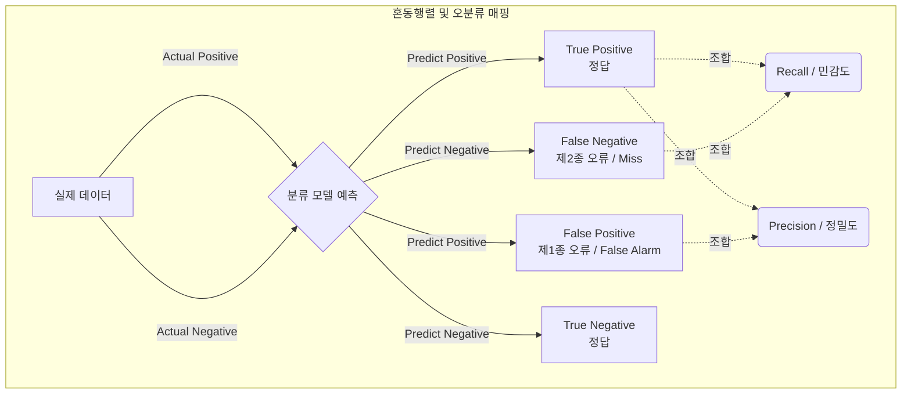

# 혼동행렬 (Confusion Matrix)

---

## I. 분류 모델 성능 평가의 핵심, 혼동행렬의 개요

* **정의**: 머신러닝 분류(Classification) 모델의 예측 성능을 실제 값과 예측 값의 일치 여부를 기반으로 2x2(또는 NxN) 행렬 형태로 나타낸 평가 지표
* **등장배경**: 데이터 불균형(Imbalanced Data) 환경에서 전체 데이터 중 비중이 큰 클래스만 맞추더라도 성능이 높게 나타나는 단순 정확도(Accuracy Paradox)의 한계 극복 필요
* **특징**: 제1종 오류와 제2종 오류 직관적 시각화, 정밀도/재현율/F1-Score 등 세부 성능 지표 도출의 기준 제공, 오분류 비용(Misclassification Cost) 분석 기반 마련

---

## II. 혼동행렬의 개념도 및 핵심 구성 요소

### 가. 혼동행렬의 개념도 및 동작 원리

* 분류 모델의 예측 결과와 실제 정답을 교차 비교하여 4가지 기본 지표(TP, TN, FP, FN)로 분류 및 파생 지표(정밀도, 재현율 등) 산출

### 나. 혼동행렬의 핵심 구성 요소

| 구분 | 요소기술(키워드) | 세부 설명 |
| --- | --- | --- |
| 기본 지표 | **True Positive (TP)** | 실제 Positive를 Positive로 정확하게 예측한 건수 (정상 탐지) |
| 기본 지표 | **True Negative (TN)** | 실제 Negative를 Negative로 정확하게 예측한 건수 (정상 거부) |
| 오류 지표 | **False Positive (FP)** | 실제 Negative를 Positive로 잘못 예측 (제1종 오류, False Alarm) |
| 오류 지표 | **False Negative (FN)** | 실제 Positive를 Negative로 잘못 예측 (제2종 오류, Miss) |
| 파생 지표 | **정밀도 (Precision)** | Positive 예측 중 실제 Positive인 비율, FP(1종 오류) 최소화 시 중요 |
| 파생 지표 | **재현율 (Recall)** | 실제 Positive 중 Positive로 예측한 비율, FN(2종 오류) 최소화 시 중요 |
| 파생 지표 | **정확도 (Accuracy)** | 전체 데이터 중 올바르게 예측한 비율, 데이터 [[클래스]] 비율이 균일할 때 유효 |
| 파생 지표 | **F1 Score** | 정밀도와 재현율의 조화평균, 데이터 불균형 환경에서 모델 성능을 평가하는 핵심 지표 |

---

## III. 혼동행렬과 ROC/AUC의 비교 및 실무 활용 전략

### 가. 분류 성능 평가 지표 간 비교 (혼동행렬 vs ROC/AUC)

| 비교 항목 | 혼동행렬 (Confusion Matrix) | ROC Curve / AUC |
| --- | --- | --- |
| **평가 기준** | 단일 임계값(Threshold) 기반의 절대적 예측 결과 | 임계값 변화에 따른 FPR과 TPR의 연속적 관계 |
| **시각화 형태** | 2x2 (또는 NxN) 행렬 (표 형태) | 2차원 그래프 (X축: FPR, Y축: TPR) |
| **주요 목적** | 오류 유형(1종, 2종)의 상세 파악 및 오분류 내역 확인 | 임계값에 독립적인 모델의 전반적 분류 성능 평가 |
| **활용 환경** | 클래스별 오분류 비용이 다를 때 임계값 튜닝 후 결과 확인 | 다양한 분류 모델 간의 성능을 직관적으로 비교할 때 |

### 나. 도메인 특성에 따른 혼동행렬 기반 임계값(Threshold) 튜닝 전략

* **FN(제2종 오류) 위험도가 높은 도메인**: 암 진단, 불량품 탐지 등에서는 예측 임계값을 낮추어 **재현율(Recall)** 을 극대화하는 방향으로 모델 튜닝
* **FP(제1종 오류) 위험도가 높은 도메인**: 스팸 메일 필터링, 무고한 용의자 판별 등에서는 예측 임계값을 높여 **정밀도(Precision)** 를 극대화하는 방향으로 모델 튜닝

---

### 🔗 연관 토픽

- **소속 도메인**: [[00_인공지능_MOC|🤖 인공지능]]
- **세부 분류**: `2. 머신러닝 기초 & 핵심 알고리즘`
- **핵심 연관 토픽**:
  - [[클래스]]
  - [[지도학습]]
  - [[랜덤 포레스트|랜덤 포레스트 (Random Forest)]]
  - [[앙상블 학습|앙상블 학습(Ensemble Learning)]]
  - [[이미지넷]]
