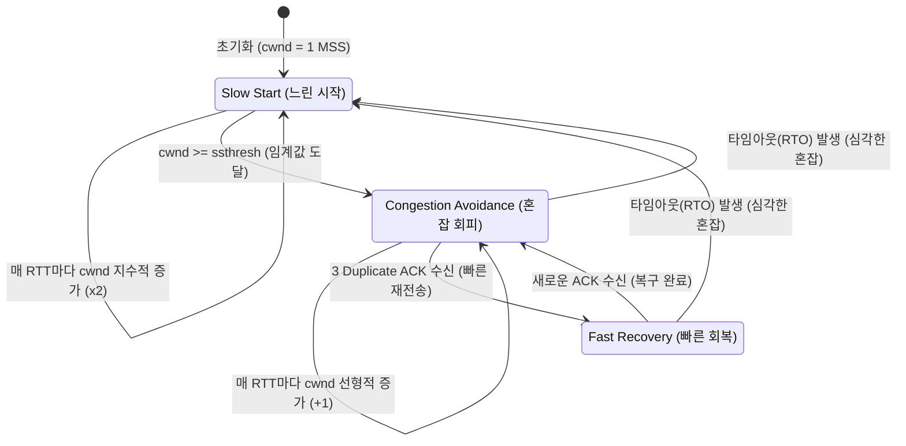

# TCP 혼잡제어 (TCP Congestion Control)

---

## I. 네트워크 붕괴 방지를 위한, TCP 혼잡제어의 개요

* **정의**: 송신측의 데이터 전송 속도와 [[라우터]] 등 네트워크의 데이터 처리 속도 차이로 인해 발생하는 통신 병목 및 혼잡을 방지하기 위해 송신 윈도우 크기(cwnd)를 동적으로 조절하는 전송 제어 기법
* **등장배경**: 초기 [[TCP]] 환경에서 송신 패킷이 라우터 버퍼 용량을 초과하여 손실(Drop)되는 현상 발생, 이후 무분별한 재전송으로 인한 네트워크 붕괴(Congestion Collapse) 현상 방지 필요
* **특징**: 종단 간([[End-to-End]]) 제어, 송신측 주도의 동적 윈도우 크기(Congestion Window) 조절, 임계값(ssthresh) 기반의 혼잡 상태 판단 및 상태 전이

---

## II. TCP 혼잡제어의 개념도 및 핵심 기술 요소

### 가. TCP 혼잡제어의 상태 전이 및 동작 원리

* 송신측은 네트워크 혼잡 상황을 타임아웃([[Timeout]]) 또는 3 중복 ACK(3 Duplicate ACK) 수신 여부로 판단하여 지수적/선형적 증감 알고리즘을 동적으로 적용

### 나. TCP 혼잡제어의 핵심 기술 요소

| 구분 | 요소기술(키워드) | 세부 설명 |
| --- | --- | --- |
| 제어 변수 | **cwnd** (Congestion Window) | 네트워크 상태를 고려하여 송신측이 결정하는 한 번에 전송 가능한 패킷의 양 (윈도우 크기) |
| 제어 변수 | **ssthresh** (Slow Start Threshold) | Slow Start에서 Congestion Avoidance 상태로 전환되는 기준 임계값 |
| 제어 [[알고리즘]] | **Slow Start** (느린 시작) | 초기 윈도우 크기를 1로 시작하여 ACK를 받을 때마다 지수적(2^n)으로 윈도우 크기를 증가시키는 기법 |
| 제어 알고리즘 | **Congestion Avoidance** | 윈도우 크기가 임계값(ssthresh)에 도달하면 혼잡을 피하기 위해 윈도우 크기를 1씩 선형적 증가 (Additive Increase) |
| 오류 대응 | **Fast Retransmit** (빠른 재전송) | 수신측으로부터 동일한 패킷에 대한 3 Duplicate ACK 수신 시, 타임아웃 전이라도 즉시 누락 패킷을 재전송 |
| 오류 대응 | **Fast Recovery** (빠른 회복) | 3 Dup ACK 발생 시 네트워크가 완전히 혼잡하지 않다고 판단하여 cwnd를 1로 줄이지 않고 절반으로 줄인 후 선형 증가 (TCP Reno 방식) |
| 혼잡 회피 모델 | **AIMD** | 네트워크에 문제 없을 시 대역폭을 선형적으로 증가시키고(AI), 패킷 손실 발생 시 대역폭을 절반으로 감소(MD)시키는 기본 모델 |

---

## III. TCP 혼잡제어와 흐름제어 비교 및 최신 동향

### 가. TCP 혼잡제어와 흐름제어(Flow Control) 비교

| 비교 항목 | [[TCP 혼잡제어]] (Congestion Control) | TCP 흐름제어 (Flow Control) |
| --- | --- | --- |
| **주요 목적** | 네트워크 라우터 내의 패킷 혼잡 및 오버플로우 방지 | 송수신 호스트 간의 데이터 처리 속도 불일치 해결 |
| **병목 지점** | 라우터 큐([[Queue]]), 네트워크 전송 매체 | 수신측(Receiver) 버퍼 |
| **제어 주체** | 송신측(Sender)이 능동적으로 추정하여 제어 | 수신측(Receiver)이 수신 윈도우 크기를 통보(rwnd)하여 제어 |
| **핵심 기법** | Slow Start, Congestion Avoidance, AIMD | Sliding Window, Stop & Wait |
| **기준 변수** | cwnd (Congestion Window) | rwnd (Receive Window) |

### 나. TCP 혼잡제어 알고리즘의 발전 동향 및 전망

* **Loss-based (손실 기반)의 한계**: 전통적인 TCP Tahoe/Reno/CUBIC은 패킷 손실이 발생해야만 혼잡으로 인식하므로 대역폭 낭비 및 버퍼블로트(Bufferbloat) 현상 발생
* **Delay-based (지연 기반)의 등장**: TCP Vegas, BBR 등은 RTT(Round Trip Time)의 증가나 병목 대역폭을 능동적으로 계산하여 패킷 유실 전에 선제적으로 윈도우 크기를 조절
* **TCP BBR (Bottleneck Bandwidth and RTT)의 확산**: 구글이 개발한 혼잡제어 알고리즘으로 대역폭과 지연시간을 모델링하여 최적의 전송률을 유지하며, 최근 클라우드 서버(GCP) 및 고해상도 미디어 스트리밍 환경에서 글로벌 표준으로 빠르게 자리매김 중

---

### 🔗 연관 토픽

- **소속 도메인**: [[00_네트워크_MOC|🌐 네트워크]]
- **세부 분류**: `3. 전송 계층 & 트래픽 / 혼잡 제어 (L4)`
- **핵심 연관 토픽**:
  - [[TCP 혼잡제어]]
  - [[TCP]]
  - [[QoS|QoS (Quality of Service)]]
  - [[Sliding Window & 네이글(Nagle's) 알고리즘]]
  - [[망 중립성|망 중립성 (Network Neutrality)]]
