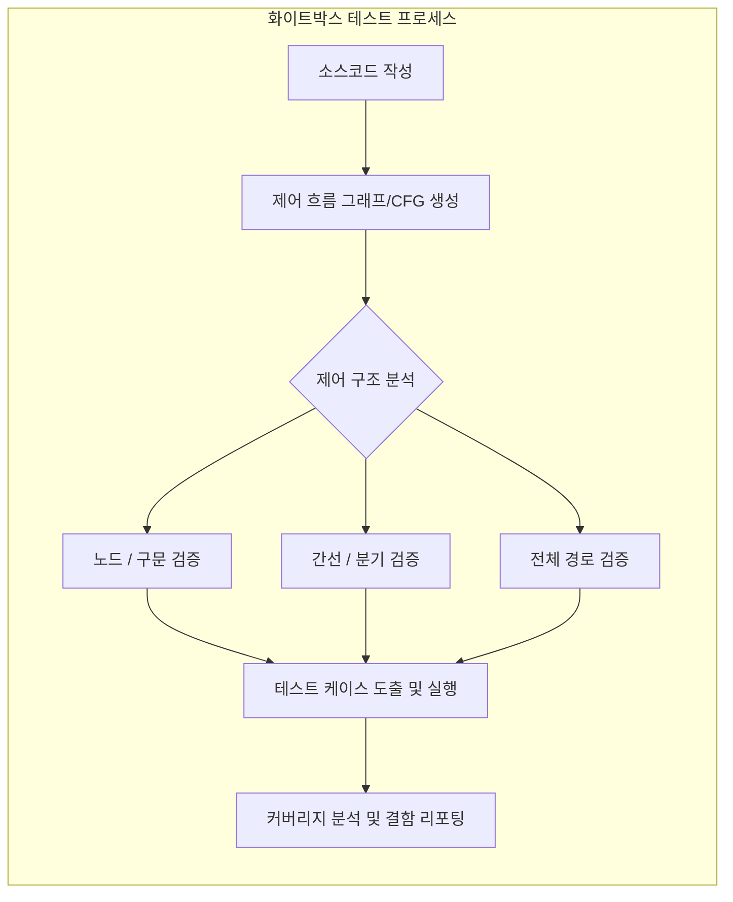

# 화이트박스 테스트 (White Box Testing)

---

## I. 소프트웨어 내부 논리 구조 기반 검증, 화이트박스 테스트의 개요

* **정의**: 프로그램의 내부 소스코드 구조, 동작 [[알고리즘]], 제어 흐름 및 데이터 흐름을 분석하여 개발자 관점에서 논리적 경로의 모든 결함을 검출하는 구조 기반(Structure-Based) 테스트 기법
* **필요성 및 등장배경**: 블랙박스 테스트만으로는 발견하기 어려운 내부의 숨겨진 결함(Dead Code 등) 검출 필요, 소프트웨어의 안전성과 신뢰성이 직결되는 미션 크리티컬 시스템의 완벽한 논리 검증 요구 증가
* **특징**: 소스코드 구조에 대한 완전한 가시성 확보, 구문/분기/경로 등 커버리지(Coverage) 정량화 가능, 주로 단위(Unit) 및 통합(Integration) 테스트 단계에서 수행

---

## II. 화이트박스 테스트의 개념도 및 핵심 기술 요소

### 가. 화이트박스 테스트의 분석 개념도

* 소스코드를 기반으로 제어 흐름 그래프(Control Flow Graph)를 도출하고, 노드(구문), 간선(분기), 조건 등의 논리적 경로를 역추적하여 달성하고자 하는 커버리지 기준에 맞춰 테스트 케이스를 생성하고 실행함

### 나. 화이트박스 테스트의 핵심 기술 요소 (커버리지 기법 중심)

| 구분 | 요소기술(키워드) | 세부 설명 |
| --- | --- | --- |
| 제어 흐름 | **문장 커버리지 (Statement)** | 소스코드의 모든 구문(Line)이 최소 한 번 이상 실행되도록 테스트 케이스 설계 |
| 제어 흐름 | **결정/분기 커버리지 (Decision/Branch)** | 전체 조건식의 결과가 참(True)과 거짓(False)을 최소 한 번씩 수행하도록 설계 |
| 제어 흐름 | **조건 커버리지 (Condition)** | 전체 조건식 내의 각 개별 조건식이 참/거짓을 최소 한 번씩 수행하도록 설계 |
| 제어 흐름 | **조건/결정 커버리지 (Condition/Decision)** | 전체 조건식의 참/거짓과 개별 조건식의 참/거짓을 모두 만족하도록 설계 |
| 제어 흐름 | **MC/DC (변경 조건/결정)** | 개별 조건식이 다른 조건식에 영향을 받지 않고 전체 조건식 결과에 독립적으로 영향을 미치도록 설계 ([[ISO 26262]] 등 표준에서 요구) |
| 제어 흐름 | **다중 조건 커버리지 (Multiple Condition)** | 결정 포인트 내에 있는 모든 개별 조건식의 가능한 모든 논리적 조합(100%)을 검증 |
| 제어 흐름 | **경로 커버리지 (Path)** | 제어 흐름 그래프 상의 시작부터 종료까지 발생 가능한 모든 경로를 테스트 |
| 데이터 흐름 | **데이터 흐름 테스트 (Data Flow)** | 변수의 정의(Definition)와 사용(Use) 경로에 초점을 맞춰 변수 값의 생명주기와 비정상적 변경(DU Path)을 검증 |

---

## III. 화이트박스 테스트와 블랙박스 테스트 비교 및 실무 활용 전략

### 가. 화이트박스 테스트와 블랙박스 테스트 비교

| 비교 항목 | 화이트박스 테스트 (White Box Testing) | [[블랙박스 테스트]] (Black Box Testing) |
| --- | --- | --- |
| **핵심 관점** | 시스템 내부 구조 및 논리 중심 (How) | 사용자의 요구사항 및 명세 중심 (What) |
| **기반 문서** | 소스코드, 내부 설계서 | [[요구사항 명세서]], 사용자 메뉴얼 |
| **수행 주체** | 개발자 중심 (SDET) | 테스트 엔지니어, 최종 사용자(QA) |
| **주요 기법** | 제어구조 테스트(커버리지), 데이터 흐름 테스트 | 동등 분할, 경계값 분석, 유스케이스 테스트 |
| **적용 단계** | 주로 단위(Unit), 통합(Integration) 테스트 | 주로 시스템(System), 인수(Acceptance) 테스트 |
| **장/단점** | [장] 숨은 논리 오류 발견 / [단] 테스트 비용 증가 | [장] 사용성 중심 검증 / [단] 미사용 코드 검증 불가 |

### 나. 화이트박스 테스트의 최신 트렌드 및 실무 활용 전략

* **지속적 통합(CI/CD) 파이프라인 연동**: SonarQube, JaCoCo, JUnit 등의 도구를 활용하여 빌드 시점에 자동으로 정적 코드 분석 및 커버리지 측정이 수행되도록 자동화 체계([[DevOps]]) 구축 필수
* **시큐어 코딩 및 [[SAST]](정적 애플리케이션 보안 테스트)**: 단순 논리 오류 검출을 넘어 소프트웨어 보안 취약점(버퍼 오버플로우, 인젝션 등)을 소스코드 레벨에서 사전 차단하기 위한 [[DevSecOps]]의 핵심 검증 도구로 활용 확대

---

### 🔗 연관 토픽

- **소속 도메인**: [[00_소프트웨어공학_MOC|🏗️ 소프트웨어공학]]
- **세부 분류**: `6. 소프트웨어 테스팅 & 품질 보증 (QA/QC)`
- **핵심 연관 토픽**:
  - [[코드 커버리지|코드 커버리지(Code Coverage)]]
  - [[DevOps|데브옵스 (DevOps)]]
  - [[통합 테스트]]
  - [[소프트웨어 테스트|소프트웨어 테스트 (Software Test)]]
  - [[DevSecOps]]
