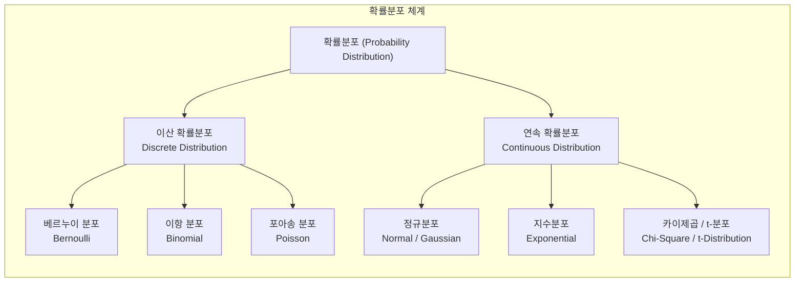

# 확률분포 (Probability Distribution)

---

## I. 데이터의 불확실성 모델링을 위한, 확률분포의 개요

* **정의**: 확률 변수가 취할 수 있는 모든 값과 그 값이 발생할 확률을 수학적 함수나 표 형태로 대응시켜 데이터의 출현 양상을 나타낸 모델
* **등장배경**: 현실 세계의 복잡하고 불확실한 데이터 현상을 수학적으로 추상화하고, 데이터 분석, 통계적 [[가설 검정]] 및 머신러닝 알고리즘의 최적화 수행 필요
* **특징**: 이산형과 연속형으로 분류, 모수(Parameter)를 통해 분포의 특성 정의, 데이터의 중심 경향과 산포도를 파악하는 기초 통계의 핵심 도구

---

## II. 확률분포의 개념도 및 핵심 기술 요소

### 가. 확률분포의 체계 및 분류 구조도

* 확률변수의 값의 성격(셀 수 있는 이산값 vs 연속적인 실수값)에 따라 이산 확률분포와 연속 확률분포로 대별되며 각각 다양한 통계 및 머신러닝 모델의 기본 가정으로 활용됨

### 나. 확률분포의 핵심 기술 요소 (주요 분포 및 통계 개념)

| 구분 | 요소기술(키워드) | 세부 설명 |
| --- | --- | --- |
| 이산형 분포 | **[[베르누이 분포]] (Bernoulli)** | 성공(1) 또는 실패(0)의 2가지 결과만 존재하는 단일 시행의 확률분포 |
| 이산형 분포 | **이항 분포 (Binomial)** | 독립적인 베르누이 시행을 $n$번 반복했을 때의 총 성공 횟수에 대한 확률분포 |
| 이산형 분포 | **[[포아송 분포]] (Poisson)** | 단위 시간이나 공간 내에 드물게 발생하는 사건의 발생 횟수를 나타내는 분포 |
| 연속형 분포 | **[[정규분포]] (Normal)** | 평균($\mu$)과 분산($\sigma^2$)에 의해 결정되며, 좌우 대칭의 종(Bell) 모양을 이루는 연속형 분포 |
| 연속형 분포 | **지수분포 (Exponential)** | 사건과 사건 사이의 대기 시간을 나타내며 '무기억성(Memoryless)' 성질을 갖는 분포 |
| 통계 함수 | **확률질량함수 (PMF)** | 이산 확률변수가 특정한 값을 가질 확률을 나타내는 함수 ($P(X=x)$) |
| 통계 함수 | **확률밀도함수 (PDF)** | 연속 확률변수의 특정 구간 내 포함될 확률을 적분 형태로 나타내는 함수 |
| 응용 기술 | **최대우도추정 (MLE)** | 관측된 데이터가 주어졌을 때, 가장 타당한 확률분포의 모수를 추정하는 최적화 기법 |

---

## III. 이산 확률분포와 연속 확률분포 비교 및 인공지능 활용 동향

### 가. 이산 확률분포와 연속 확률분포 비교

| 비교 항목 | 이산 확률분포 (Discrete Distribution) | 연속 확률분포 (Continuous Distribution) |
| --- | --- | --- |
| **확률변수 성격** | 셀 수 있는(Countable) 이산적인 값 | 연속적인 실수 구간의 값 |
| **핵심 함수** | 확률질량함수 (PMF, Probability Mass Function) | 확률밀도함수 (PDF, Probability Density Function) |
| **대표 모델** | 베르누이 분포, 이항 분포, 포아송 분포 | 정규분포, 지수분포, 스튜던트 t-분포 |
| **주요 활용** | 스팸 메일 분류(성공/실패), 고객 구매 건수 예측 | 센서 데이터 오차 분석, 키/체중 등 연속적 특성 모델링 |

### 나. AI 및 머신러닝 분야의 확률분포 활용 동향

* **생성형 AI와 잠재공간(Latent Space)**: [[VAE|VAE(Variational Autoencoder)]] 등에서 데이터의 복잡한 특징을 다차원 정규분포 등의 확률분포로 매핑하여 새로운 데이터 생성
* **이상 탐지([[Anomaly(이상현상)|Anomaly]] Detection)**: 정상 데이터가 따르는 확률분포(예: 다변량 정규분포)를 학습하고, 이로부터 크게 벗어나는 이상치를 효과적으로 식별하는 데 활용

---

### 🔗 연관 토픽

- **소속 도메인**: [[00_인공지능_MOC|🤖 인공지능]]
- **세부 분류**: `1. 수학 · 통계학 & 데이터 전처리`
- **핵심 연관 토픽**:
  - [[정규분포|정규분포(Normal Distribution)]]
  - [[확률분포와 확률 밀도 함수]]
  - [[가설 검정]]
  - [[VAE|VAE(Variational Autoencoder)]]
  - [[중심극한정리|중심극한정리 (Central Limit Theorem)]]
