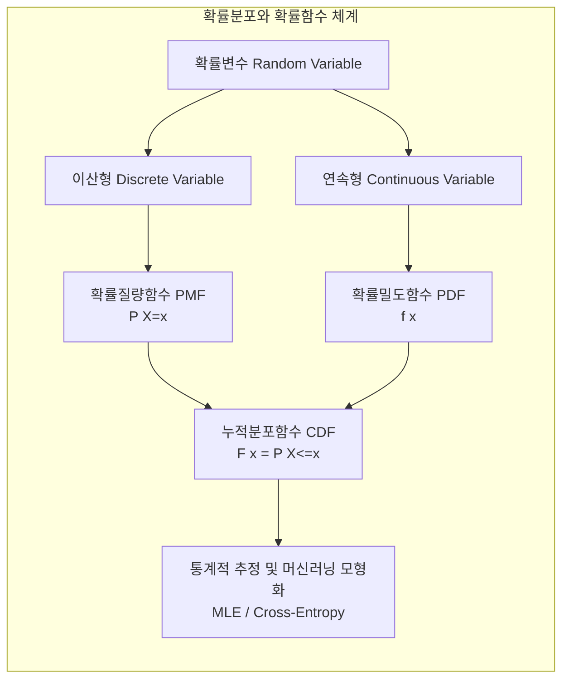

# 확률분포와 확률 밀도 함수 (Probability Distribution & Probability Density Function)

---

## I. 불확실성 모델링을 위한 확률분포와 확률밀도함수의 개요

* **정의**: 확률변수가 취할 수 있는 모든 값과 그에 대응하는 발생 가능성을 수학적으로 대응시킨 전체 구조인 '[[확률분포]]'와, 연속형 확률변수의 특정 구간 내 확률을 면적(적분)으로 나타내는 핵심 함수인 '확률밀도함수(PDF)'
* **등장배경**: 현실의 복잡한 이산 및 연속 데이터의 불확실성을 정량화하고, 통계적 추정, [[가설 검정]] 및 [[인공지능]] 모델의 최적화를 수행하기 위한 수학적 기반 필요
* **특징**: 이산형과 연속형 모델의 체계적 이원화, 누적분포함수(CDF)와의 상호 연계성, 데이터의 중심 경향과 분포 특성 파악 가능

---

## II. 확률분포의 체계 및 확률밀도함수의 핵심 구성 요소

### 가. 확률분포 체계와 확률함수의 관계도

* 확률변수의 성격에 따라 이산형은 확률질량함수(PMF)로, 연속형은 확률밀도함수(PDF)로 모델링되며, 이는 누적분포함수(CDF)를 통해 상호 유기적으로 연결됨

### 나. 확률분포 및 밀도함수 관련 핵심 기술 요소

| 구분 | 요소기술(키워드) | 세부 설명 |
| --- | --- | --- |
| 기본 개념 | **확률변수 (Random Variable)** | 표본 공간의 각 결과를 실수 값으로 매핑하는 함수 |
| 기본 개념 | **확률분포 (Probability Distribution)** | 확률변수가 취할 수 있는 값과 그 확률의 대응 관계 전체를 나타내는 모형 |
| 이산 함수 | **확률질량함수 (PMF)** | 이산형 확률변수가 특정 값($x$)을 가질 확률을 나타내는 함수 ($\sum P(X=x) = 1$) |
| 연속 함수 | **확률밀도함수 (PDF)** | 연속형 확률변수의 특정 구간 확률을 곡선 아래의 면적(적분)으로 나타내는 함수 |
| 누적 함수 | **누적분포함수 (CDF)** | 확률변수가 특정 값 이하가 될 확률을 누적하여 나타낸 함수 ($F(x) = P(X \le x)$) |
| 대표 분포 | **[[정규분포]] (Normal Distribution)** | 평균과 분산에 의해 좌우 대칭의 종 모양을 이루는 가장 대표적인 연속 확률분포 |
| 통계 추정 | **최대우도추정 (MLE)** | 관측된 데이터가 주어졌을 때, 가장 타당한 확률분포의 모수를 추정하는 최적화 기법 |
| [[딥러닝]] 응용 | **소프트맥스 (Softmax)** | 신경망 출력층에서 다중 클래스에 대한 확률분포 형태로 값을 매핑하는 활성화 함수 |

---

## III. 확률질량함수(PMF)와 확률밀도함수(PDF) 비교 및 인공지능 활용 동향

### 가. 확률질량함수(PMF)와 확률밀도함수(PDF) 비교

| 비교 항목 | 확률질량함수 (PMF, Probability Mass Function) | 확률밀도함수 (PDF, Probability Density Function) |
| --- | --- | --- |
| **적용 대상** | 이산형 확률변수 (Discrete Variable) | 연속형 확률변수 (Continuous Variable) |
| **함수 의미** | 특정 값($x$)을 가질 **확률 자체** ($P(X=x)$) | 특정 구간에서의 **확률의 밀도** (자체는 확률이 아님) |
| **수학적 제약** | 모든 값의 확률 합은 1 ($\sum P(X=x) = 1$) | 전체 구간의 적분 값은 1 ($\int_{-\infty}^{\infty} f(x)dx = 1$) |
| **확률 계산 방식** | 특정 값에서의 함수값 자체가 해당 확률 | 특정 구간 $[a, b]$에 대한 정적분 값 ($\int_{a}^{b} f(x)dx$) |

### 나. 인공지능 및 데이터 분석 분야의 확률밀도함수 활용 동향

* **생성형 AI와 확률 밀도 추정**: [[VAE|VAE(Variational Autoencoder)]] 및 확산 모델(Diffusion Models) 등에서 복잡한 고차원 데이터의 실제 확률 밀도 함수를 근사하여 새로운 데이터 샘플 생성
* **손실 함수(Loss Function) 설계**: 모델이 예측한 확률분포와 실제 데이터의 확률분포 간의 차이를 정량화하기 위해 쿨백-라이블러 발산(Kullback-Leibler Divergence) 및 크로스 엔트로피 산출에 활용

---

### 🔗 연관 토픽

- **소속 도메인**: [[00_인공지능_MOC|🤖 인공지능]]
- **세부 분류**: `1. 수학 · 통계학 & 데이터 전처리`
- **핵심 연관 토픽**:
  - [[정규분포|정규분포(Normal Distribution)]]
  - [[확률분포]]
  - [[가설 검정]]
  - [[VAE|VAE(Variational Autoencoder)]]
  - [[인공지능]]
