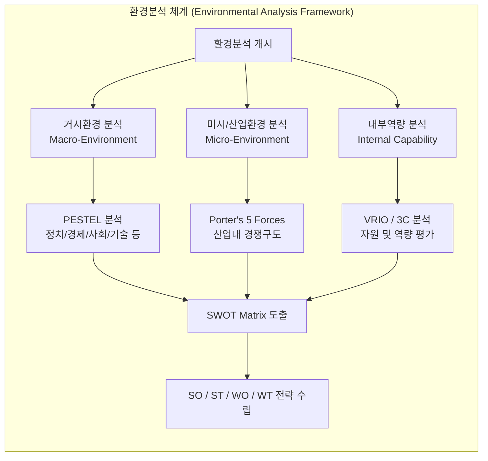

# 환경분석 (Environmental Analysis)

---

## I. 전략적 의사결정의 기초, 환경분석의 개요

* **정의**: 기업 또는 IT 프로젝트가 직면한 거시적·미시적 외부 환경과 내부 역량을 체계적으로 식별하고 평가하여 기회와 위협, 강점과 약점을 도출하는 전략 수립 기법
* **등장배경**: [[디지털 전환|디지털 전환(DX)]], [[인공지능]](AI) 확산 등 급변하는 기술 및 시장 변화 속에서 기업의 생존과 지속 가능한 IT 투자 방향성 설정을 위한 선제적 리스크 관리 필요
* **특징**: 내·외부 요인의 통합적 분석, 기회(Opportunity) 및 위협(Threat) 요인의 선제적 대응, 정보화전략계획([[ISP (Information Strategy Plan)|ISP]]) 및 중장기 IT 전략 수립의 기초 자료 제공

---

## II. 환경분석의 개념도 및 핵심 분석 기법

### 가. 환경분석의 체계 및 프로세스 개념도

* 거시적 트렌드, 산업 내 경쟁 구도, 내부 자원 역량을 다각도로 분석한 후, 이를 교차 결합하여 최종적인 전략 방향성을 도출하는 구조

### 나. 환경분석의 핵심 분석 기법 및 구성 요소

| 구분 | 분석 기법(Framework) | 주요 내용 및 초점 |
| --- | --- | --- |
| 거시환경 | **PESTEL 분석** | 정치(P), 경제(E), 사회(S), 기술(T), 환경(E), 법률(L) 등 거시적 트렌드 파악 |
| 산업환경 | **Porter's 5 Forces** | 기존 기업 경쟁, 잠재 진입자, 대체재, 구매자 및 공급자의 교섭력 분석 |
| 시장환경 | **3C 분석** | 고객(Customer), 자사(Company), 경쟁사(Competitor) 관점의 시장 분석 |
| 내부역량 | **VRIO 모형** | 자원의 가치성(V), 희소성(R), 모방 불가능성(I), 조직화(O) 평가 |
| 종합분석 | **SWOT 분석** | 강점(S), 약점(W), 기회(O), 위협(T) 요인의 교차 분석을 통한 전략 도출 |
| 디지털 환경 | **DX & Tech Trend** | AI, 클라우드, 빅데이터 등 최신 IT 기술 도입 타당성 및 기술 성숙도 분석 |

---

## III. 전통적 환경분석과 디지털 시대의 환경분석 비교 및 최신 동향

### 가. 전통적 환경분석과 디지털 환경분석의 비교

| 비교 항목 | 전통적 환경분석 (Traditional) | 디지털 시대의 환경분석 (Digital/Real-time) |
| --- | --- | --- |
| **분석 주기도** | 주기적, 단발성 (연간 단위 보고서 중심) | 실시간, 연속적 (Continuous Monitoring) |
| **데이터 원본** | 정형 데이터, 설문조사, 전문가 인터뷰 | 비정형 데이터, 소셜 버즈, 실시간 로그, 빅데이터 |
| **활용 도구** | SWOT, PESTEL, 3C 정적 매트릭스 | AI 기반 시장 센싱, 빅데이터 트렌드 분석 도구 |
| **대응 속도** | 사후 대응 및 중장기 계획 수립 위주 | 선제적이고 애자일([[Agile]])한 전략 수정 반영 |

### 나. 환경분석의 최신 트렌드 및 실무 활용 전략

* **데이터 기반 실시간 시장 센싱 (Real-time Sensing)**: 정적 보고서 위주의 분석에서 벗어나, 빅데이터 수집 및 생성형 AI를 활용한 실시간 트렌드 및 경쟁사 동향 자동 분석 체계 구축
* **IT 전략 및 ISP/[[ISMP]] 연계 강화**: 도출된 환경분석 결과를 기반으로 디지털 혁신(DX) 과제를 도출하고, 이를 전사 아키텍처(EA) 및 정보화 로드맵과 유기적으로 연계하여 실행력 확보

---

### 🔗 연관 토픽

- **소속 도메인**: [[00_경영전략_MOC|📈 경영전략]]
- **세부 분류**: `1. 경영 환경 분석 & 전략 수립 프레임워크`
- **핵심 연관 토픽**:
  - [[디지털 전환|디지털 전환(DX)]]
  - [[ISP (Information Strategy Plan)]]
  - [[3C 4C 분석|3C  4C 분석]]
  - [[ISMP|ISMP (Information System Master Plan)]]
  - [[Ansoff Matrix]]
