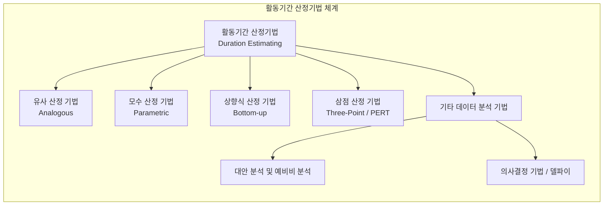

# 활동기간 산정기법 (Activity Duration Estimating Techniques)

---

## I. 성공적인 일정 관리를 위한, 활동기간 산정기법의 개요

* **정의**: 프로젝트의 각 활동을 완료하는 데 필요한 작업 기간(Work Periods)을 추정하기 위해 범위 기준서, 자원 요구사항, 제약조건 등을 바탕으로 소요 시간을 산정하는 PMBOK 기반의 일정 계획 기법
* **등장배경**: 프로젝트 납기 준수, 한정된 자원의 효율적 배분, 그리고 불확실한 환경 속에서 발생할 수 있는 일정 지연 리스크를 사전에 식별하고 대응하기 위한 과학적 산정 필요
* **특징**: 과거 데이터와 통계적 모델을 활용하는 정량적 기법부터 전문가의 직관과 경험을 활용하는 정성적 기법까지 다양하게 존재하며, 프로젝트 생명주기 단계에 따라 상세도가 달라짐

---

## II. 활동기간 산정기법의 분류 체계 및 핵심 기술 요소

### 가. 활동기간 산정기법의 분류 체계도

* 프로젝트의 가용 정보 수준과 특성에 따라 과거 유사 사례를 활용하거나, 수학적 모수 및 세부 작업 합산, 확률적 분포를 적용하여 소요 기간을 도출함

### 나. 활동기간 산정기법의 핵심 요소 및 세부 내용

| 구분 | 요소기술(키워드) | 세부 설명 |
| --- | --- | --- |
| 경험 기반 | **유사 산정 (Analogous)** | 과거 유사 프로젝트의 실제 기간 데이터를 활용하여 현재 활동의 기간을 산정 (빠름, 정확도 낮음) |
| 통계 기반 | **모수 산정 (Parametric)** | 역사적 데이터와 통계적 관계(예: 생산성 지표, 단위당 작업량)를 수학적 모수에 적용하여 산정 |
| 상세 기반 | **상향식 산정 (Bottom-up)** | [[WBS]] 최하위 작업(Work Package) 단위로 상세히 기간을 산정한 후 전체 프로젝트 기간으로 합산 |
| 확률 기반 | **삼점 산정 (Three-Point)** | 낙관치(O), 비관치(P), 최빈치(M)를 기반으로 기대값을 산정하는 PERT 기법 적용 ((O + 4M + P) / 6) |
| 대안 분석 | **대안 분석 (Alternatives)** | 다양한 실행 방법이나 자원 할당 대안(외주 vs 자체 개발 등)에 따른 기간 비교 검토 |
| 리스크 반영 | **예비비 분석 (Reserve Analysis)** | 일정 불확실성에 대비하여 완충 시간인 비상 준비금(Contingency Reserve)을 일정에 반영 |
| 의사결정 | **델파이 기법 (Delphi)** | 전문가 그룹의 익명 피드백과 합의 과정을 통해 편향을 줄이고 객관적 기간 추정치 도출 |
| 도구 활용 | **PMIS (프로젝트 관리 정보시스템)** | [[스케줄링]] 소프트웨어(MS Project 등)의 알고리즘과 자원 캘린더를 활용한 자동 산정 |

---

## III. 전통적 산정기법과 애자일 방식 비교 및 최신 트렌드

### 가. 전통적 활동기간 산정기법과 애자일(Agile) 방식 비교

| 비교 항목 | 전통적 산정기법 (PMBOK 기반) | 애자일 방식 ([[Agile]] / [[SCRUM|Scrum]]) |
| --- | --- | --- |
| **산정 대상** | WBS 기반의 전체 활동(Activity) 및 작업 패키지 | 사용자 스토리(User Story) 및 백로그(Backlog) |
| **산정 단위** | 절대적 시간 단위 (일, 주, 월 단위 기간 산정) | 상대적 크기 및 속도 (스토리 포인트, Velocity) |
| **적용 시점** | 프로젝트 초기 계획 단계 (WBS 수립 시점) | 매 스프린트(Sprint) 계획 수립 시 반복적 산정 |
| **특징 및 한계** | 상세하나 초기 불확실성이 높을 경우 오차 발생 | 변화에 유연하나 장기 총 기간 예측에는 제약 있음 |

### 나. 활동기간 산정의 최신 트렌드 및 실무 활용 전략

* **하이브리드 산정 체계 도입**: 대규모 프로젝트에서는 전통적인 모수/상향식 산정과 애자일의 반복적 스토리 포인트 산정을 결합하여 예측 가능성과 유연성 동시 확보
* **데이터 기반 산정 자동화**: 과거 프로젝트 관리 시스템(Jira, Confluence 등)에 축적된 빅데이터와 생성형 AI를 활용하여 유사 및 모수 산정의 정확도를 자동으로 제고하는 방향으로 진화 중

---

### 🔗 연관 토픽

- **소속 도메인**: [[00_프로젝트관리_MOC|📋 프로젝트관리]]
- **세부 분류**: `1. PMBOK 표준 & 프로젝트 거버넌스`
- **핵심 연관 토픽**:
  - [[SCRUM]]
  - [[PMBOK 프로세스 그룹 (5단계)]]
  - [[연동계획|연동계획 (Rolling Wave Planning)]]
  - [[ISO 21500]]
  - [[Agile]]
